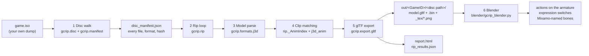
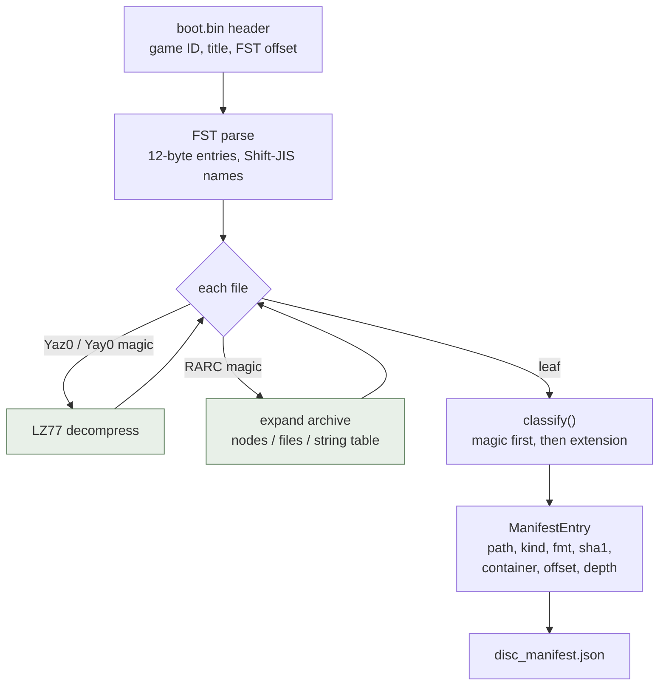
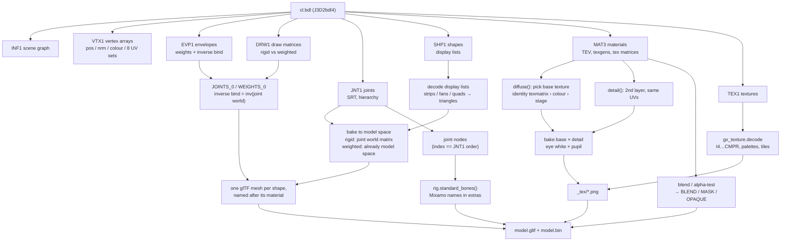
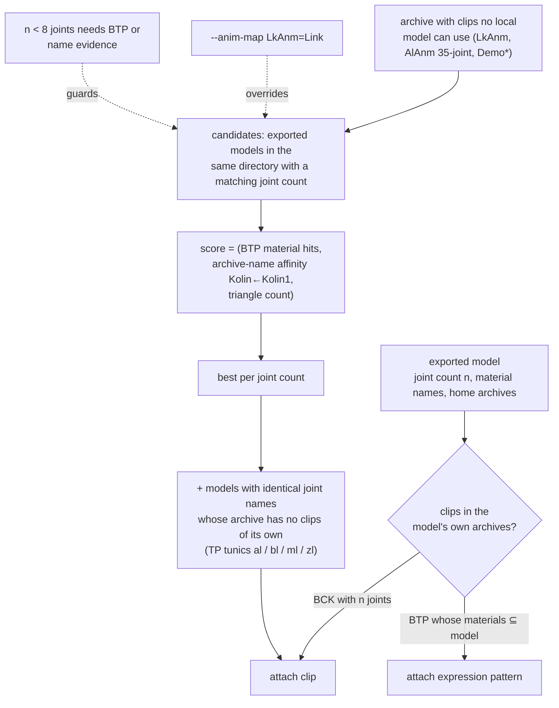
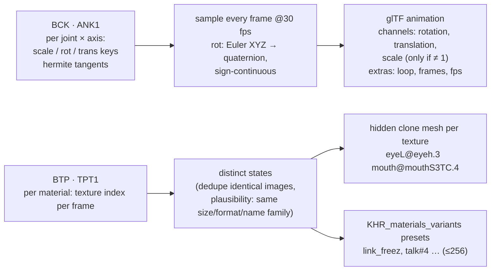
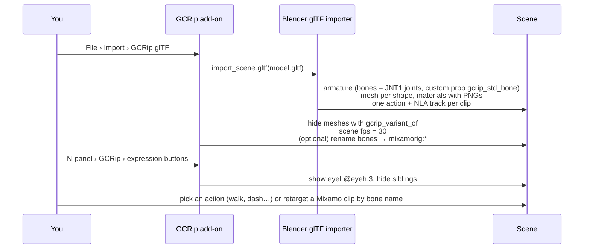

# GCRip pipeline

How a GameCube disc image becomes textured, rigged, animated glTF you can play back in Blender.
Five diagrams, from coarse to fine. Module names are the real ones in `gcrip/`.

## 1. End to end

## 2. Disc walk (`gcrip disc/manifest`)

Every file on the disc is located, decompressed if needed, sniffed for its format, hashed and
recorded. Nothing is written yet; this is the map the rip works from.

Kinds that matter downstream: `model` (BMD/BDL), `animation` (BCK/BTP/BVA…), `texture` (BTI/TPL).
Recursion goes eight archives deep; identical files are recognised by SHA-1.

## 3. One model: J3D → glTF

Alternate face meshes stacked on the same joint (`eyeLdamA`…) are detected by name + bbox and
exported hidden (`KHR_node_visibility`) under `<model>_variants`.

## 4. Animation & expression matching (`rip._AnimIndex`)

Clips live in the same archive as the model, in an animation-only archive (`LkAnm.arc`), or in
cutscene packs (`Demo*.arc`). Byte-identical models are exported once, so a model "lives" in every
archive that holds a copy of it.

## 5. Blender side (`blender/gcrip_blender.py`)

## What is heuristic (and where to look when it's wrong)

| step | assumption | if wrong |
|---|---|---|
| base texture | first TEV stage sampling a vertex UV set, identity matrix, colour format | material shows the wrong layer → check `report.html` texture strip |
| detail bake | 2nd texture in the same UV space multiplies the base | odd tint on a face part → `gcrip_composite` extras name the pair |
| clip → model | joint count (+ names for twins), same directory, name affinity | wrong actor animates → `--anim-map ANIM=MODEL` |
| expressions | BTP swaps only the diffuse slot; alternate must match size/format/name family | missing switch → the texture is on another slot / a different TEX1 order |
| bone names | keyword + hierarchy walk from hands/feet/head | unmapped bone → add the token to `rig._KEYWORDS` |
