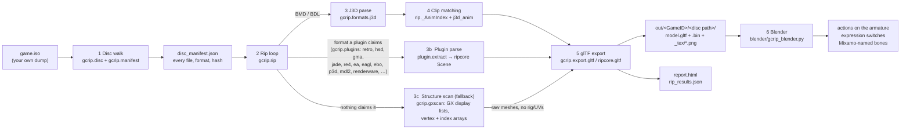
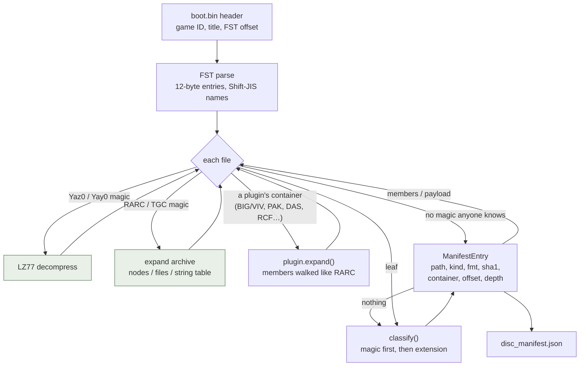
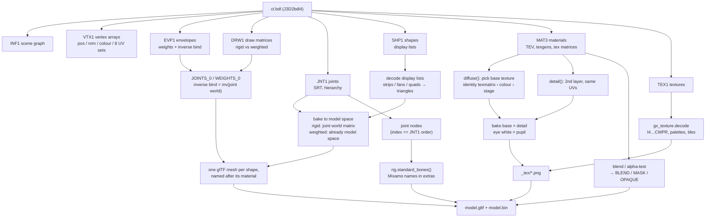
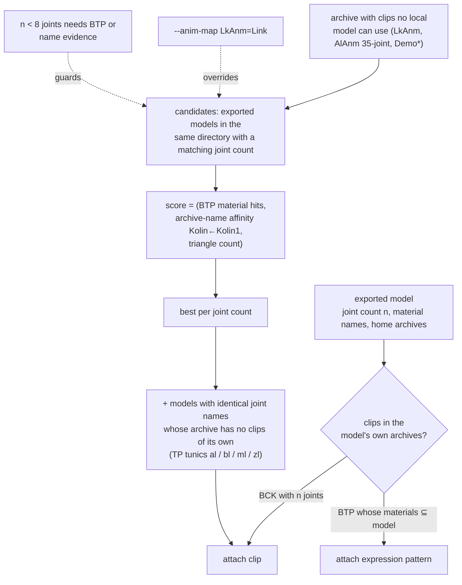
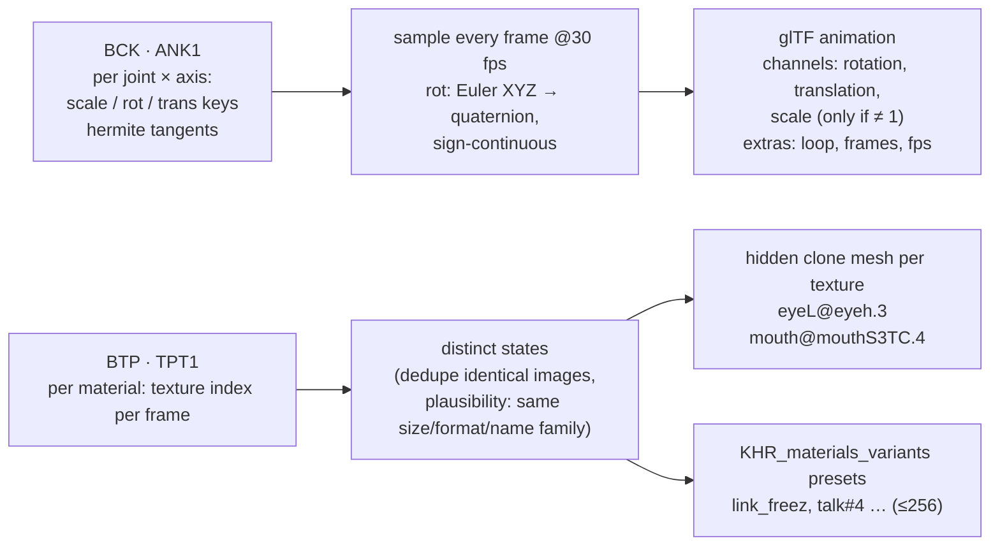
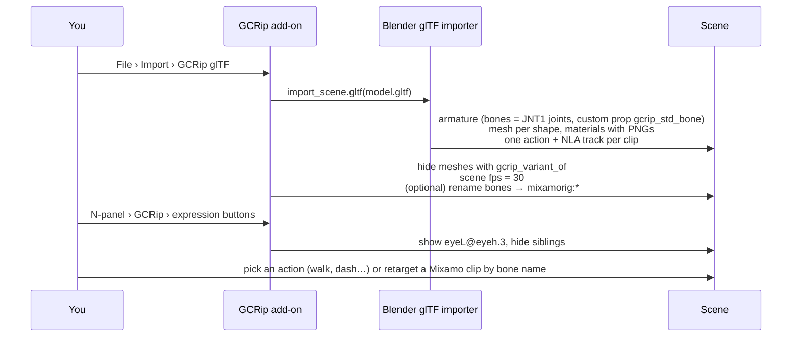
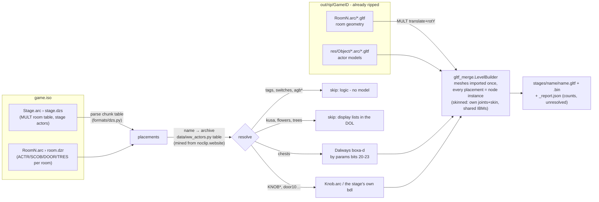
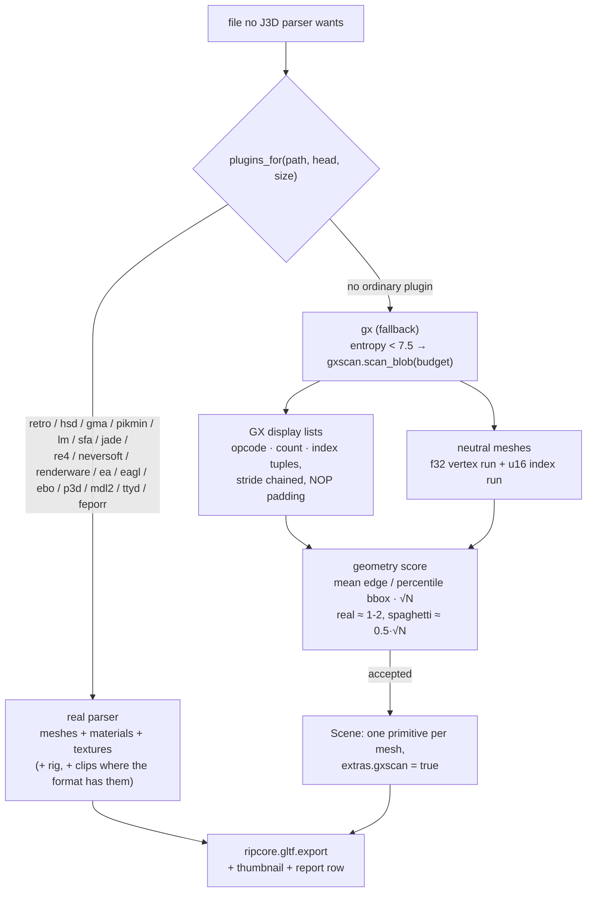

# GCRip pipeline

How a GameCube disc image becomes textured, rigged, animated glTF you can play back in Blender.
One master chart (1) shows every route a file can take; the later charts zoom into one
stage each. Non-J3D games follow the same walk and export - only the "model parse" box
differs per format - so there is one pipeline, not one per engine. Module names are the
real ones in `gcrip/`.

## 1. End to end

## 2. Disc walk (`gcrip disc/manifest`)

Every file on the disc is located, decompressed if needed, sniffed for its format, hashed and
recorded. Nothing is written yet; this is the map the rip works from.

Kinds that matter downstream: `model` (BMD/BDL), `animation` (BCK/BTP/BVA…), `texture` (BTI/TPL).
Recursion goes eight archives deep; identical files are recognised by SHA-1. Plugin containers
are tried in name order and the two fallbacks (`generic`, `gx`) only when no real plugin
claims a file, so a known format always wins over a guess; a member byte-identical to its
container is refused (index-only headers would otherwise recurse forever).

## 3. One model: J3D → glTF

Alternate face meshes stacked on the same joint (`eyeLdamA`…) are detected by name + bbox and
exported hidden (`KHR_node_visibility`) under `<model>_variants`.

## 4. Animation & expression matching (`rip._AnimIndex`)

Clips live in the same archive as the model, in an animation-only archive (`LkAnm.arc`), or in
cutscene packs (`Demo*.arc`). Byte-identical models are exported once, so a model "lives" in every
archive that holds a copy of it.

## 5. Blender side (`blender/gcrip_blender.py`)

## 6. Level recompilation (`gcrip stage`, Wind Waker)

Actor positions are world-space; MULT moves only room geometry (verified against the game:
Outset's actors sit at the island's world slot, X≈-200k Z≈+300k). Rotation uses only the
Y angle (x/z fields usually carry parameters), s16 angle units, 0x8000 = 180°.

## 7. Non-J3D formats and the universal fallback

Every plugin turns one file into `ripcore.scene.Scene` objects (joints, materials,
primitives, decoded textures, clips) and hands them to the same exporter, so the chart in
§1 is the whole story for every engine. What differs is only how much a format gives up:

EA Canada's EAGL objects (`plugins/eagl.py`: FIFA, NBA Live, NHL, MVP, Def Jam, Fight
Night - `.ord` + `.orp` = one ELF relocatable split in two) are the first non-J3D format
that reaches the exporter with a full rig: the `__Skeleton` table gives every bone its
parent, local TRS and inverse-bind matrix, and each render packet carries one row per GX
position-matrix slot holding up to four blend weights whose low mantissa byte is the bone
index - so the per-vertex `posmtx` byte in the display list becomes glTF `JOINTS_0` /
`WEIGHTS_0`. The 25 `__Model` "variations" of a player all share the same packets; they
are kit toggle sets (`enable_body_Sleeves_Long_r`, `enable_accs_goggles`, ...), so one Scene
per object carries every part and the toggles are left for a later split.

The later EA Sports titles (NHL 2005/06, NBA Live 2005/06, FIFA 05, 2006 FIFA World Cup,
UEFA CL) moved to EBO objects (`plugins/ebo.py`): a little-endian container whose type
and export tables name every serialised class (`Geometry`, `GcDisplayList`,
`GCVertexStream`, `Float3`/`Short3`/`Char3`/`Short2`/`R5G6B5`, or `EaglAnim::*` for
animation banks and skeletons). Each Geometry export is one Scene; its lists are GX strips
whose vertex is `[posmtx][texmtx]` plus one u8/u16 index per stream in GX order, integer
positions are normalised to the Geometry's own bounding box, and the per-list skin table
(weights with the bone index in the low byte, like FIFA) points into the game's skeleton
objects (`preload/gmisc.viv/bodyskel.ebo`, `faceskel.ebo`, `handskel.ebo`), which give
names, parents and inverse-bind matrices - so players export rigged, in T-pose.

Radical Entertainment's Pure3D (`plugins/p3d.py`, `plugins/rcf.py`: Simpsons Hit & Run and
Road Rage, Hulk, The Incredible Hulk, Crash Tag Team Racing, Dark Summit, Monsters Inc,
Godzilla) is a documented chunk tree - in both endians on GameCube - but its geometry is
GX-native: each prim group carries a vertex-attribute descriptor, a big-endian fixed-point
vertex buffer and a display list, which `formats/p3d.py` decodes with the same
index-width search as EBO. Files are usually wrapped in `P3DZ`, Radical's LZR byte-LZ
(`formats/lzr.py`, blocks of 4 KB), and on Hulk/Crash sit inside RCF archives
(`formats/rcf.py`). Skins name their skeleton (`Skeleton`/`SkeletonJoint` rest poses),
shaders name their textures (DXT1 DDS or PNG inside the file).

Krome Studios' Merkury engine (`plugins/rkv.py`, `plugins/mdl2.py`: Ty the Tasmanian Tiger)
keeps everything in one `.rkv` archive whose directory sits at the END of the file
(`formats/rkv.py`). Its `.gmd` models are big-endian MDL2 tables (`formats/mdl2.py`): one
interleaved 28-byte vertex buffer (f32 position, s8 normal, s16 UV /4096, a two-bone weight,
RGBA) and per-mesh GX display lists whose vertices are four u16 indices (position, normal,
colour, uv) into that buffer. Material names are the `.gtx` texture stems (CMPR with mips,
or RGB5A3 for alpha textures); bones are positions only, the hierarchy lives in `.bad` text
files. Blitz Games' `.gcp` packs (`plugins/blitz.py`) are only split into their packages so
the fallback scanner can read them.

The fallback is a map as much as a rip: its hits say where in an archive the models live
and how the vertices are laid out, which is most of what a real plugin needs. Multi-platform
engines that store only vertex/index buffers (Treyarch, Radical P3D) reach the scanner only
after their container - and often their own compression - is opened; `formats.generic`
handles the common table and LZ shapes, the rest is per-studio work in the order the
compatibility list's developer column suggests.

## What is heuristic (and where to look when it's wrong)

| step | assumption | if wrong |
|---|---|---|
| base texture | first TEV stage sampling a vertex UV set, identity matrix, colour format | material shows the wrong layer → check `report.html` texture strip |
| detail bake | 2nd texture in the same UV space multiplies the base | odd tint on a face part → `gcrip_composite` extras name the pair |
| clip → model | joint count (+ names for twins), same directory, name affinity | wrong actor animates → `--anim-map ANIM=MODEL` |
| expressions | BTP swaps only the diffuse slot; alternate must match size/format/name family | missing switch → the texture is on another slot / a different TEX1 order |
| bone names | keyword + hierarchy walk from hands/feet/head | unmapped bone → add the token to `rig._KEYWORDS` |
| eagl skin | weight row = 4 f32 summing to 1 with the bone index in the low mantissa byte; the counted pointer right before the `__const MATRIX4` tag | limbs tear when posed → a packet's slot table is elsewhere in the entry list; compare with `_packet_entries` order |
| ebo streams | a stream is an `i8` record with a 12-byte `{size, stride, offset}` header just before its bytes; kind by stride (12/6/3 positions or normals, 4 UV or RGBA, 8 f32 UV, 2 RGB565); the command buffer is the header-less buffer that chains as GX strips | a list drops out → its stride guess (prefix + index widths) missed; check `_layout` against the stream counts |
| p3d display list | stride = whatever chains through the zero-padded list; column widths (0/1/2 per attribute in GX order) picked by index ranges + compactness | a group drops out → the descriptor's second byte (2 = INDEX8, 3 = INDEX16, 1 = none) disagrees with the chain; check `_best_layout` |
| mdl2 display list | four u16 index columns per vertex (pos, nrm, col, uv) into the single interleaved buffer; an index beyond the vertex count means "same as position" | wrong UVs → the column order is not GX order for that model; compare `_gather` columns with the vertex count |
| generic table | (offset,size) rows near the start or at a header pointer; 4-aligned, non-overlapping, ≥40 % coverage | members look wrong → the archive has a name/hash column layout `find_toc` mis-picked; write a plugin |
| gx scan | display lists chain at one stride; a position array exists for the biggest index; triangles are compact | slivers / spaghetti → wrong stride or array won the score; raise `_accept` limits or write a plugin |
