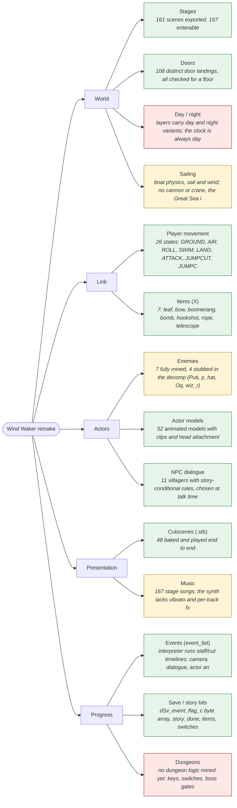

# The Wind Waker remake: one map

Generated by `tools/ww_game_chart.py`. Every status below is read out of the build or
the mined data - the player's own state machine, the item list, the enemy table, the
baked cutscenes, the story graph - so this cannot drift from what the engine does.

**Systems:** 9 working, 3 partial, 2 not started.  
**Story:** 41 of 42 mined steps reachable (1 partial, 0 missing) across 2 chapters: outset, fortress.

## 1. Systems

| system | status | evidence |
| --- | --- | --- |
| Stages | ok | 161 scenes exported, 157 enterable |
| Doors | ok | 108 distinct door landings, all checked for a floor |
| Player movement | ok | 26 states: GROUND, AIR, ROLL, SWIM, LAND, ATTACK, JUMPCUT, JUMPCUT_LAND, DAMAGE, GLIDE, CARRY, GRAB, VJUMP, HANG, CLIMB, LADDER, CLIMBWALL, AIM, ITEM_WAIT, HOOKPULL, SHIP, ROPE_THROW, ROPE, LOOK, CROUCH, CRAWL |
| Items (X) | ok | 7: leaf, bow, boomerang, bomb, hookshot, rope, telescope |
| Enemies | partial | 7 fully mined, 4 stubbed in the decomp (Puti, p_hat, Oq, wiz_r) |
| Actor models | ok | 52 animated models with clips and head attachment |
| Cutscenes (.stb) | ok | 48 baked and played end to end |
| Events (event_list) | ok | interpreter runs staff/cut timelines: camera, dialogue, actor animation |
| NPC dialogue | ok | 11 villagers with story-conditional rules, chosen at talk time |
| Music | partial | 167 stage songs; the synth lacks vibrato and per-track fx |
| Sailing | partial | boat physics, sail and wind; no cannon or crane, the Great Sea is one heavy scene |
| Save / story bits | ok | dSv_event_flag_c byte array, story_done, items, switches |
| Day / night | missing | layers carry day and night variants; the clock is always day |
| Dungeons | missing | no dungeon logic mined yet: keys, switches, boss gates |

## 2. Story

Solid arrows are story order; dotted arrows are event-bit dependencies, labelled
with the bit that carries them.

```mermaid
flowchart TD
    classDef ok fill:#e6f4ea,stroke:#1e7d34;
    classDef partial fill:#fff4d6,stroke:#a97f13;
    classDef missing fill:#fde7e7,stroke:#a51b1b;
    subgraph outset["outset"]
        opening_lookout_awake["opening_lookout_awake<br/>awake.stb<br/>sets 0x3510<br/><i>spawn - OK</i>"]
        aryll_tower_first_talk["aryll_tower_first_talk<br/><i>talk - OK</i>"]
        opening_lookout_awake --> aryll_tower_first_talk
        grandma_birthday_talk["grandma_birthday_talk<br/>tale_1<br/><i>talk - OK</i>"]
        aryll_tower_first_talk --> grandma_birthday_talk
        tale_demo_hero_clothes["tale_demo_hero_clothes<br/>tale.stb<br/>sets 0x2A80<br/><i>spawn - OK</i>"]
        grandma_birthday_talk --> tale_demo_hero_clothes
        aryll_omedeto["aryll_omedeto<br/>omedeto<br/><i>npc - OK</i>"]
        tale_demo_hero_clothes --> aryll_omedeto
        aryll_get_telescope["aryll_get_telescope<br/>get_telescope<br/><i>talk - OK</i>"]
        aryll_omedeto --> aryll_get_telescope
        telescope_watch_quill["telescope_watch_quill<br/>sets 0x0310<br/><i>look - OK</i>"]
        aryll_get_telescope --> telescope_watch_quill
        zelda_fly_helmaroc["zelda_fly_helmaroc<br/>kaizoku_zelda_fly.stb<br/>sets 0x0001<br/><i>look - OK</i>"]
        telescope_watch_quill --> zelda_fly_helmaroc
        aryll_etalk["aryll_etalk<br/>eTalk<br/><i>talk - OK</i>"]
        zelda_fly_helmaroc --> aryll_etalk
        grandma_after_prologue["grandma_after_prologue<br/>sets 0x0601<br/><i>talk - OK</i>"]
        aryll_etalk --> grandma_after_prologue
        orca_first_talk["orca_first_talk<br/>StartCamera<br/>sets 0x0640 (pre-prologue, msg 0x961) 0x0108 (post-prologue, msg 0x965)<br/><i>room_enter - OK</i>"]
        grandma_after_prologue --> orca_first_talk
        orca_sparring_lesson["orca_sparring_lesson<br/>Ji1_linkmove<br/><i>talk - OK</i>"]
        orca_first_talk --> orca_sparring_lesson
        orca_gives_hero_sword["orca_gives_hero_sword<br/>Ji1_SwordGetTalkEnd<br/>sets 0x2F10<br/><i>talk - OK</i>"]
        orca_sparring_lesson --> orca_gives_hero_sword
        orca_spin_attack_lesson["orca_spin_attack_lesson<br/>Ji1_kaiten<br/>sets 0x0501<br/><i>talk - OK</i>"]
        orca_gives_hero_sword --> orca_spin_attack_lesson
        grandma_after_sword["grandma_after_sword<br/>sets 0x0602<br/><i>talk - OK</i>"]
        orca_spin_attack_lesson --> grandma_after_sword
        amori_bokoblin_dropin["amori_bokoblin_dropin<br/>AMORI_DEMO_1<br/>sets 0x0004<br/><i>tag - OK</i>"]
        grandma_after_sword --> amori_bokoblin_dropin
        amori_meet_tetra["amori_meet_tetra<br/>meet_tetra.stb<br/>sets 0x0101<br/><i>tag - OK</i>"]
        amori_bokoblin_dropin --> amori_meet_tetra
        outset_ridge_layer9["outset_ridge_layer9<br/><i>spawn - OK</i>"]
        amori_meet_tetra --> outset_ridge_layer9
        stolen_sister["stolen_sister<br/>stolensister.stb<br/>sets 0x0E20<br/><i>tag - OK</i>"]
        outset_ridge_layer9 --> stolen_sister
        outset_village_layer2["outset_village_layer2<br/><i>spawn - OK</i>"]
        stolen_sister --> outset_village_layer2
        look_shield["look_shield<br/>LOOK_SHIELD<br/>sets 0x3202<br/><i>tag - OK</i>"]
        outset_village_layer2 --> look_shield
        grandma_gives_shield["grandma_gives_shield<br/>get_shield.stb<br/><i>talk - OK</i>"]
        look_shield --> grandma_gives_shield
        grandma_after_kidnap["grandma_after_kidnap<br/>sets 0x0740<br/><i>talk - OK</i>"]
        grandma_gives_shield --> grandma_after_kidnap
        tetra_dock_conversation["tetra_dock_conversation<br/>yuukaigo<br/><i>npc - OK</i>"]
        grandma_after_kidnap --> tetra_dock_conversation
        tetra_board_ship["tetra_board_ship<br/><i>talk - OK</i>"]
        tetra_dock_conversation --> tetra_board_ship
        departure["departure<br/>departure.stb<br/>sets 0x2401<br/><i>spawn - OK</i>"]
        tetra_board_ship --> departure
        aj_speak_ambient["aj_speak_ambient<br/>AJ_SPEAK<br/><i>talk - PARTIAL</i>"]
        departure --> aj_speak_ambient
        post_outset_note["post_outset_note<br/><i>spawn - OK</i>"]
        aj_speak_ambient --> post_outset_note
    end
    subgraph fortress["fortress"]
        ff_ride_to_fortress["ff_ride_to_fortress<br/><i>spawn - OK</i>"]
        ff_launched_at_fortress["ff_launched_at_fortress<br/>sets 0x0808<br/><i>spawn - OK</i>"]
        ff_ride_to_fortress --> ff_launched_at_fortress
        ff_arrive_exterior["ff_arrive_exterior<br/>Go_00<br/><i>spawn - OK</i>"]
        ff_launched_at_fortress --> ff_arrive_exterior
        ff_tower_looks["ff_tower_looks<br/>TowerLook3<br/><i>spawn - OK</i>"]
        ff_arrive_exterior --> ff_tower_looks
        ff_tetra_ooi["ff_tetra_ooi<br/>ooi<br/>sets 0x0804<br/><i>npc - OK</i>"]
        ff_tower_looks --> ff_tetra_ooi
        ff_infiltration["ff_infiltration<br/>maju_shinnyu.stb<br/>sets 0x0801<br/><i>npc - OK</i>"]
        ff_tetra_ooi --> ff_infiltration
        ff_searchlight_look["ff_searchlight_look<br/>SerchLook1<br/><i>tag - OK</i>"]
        ff_infiltration --> ff_searchlight_look
        ff_push_barrel["ff_push_barrel<br/>push<br/><i>tag - OK</i>"]
        ff_searchlight_look --> ff_push_barrel
        ff_interior_cells["ff_interior_cells<br/>kankin1<br/><i>spawn - OK</i>"]
        ff_push_barrel --> ff_interior_cells
        ff_door_looks["ff_door_looks<br/>DoorLook1<br/><i>tag - OK</i>"]
        ff_interior_cells --> ff_door_looks
        ff_moblin_patrol["ff_moblin_patrol<br/>moro_cam<br/><i>tag - OK</i>"]
        ff_door_looks --> ff_moblin_patrol
        ff_find_sister["ff_find_sister<br/>find_sister.stb<br/><i>spawn - OK</i>"]
        ff_moblin_patrol --> ff_find_sister
        ff_meet_korl["ff_meet_korl<br/>meetshishioh.stb<br/>sets 0x0F80<br/><i>spawn - OK</i>"]
        ff_find_sister --> ff_meet_korl
        ff_board_korl["ff_board_korl<br/>sets 0x2A08<br/><i>board - OK</i>"]
        ff_meet_korl --> ff_board_korl
    end
    tale_demo_hero_clothes -.->|0x2A80| aryll_omedeto
    telescope_watch_quill -.->|0x0310| zelda_fly_helmaroc
    zelda_fly_helmaroc -.->|0x0001| aryll_etalk
    zelda_fly_helmaroc -.->|0x0001| grandma_after_prologue
    zelda_fly_helmaroc -.->|0x0001| orca_gives_hero_sword
    amori_meet_tetra -.->|0x0101| outset_ridge_layer9
    amori_meet_tetra -.->|0x0101| stolen_sister
    stolen_sister -.->|0x0E20| outset_village_layer2
    stolen_sister -.->|0x0E20| look_shield
    stolen_sister -.->|0x0E20| grandma_gives_shield
    look_shield -.->|0x3202| grandma_gives_shield
    stolen_sister -.->|0x0E20| grandma_after_kidnap
    stolen_sister -.->|0x0E20| tetra_dock_conversation
    stolen_sister -.->|0x0E20| tetra_board_ship
    stolen_sister -.->|0x0E20| departure
    departure -.->|0x2401| ff_ride_to_fortress
    departure -.->|0x2401| ff_launched_at_fortress
    ff_infiltration -.->|0x0801| ff_interior_cells
    ff_infiltration -.->|0x0801| ff_find_sister
    ff_meet_korl -.->|0x0F80| ff_board_korl
    class opening_lookout_awake,aryll_tower_first_talk,grandma_birthday_talk,tale_demo_hero_clothes,aryll_omedeto,aryll_get_telescope,telescope_watch_quill,zelda_fly_helmaroc,aryll_etalk,grandma_after_prologue,orca_first_talk,orca_sparring_lesson,orca_gives_hero_sword,orca_spin_attack_lesson,grandma_after_sword,amori_bokoblin_dropin,amori_meet_tetra,outset_ridge_layer9,stolen_sister,outset_village_layer2,look_shield,grandma_gives_shield,grandma_after_kidnap,tetra_dock_conversation,tetra_board_ship,departure,post_outset_note,ff_ride_to_fortress,ff_launched_at_fortress,ff_arrive_exterior,ff_tower_looks,ff_tetra_ooi,ff_infiltration,ff_searchlight_look,ff_push_barrel,ff_interior_cells,ff_door_looks,ff_moblin_patrol,ff_find_sister,ff_meet_korl,ff_board_korl ok;
    class aj_speak_ambient partial;
```

| chapter | step | trigger | event | sets | status | why |
| --- | --- | --- | --- | --- | --- | --- |
| outset | opening_lookout_awake | spawn | awake | 0x3510 | ok | Game._place_player - a PLYR spawn's params >> 24 indexes the stage EVNT table |
| outset | aryll_tower_first_talk | talk |  |  | ok | Game.story_talk - via actors/npc.gd |
| outset | grandma_birthday_talk | talk | tale_1 |  | ok | Game.story_talk - via actors/npc.gd |
| outset | tale_demo_hero_clothes | spawn | TALE_DEMO | 0x2A80 | ok | Game._place_player - a PLYR spawn's params >> 24 indexes the stage EVNT table |
| outset | aryll_omedeto | npc | omedeto |  | ok | Game.story_npc_tick - proximity, or ordered as the actor is placed |
| outset | aryll_get_telescope | talk | get_telescope |  | ok | Game.story_talk - via actors/npc.gd |
| outset | telescope_watch_quill | look |  | 0x0310 | ok | Game.telescope_look - the Telescope's scope look at the step's target |
| outset | zelda_fly_helmaroc | look | zelda_fly | 0x0001 | ok | Game.telescope_look - the Telescope's scope look at the step's target |
| outset | aryll_etalk | talk | eTalk |  | ok | Game.story_talk - via actors/npc.gd |
| outset | grandma_after_prologue | talk |  | 0x0601 | ok | Game.story_talk - via actors/npc.gd |
| outset | orca_first_talk | room_enter | StartCamera | 0x0640 (pre-prologue, msg 0x961) 0x0108 (post-prologue, msg 0x965) | ok | stage.gd - the stage's arrival event runs on load |
| outset | orca_sparring_lesson | talk | Ji1_linkmove |  | ok | Game.story_talk - via actors/npc.gd |
| outset | orca_gives_hero_sword | talk | Ji1_SwordGetTalkEnd | 0x2F10 | ok | Game.story_talk - via actors/npc.gd |
| outset | orca_spin_attack_lesson | talk | Ji1_kaiten | 0x0501 | ok | Game.story_talk - via actors/npc.gd |
| outset | grandma_after_sword | talk |  | 0x0602 | ok | Game.story_talk - via actors/npc.gd |
| outset | amori_bokoblin_dropin | tag | AMORI_DEMO_1 | 0x0004 | ok | actors/tag_event.gd - a TagEv volume orders its EVNT entry |
| outset | amori_meet_tetra | tag | MEET_TETORA | 0x0101 | ok | actors/tag_event.gd - a TagEv volume orders its EVNT entry |
| outset | outset_ridge_layer9 | spawn |  |  | ok | Game._place_player - a PLYR spawn's params >> 24 indexes the stage EVNT table |
| outset | stolen_sister | tag | STOLENSISTER | 0x0E20 | ok | actors/tag_event.gd - a TagEv volume orders its EVNT entry |
| outset | outset_village_layer2 | spawn |  |  | ok | Game._place_player - a PLYR spawn's params >> 24 indexes the stage EVNT table |
| outset | look_shield | tag | LOOK_SHIELD | 0x3202 | ok | actors/tag_event.gd - a TagEv volume orders its EVNT entry |
| outset | grandma_gives_shield | talk | get_shield |  | ok | Game.story_talk - via actors/npc.gd |
| outset | grandma_after_kidnap | talk |  | 0x0740 | ok | Game.story_talk - via actors/npc.gd |
| outset | tetra_dock_conversation | npc | yuukaigo |  | ok | Game.story_npc_tick - proximity, or ordered as the actor is placed |
| outset | tetra_board_ship | talk |  |  | ok | Game.story_talk - via actors/npc.gd |
| outset | departure | spawn | departure_DEMO | 0x2401 | ok | Game._place_player - a PLYR spawn's params >> 24 indexes the stage EVNT table |
| outset | aj_speak_ambient | talk | AJ_SPEAK |  | partial | mined with low confidence |
| outset | post_outset_note | spawn |  |  | ok | Game._place_player - a PLYR spawn's params >> 24 indexes the stage EVNT table |
| fortress | ff_ride_to_fortress | spawn |  |  | ok | Game._place_player - a PLYR spawn's params >> 24 indexes the stage EVNT table |
| fortress | ff_launched_at_fortress | spawn |  | 0x0808 | ok | Game._place_player - a PLYR spawn's params >> 24 indexes the stage EVNT table |
| fortress | ff_arrive_exterior | spawn | Go_00 |  | ok | Game._place_player - a PLYR spawn's params >> 24 indexes the stage EVNT table |
| fortress | ff_tower_looks | spawn | TowerLook3 |  | ok | Game._place_player - a PLYR spawn's params >> 24 indexes the stage EVNT table |
| fortress | ff_tetra_ooi | npc | ooi | 0x0804 | ok | Game.story_npc_tick - proximity, or ordered as the actor is placed |
| fortress | ff_infiltration | npc | majyuu_shinnyuu | 0x0801 | ok | Game.story_npc_tick - proximity, or ordered as the actor is placed |
| fortress | ff_searchlight_look | tag | SerchLook1 |  | ok | actors/tag_event.gd - a TagEv volume orders its EVNT entry |
| fortress | ff_push_barrel | tag | push |  | ok | actors/tag_event.gd - a TagEv volume orders its EVNT entry |
| fortress | ff_interior_cells | spawn | kankin1 |  | ok | Game._place_player - a PLYR spawn's params >> 24 indexes the stage EVNT table |
| fortress | ff_door_looks | tag | DoorLook1 |  | ok | actors/tag_event.gd - a TagEv volume orders its EVNT entry |
| fortress | ff_moblin_patrol | tag | moro_cam |  | ok | actors/tag_event.gd - a TagEv volume orders its EVNT entry |
| fortress | ff_find_sister | spawn | FIND_SISTER |  | ok | Game._place_player - a PLYR spawn's params >> 24 indexes the stage EVNT table |
| fortress | ff_meet_korl | spawn | MEETSHISHIOH | 0x0F80 | ok | Game._place_player - a PLYR spawn's params >> 24 indexes the stage EVNT table |
| fortress | ff_board_korl | board |  | 0x2A08 | ok | player.gd board() raises RODE_KORL the first time Link boards the boat |

## 3. What is not mined yet

The story graph covers the chapters listed above. Everything after them - Dragon
Roost, the Forbidden Woods, the Tower of the Gods, Hyrule and the Master Sword,
the second Forsaken Fortress, the Earth and Wind temples and Ganon's Tower - has
no graph, so there is nothing for the engine or a test bot to follow there.
Mining a chapter means: run `tools/ww_story_mine.py <stages>` for its stages,
read the actors that order the events it names, and write one
`gcrip/data/ww_story_<chapter>.json` in the same schema.

