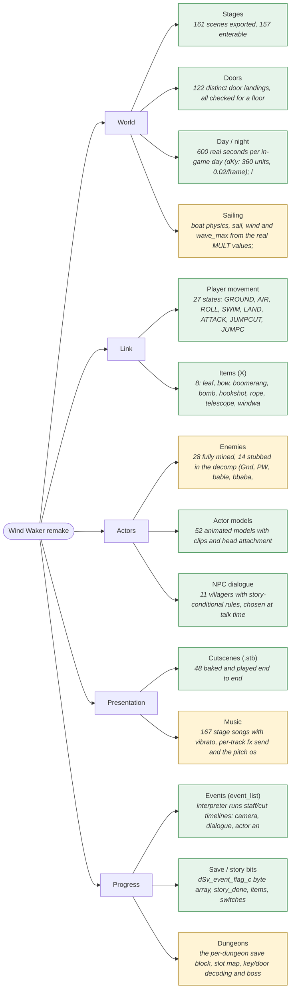

# The Wind Waker remake: one map

Generated by `tools/ww_game_chart.py`. Every status below is read out of the build or
the mined data - the player's own state machine, the item list, the enemy table, the
baked cutscenes, the story graph - so this cannot drift from what the engine does.

**Systems:** 10 working, 4 partial, 0 not started.  
**Story:** 369 of 415 mined steps reachable (20 partial, 26 missing) across 18 chapters: outset, fortress, dragonroost, forbiddenwoods, jabun, towerofgods, hyrule, temples, fortress2, ganon, ganontower, caves, gallery, houses, labyrinths, minigames, triforce, windfall.

## 1. Systems



| system | status | evidence |
| --- | --- | --- |
| Stages | ok | 161 scenes exported, 157 enterable |
| Doors | ok | 122 distinct door landings, all checked for a floor |
| Player movement | ok | 27 states: GROUND, AIR, ROLL, SWIM, LAND, ATTACK, JUMPCUT, JUMPCUT_LAND, DAMAGE, GLIDE, CARRY, GRAB, VJUMP, HANG, CLIMB, LADDER, CLIMBWALL, AIM, ITEM_WAIT, HOOKPULL, SHIP, ROPE_THROW, ROPE, LOOK, CROUCH, CRAWL, CONDUCT |
| Items (X) | ok | 8: leaf, bow, boomerang, bomb, hookshot, rope, telescope, windwaker |
| Enemies | partial | 28 fully mined, 14 stubbed in the decomp (Gnd, PW, bable, bbaba, magtail, nezumi, Sss, Puti, gmos, wiz_r, Oq, p_hat, pow, Oqw) |
| Actor models | ok | 52 animated models with clips and head attachment |
| Cutscenes (.stb) | ok | 48 baked and played end to end |
| Events (event_list) | ok | interpreter runs staff/cut timelines: camera, dialogue, actor animation |
| NPC dialogue | ok | 11 villagers with story-conditional rules, chosen at talk time |
| Music | partial | 167 stage songs with vibrato, per-track fx send and the pitch oscillator mined from JAudio; the scene-level reverb amount is still a chosen constant, and no sound effects at all (ww_sound_effects.json maps the banks and the 28 footstep surfaces) |
| Sailing | partial | boat physics, sail, wind and wave_max from the real MULT values; no cannon, crane or cyclones, and the Great Sea is one heavy scene - its RTBL streaming rule is mined (ww_greatsea.json) but not built |
| Save / story bits | ok | dSv_event_flag_c byte array, story_done, items, switches |
| Day / night | ok | 600 real seconds per in-game day (dKy: 360 units, 0.02/frame); layers swap at 6 and 18 |
| Dungeons | partial | the per-dungeon save block, slot map, key/door decoding and boss flags are mined (ww_dungeons.json); boss deaths and room clears work, but keys, locked doors and the dungeon-item mask are not wired into the engine |

## 2. Story

Solid arrows are story order; dotted arrows are event-bit dependencies, labelled
with the bit that carries them.

```mermaid
flowchart TD
    classDef ok fill:#e6f4ea,stroke:#1e7d34;
    classDef partial fill:#fff4d6,stroke:#a97f13;
    classDef missing fill:#fde7e7,stroke:#a51b1b;
    subgraph outset["outset"]
        opening_lookout_awake["opening_lookout_awake<br/>awake.stb<br/>sets 0x3510<br/><i>spawn - OK</i>"]
        aryll_tower_first_talk["aryll_tower_first_talk<br/><i>talk - OK</i>"]
        opening_lookout_awake --> aryll_tower_first_talk
        grandma_birthday_talk["grandma_birthday_talk<br/>tale_1<br/><i>talk - OK</i>"]
        aryll_tower_first_talk --> grandma_birthday_talk
        tale_demo_hero_clothes["tale_demo_hero_clothes<br/>tale.stb<br/>sets 0x2A80<br/><i>spawn - OK</i>"]
        grandma_birthday_talk --> tale_demo_hero_clothes
        aryll_omedeto["aryll_omedeto<br/>omedeto<br/><i>npc - OK</i>"]
        tale_demo_hero_clothes --> aryll_omedeto
        aryll_get_telescope["aryll_get_telescope<br/>get_telescope<br/><i>talk - OK</i>"]
        aryll_omedeto --> aryll_get_telescope
        telescope_watch_quill["telescope_watch_quill<br/>sets 0x0310<br/><i>look - OK</i>"]
        aryll_get_telescope --> telescope_watch_quill
        zelda_fly_helmaroc["zelda_fly_helmaroc<br/>kaizoku_zelda_fly.stb<br/>sets 0x0001<br/><i>look - OK</i>"]
        telescope_watch_quill --> zelda_fly_helmaroc
        aryll_etalk["aryll_etalk<br/>eTalk<br/><i>talk - OK</i>"]
        zelda_fly_helmaroc --> aryll_etalk
        grandma_after_prologue["grandma_after_prologue<br/>sets 0x0601<br/><i>talk - OK</i>"]
        aryll_etalk --> grandma_after_prologue
        orca_first_talk["orca_first_talk<br/>StartCamera<br/>sets 0x0640 (pre-prologue, msg 0x961) 0x0108 (post-prologue, msg 0x965)<br/><i>room_enter - OK</i>"]
        grandma_after_prologue --> orca_first_talk
        orca_sparring_lesson["orca_sparring_lesson<br/>Ji1_linkmove<br/><i>talk - OK</i>"]
        orca_first_talk --> orca_sparring_lesson
        orca_gives_hero_sword["orca_gives_hero_sword<br/>Ji1_SwordGetTalkEnd<br/>sets 0x2F10<br/><i>talk - OK</i>"]
        orca_sparring_lesson --> orca_gives_hero_sword
        orca_spin_attack_lesson["orca_spin_attack_lesson<br/>Ji1_kaiten<br/>sets 0x0501<br/><i>talk - OK</i>"]
        orca_gives_hero_sword --> orca_spin_attack_lesson
        grandma_after_sword["grandma_after_sword<br/>sets 0x0602<br/><i>talk - OK</i>"]
        orca_spin_attack_lesson --> grandma_after_sword
        amori_bokoblin_dropin["amori_bokoblin_dropin<br/>AMORI_DEMO_1<br/>sets 0x0004<br/><i>tag - OK</i>"]
        grandma_after_sword --> amori_bokoblin_dropin
        amori_meet_tetra["amori_meet_tetra<br/>meet_tetra.stb<br/>sets 0x0101<br/><i>tag - OK</i>"]
        amori_bokoblin_dropin --> amori_meet_tetra
        outset_ridge_layer9["outset_ridge_layer9<br/><i>spawn - OK</i>"]
        amori_meet_tetra --> outset_ridge_layer9
        stolen_sister["stolen_sister<br/>stolensister.stb<br/>sets 0x0E20<br/><i>tag - OK</i>"]
        outset_ridge_layer9 --> stolen_sister
        outset_village_layer2["outset_village_layer2<br/><i>spawn - OK</i>"]
        stolen_sister --> outset_village_layer2
        look_shield["look_shield<br/>LOOK_SHIELD<br/>sets 0x3202<br/><i>tag - OK</i>"]
        outset_village_layer2 --> look_shield
        grandma_gives_shield["grandma_gives_shield<br/>get_shield.stb<br/><i>talk - OK</i>"]
        look_shield --> grandma_gives_shield
        grandma_after_kidnap["grandma_after_kidnap<br/>sets 0x0740<br/><i>talk - OK</i>"]
        grandma_gives_shield --> grandma_after_kidnap
        tetra_dock_conversation["tetra_dock_conversation<br/>yuukaigo<br/><i>npc - OK</i>"]
        grandma_after_kidnap --> tetra_dock_conversation
        tetra_board_ship["tetra_board_ship<br/><i>talk - OK</i>"]
        tetra_dock_conversation --> tetra_board_ship
        departure["departure<br/>departure.stb<br/>sets 0x2401 0x2401 0x2401 0x2401 0x2401 0x2401<br/><i>spawn - OK</i>"]
        tetra_board_ship --> departure
        aj_speak_ambient["aj_speak_ambient<br/>AJ_SPEAK<br/><i>talk - PARTIAL</i>"]
        departure --> aj_speak_ambient
        post_outset_note["post_outset_note<br/><i>spawn - OK</i>"]
        aj_speak_ambient --> post_outset_note
    end
    subgraph fortress["fortress"]
        ff_ride_to_fortress["ff_ride_to_fortress<br/><i>spawn - OK</i>"]
        ff_launched_at_fortress["ff_launched_at_fortress<br/>sets 0x0808<br/><i>spawn - OK</i>"]
        ff_ride_to_fortress --> ff_launched_at_fortress
        ff_arrive_exterior["ff_arrive_exterior<br/>Go_00<br/><i>spawn - OK</i>"]
        ff_launched_at_fortress --> ff_arrive_exterior
        ff_tower_looks["ff_tower_looks<br/>TowerLook3<br/><i>spawn - OK</i>"]
        ff_arrive_exterior --> ff_tower_looks
        ff_tetra_ooi["ff_tetra_ooi<br/>ooi<br/>sets 0x0804<br/><i>npc - OK</i>"]
        ff_tower_looks --> ff_tetra_ooi
        ff_infiltration["ff_infiltration<br/>maju_shinnyu.stb<br/>sets 0x0801<br/><i>npc - OK</i>"]
        ff_tetra_ooi --> ff_infiltration
        ff_searchlight_look["ff_searchlight_look<br/>SerchLook1<br/><i>tag - OK</i>"]
        ff_infiltration --> ff_searchlight_look
        ff_push_barrel["ff_push_barrel<br/>push<br/><i>tag - OK</i>"]
        ff_searchlight_look --> ff_push_barrel
        ff_interior_cells["ff_interior_cells<br/>kankin1<br/><i>spawn - OK</i>"]
        ff_push_barrel --> ff_interior_cells
        ff_door_looks["ff_door_looks<br/>DoorLook1<br/><i>tag - OK</i>"]
        ff_interior_cells --> ff_door_looks
        ff_moblin_patrol["ff_moblin_patrol<br/>moro_cam<br/><i>tag - OK</i>"]
        ff_door_looks --> ff_moblin_patrol
        ff_find_sister["ff_find_sister<br/>find_sister.stb<br/>sets 0x2580 0x2580 0x2580 0x2580 0x2580<br/><i>spawn - OK</i>"]
        ff_moblin_patrol --> ff_find_sister
        ff_meet_korl["ff_meet_korl<br/>meetshishioh.stb<br/>sets 0x0F80 0x2E01 0x2E01 0x2E01 0x2E01 0x2E01<br/><i>spawn - OK</i>"]
        ff_find_sister --> ff_meet_korl
        ff_board_korl["ff_board_korl<br/>sets 0x2A08<br/><i>board - OK</i>"]
        ff_meet_korl --> ff_board_korl
    end
    subgraph dragonroost["dragonroost"]
        dr_arrive_island["dr_arrive_island<br/>ARRIVAL_DRG<br/>sets 0x0902<br/><i>tag - OK</i>"]
        dr_chieftain_dragontale["dr_chieftain_dragontale<br/>dragontale.stb<br/><i>tag - OK</i>"]
        dr_arrive_island --> dr_chieftain_dragontale
        dr_medli_gives_letter["dr_medli_gives_letter<br/>Md_ItemGet<br/>sets 0x0E02<br/><i>talk - OK</i>"]
        dr_chieftain_dragontale --> dr_medli_gives_letter
        dr_komali_refuses["dr_komali_refuses<br/><i>talk - PARTIAL</i>"]
        dr_medli_gives_letter --> dr_komali_refuses
        dr_medli_cliff_request["dr_medli_cliff_request<br/>md_cliff<br/>sets 0x1104<br/><i>talk - OK</i>"]
        dr_komali_refuses --> dr_medli_cliff_request
        dr_throw_medli_to_ledge["dr_throw_medli_to_ledge<br/>MD_FLY<br/>sets 0x1102<br/><i>npc_tag - OK</i>"]
        dr_medli_cliff_request --> dr_throw_medli_to_ledge
        dr_bomb_the_spring["dr_bomb_the_spring<br/>Eskban<br/><i>npc - OK</i>"]
        dr_throw_medli_to_ledge --> dr_bomb_the_spring
        dr_enter_cavern["dr_enter_cavern<br/>TELOP_DORAGON<br/><i>tag - OK</i>"]
        dr_bomb_the_spring --> dr_enter_cavern
        dr_cavern_set_pieces["dr_cavern_set_pieces<br/>moro_cut<br/><i>tag - OK</i>"]
        dr_enter_cavern --> dr_cavern_set_pieces
        dr_trapped_with_bokoblins["dr_trapped_with_bokoblins<br/>MORI1_EVENT<br/><i>tag - OK</i>"]
        dr_cavern_set_pieces --> dr_trapped_with_bokoblins
        dr_clear_room_bars_open["dr_clear_room_bars_open<br/>DEFAULT_STOP_OPEN<br/>sets 0x1140<br/><i>defeat - OK</i>"]
        dr_trapped_with_bokoblins --> dr_clear_room_bars_open
        dr_grappling_hook["dr_grappling_hook<br/>Md_RopeGet<br/>sets 0x1101<br/><i>talk - OK</i>"]
        dr_clear_room_bars_open --> dr_grappling_hook
        dr_carry_medli["dr_carry_medli<br/>Md_Fly2<br/>sets 0x1280<br/><i>npc - OK</i>"]
        dr_grappling_hook --> dr_carry_medli
        dr_gohma["dr_gohma<br/><i>defeat - OK</i>"]
        dr_carry_medli --> dr_gohma
        dr_boss_warp_out["dr_boss_warp_out<br/>WARP_WIND<br/><i>npc - OK</i>"]
        dr_gohma --> dr_boss_warp_out
        dr_valoo_calms["dr_valoo_calms<br/>howling.stb<br/>sets 0x3908<br/><i>spawn - OK</i>"]
        dr_boss_warp_out --> dr_valoo_calms
        dr_dins_pearl["dr_dins_pearl<br/>getperl_komori.stb<br/><i>spawn - OK</i>"]
        dr_valoo_calms --> dr_dins_pearl
        dr_secret_cave["dr_secret_cave<br/><i>room_enter - OK</i>"]
        dr_dins_pearl --> dr_secret_cave
    end
    subgraph forbiddenwoods["forbiddenwoods"]
        fw_korl_sends_link_to_forest["fw_korl_sends_link_to_forest<br/>sets 0x0A80<br/><i>talk - OK</i>"]
        fw_arrive_forest_haven["fw_arrive_forest_haven<br/>ARRIVAL_FST<br/>sets 0x0A20<br/><i>tag - OK</i>"]
        fw_korl_sends_link_to_forest --> fw_arrive_forest_haven
        fw_korl_forest_directions["fw_korl_forest_directions<br/>sets 0x2B80<br/><i>talk - OK</i>"]
        fw_arrive_forest_haven --> fw_korl_forest_directions
        fw_forest_haven_looks["fw_forest_haven_looks<br/>R29LOOK_KINDAN<br/><i>spawn - OK</i>"]
        fw_korl_forest_directions --> fw_forest_haven_looks
        fw_fall_into_forest_haven["fw_fall_into_forest_haven<br/>fall<br/><i>tag - OK</i>"]
        fw_forest_haven_looks --> fw_fall_into_forest_haven
        fw_mori_inside["fw_mori_inside<br/>MORI_INSIDE<br/><i>spawn - OK</i>"]
        fw_fall_into_forest_haven --> fw_mori_inside
        fw_meet_deku_tree["fw_meet_deku_tree<br/>meet_deku.stb<br/>sets 0x1801<br/><i>npc - OK</i>"]
        fw_mori_inside --> fw_meet_deku_tree
        fw_koroks_and_lift["fw_koroks_and_lift<br/>Calling<br/><i>npc - PARTIAL</i>"]
        fw_meet_deku_tree --> fw_koroks_and_lift
        fw_get_deku_leaf["fw_get_deku_leaf<br/><i>item - OK</i>"]
        fw_koroks_and_lift --> fw_get_deku_leaf
        fw_glide_to_forbidden_woods["fw_glide_to_forbidden_woods<br/><i>room_enter - PARTIAL</i>"]
        fw_get_deku_leaf --> fw_glide_to_forbidden_woods
        fw_woods_telop["fw_woods_telop<br/>TELOP_FOREST<br/><i>tag - OK</i>"]
        fw_glide_to_forbidden_woods --> fw_woods_telop
        fw_woods_cameras["fw_woods_cameras<br/>StartCam<br/><i>tag - OK</i>"]
        fw_woods_telop --> fw_woods_cameras
        fw_dungeon_items["fw_dungeon_items<br/><i>item - OK</i>"]
        fw_woods_cameras --> fw_dungeon_items
        fw_mothula["fw_mothula<br/><i>defeat - OK</i>"]
        fw_dungeon_items --> fw_mothula
        fw_get_boomerang["fw_get_boomerang<br/><i>item - OK</i>"]
        fw_mothula --> fw_get_boomerang
        fw_kalle_demos["fw_kalle_demos<br/><i>defeat - OK</i>"]
        fw_get_boomerang --> fw_kalle_demos
        fw_heart_container["fw_heart_container<br/><i>item - OK</i>"]
        fw_kalle_demos --> fw_heart_container
        fw_rescue_makar["fw_rescue_makar<br/>cb_rescue<br/><i>npc - OK</i>"]
        fw_heart_container --> fw_rescue_makar
        fw_warp_out_with_makar["fw_warp_out_with_makar<br/>WARP_WIND<br/><i>npc - OK</i>"]
        fw_rescue_makar --> fw_warp_out_with_makar
        fw_boss_warpout_to_forest_haven["fw_boss_warpout_to_forest_haven<br/>BOSS_WARPOUT<br/><i>spawn - OK</i>"]
        fw_warp_out_with_makar --> fw_boss_warpout_to_forest_haven
        fw_getperl_deku["fw_getperl_deku<br/>getperl_deku.stb<br/><i>spawn - OK</i>"]
        fw_boss_warpout_to_forest_haven --> fw_getperl_deku
        fw_makar_in_forest_haven["fw_makar_in_forest_haven<br/>sets 0x1904<br/><i>talk - OK</i>"]
        fw_getperl_deku --> fw_makar_in_forest_haven
        fw_korl_after_the_pearl["fw_korl_after_the_pearl<br/>sets 0x0A08 0x2A02<br/><i>talk - OK</i>"]
        fw_makar_in_forest_haven --> fw_korl_after_the_pearl
        fw_otkura_boundary["fw_otkura_boundary<br/>awake_kokiri.stb<br/>sets 0x1610 0x1604<br/><i>spawn - OK</i>"]
        fw_korl_after_the_pearl --> fw_otkura_boundary
    end
    subgraph jabun["jabun"]
        jab_korl_points_to_greatfish["jab_korl_points_to_greatfish<br/>sets 0x0A08<br/><i>talk - OK</i>"]
        jab_arrive_greatfish_ruined["jab_arrive_greatfish_ruined<br/>ARRIVAL_BRK<br/>sets 0x0A02<br/><i>tag - OK</i>"]
        jab_korl_points_to_greatfish --> jab_arrive_greatfish_ruined
        jab_korl_briefing_after_greatfish["jab_korl_briefing_after_greatfish<br/>sets 0x0A01<br/><i>talk - OK</i>"]
        jab_arrive_greatfish_ruined --> jab_korl_briefing_after_greatfish
        jab_quill_at_greatfish["jab_quill_at_greatfish<br/><i>talk - OK</i>"]
        jab_korl_briefing_after_greatfish --> jab_quill_at_greatfish
        jab_arrive_windfall_night["jab_arrive_windfall_night<br/>ARRIVAL_TWN<br/>sets 0x1F04<br/><i>tag - OK</i>"]
        jab_quill_at_greatfish --> jab_arrive_windfall_night
        jab_bombshop_raid["jab_bombshop_raid<br/>bombshop.stb<br/>sets 0x2110 0x3B20 0x2110 0x2110 0x2110 0x2110 0x2110<br/><i>tag - OK</i>"]
        jab_arrive_windfall_night --> jab_bombshop_raid
        jab_bombshop_owner["jab_bombshop_owner<br/>BMS_LAND_DEMO<br/><i>npc - PARTIAL</i>"]
        jab_bombshop_raid --> jab_bombshop_owner
        jab_password_door["jab_password_door<br/>sets 0x1910 0x3B20<br/><i>talk - OK</i>"]
        jab_bombshop_owner --> jab_password_door
        jab_board_pirate_ship["jab_board_pirate_ship<br/><i>room_enter - OK</i>"]
        jab_password_door --> jab_board_pirate_ship
        jab_niko_second_course_intro["jab_niko_second_course_intro<br/>P2B_INTRO_2<br/><i>npc - PARTIAL</i>"]
        jab_board_pirate_ship --> jab_niko_second_course_intro
        jab_rope_course_2["jab_rope_course_2<br/>Hlift_up<br/><i>npc - OK</i>"]
        jab_niko_second_course_intro --> jab_rope_course_2
        jab_rope_course_2_cleared["jab_rope_course_2_cleared<br/>P2B_GOAL_2<br/><i>npc - OK</i>"]
        jab_rope_course_2 --> jab_rope_course_2_cleared
        jab_get_bomb_bag["jab_get_bomb_bag<br/>P2B_BOMB_GET<br/><i>chest - OK</i>"]
        jab_rope_course_2_cleared --> jab_get_bomb_bag
        jab_korl_briefing_after_bombs["jab_korl_briefing_after_bombs<br/>sets 0x1F02<br/><i>talk - OK</i>"]
        jab_get_bomb_bag --> jab_korl_briefing_after_bombs
        jab_return_to_outset["jab_return_to_outset<br/>PUROLO_RETURN<br/>sets 0x3E10<br/><i>tag - OK</i>"]
        jab_korl_briefing_after_bombs --> jab_return_to_outset
        jab_blow_open_the_cave["jab_blow_open_the_cave<br/>ajav_uzu<br/><i>hit - OK</i>"]
        jab_return_to_outset --> jab_blow_open_the_cave
        jab_receive_nayrus_pearl["jab_receive_nayrus_pearl<br/>getperl_jab.stb<br/>sets 0x3920 0x3920 0x3920 0x3920 0x3920 0x3920<br/><i>spawn - OK</i>"]
        jab_blow_open_the_cave --> jab_receive_nayrus_pearl
        jab_curse_broken["jab_curse_broken<br/>sets 0x2F20<br/><i>talk - OK</i>"]
        jab_receive_nayrus_pearl --> jab_curse_broken
        jab_abship_not_in_this_chapter["jab_abship_not_in_this_chapter<br/>hasigo_down<br/><i>room_enter - OK</i>"]
        jab_curse_broken --> jab_abship_not_in_this_chapter
    end
    subgraph towerofgods["towerofgods"]
        totg_pearl_din["totg_pearl_din<br/>DOGUU_DEMO1<br/><i>npc - OK</i>"]
        totg_first_statue_reaction["totg_first_statue_reaction<br/>DOGUU_DEMO2<br/><i>npc - OK</i>"]
        totg_pearl_din --> totg_first_statue_reaction
        totg_place_pearl["totg_place_pearl<br/>DOGUU_DEMO3<br/>sets 0x1480 0x1440 0x1410<br/><i>npc - OK</i>"]
        totg_first_statue_reaction --> totg_place_pearl
        totg_tower_rises["totg_tower_rises<br/>MEGAMI_DEMO<br/>sets 0x1E40<br/><i>npc - OK</i>"]
        totg_place_pearl --> totg_tower_rises
        totg_tower_rises_cutscene["totg_tower_rises_cutscene<br/>towerd.stb<br/>sets 0x2E80 0x2E80 0x2E80 0x2E80 0x2E80 0x2E80<br/><i>spawn - OK</i>"]
        totg_tower_rises --> totg_tower_rises_cutscene
        totg_arrive_tower["totg_arrive_tower<br/><i>spawn - OK</i>"]
        totg_tower_rises_cutscene --> totg_arrive_tower
        totg_enter_dungeon["totg_enter_dungeon<br/>moro_scam<br/><i>spawn - OK</i>"]
        totg_arrive_tower --> totg_enter_dungeon
        totg_interior_camera_beats["totg_interior_camera_beats<br/>moro_R06<br/><i>tag - OK</i>"]
        totg_enter_dungeon --> totg_interior_camera_beats
        totg_wake_servants["totg_wake_servants<br/>Os_Wakeup<br/>sets 0x1780 0x1740 0x1720<br/><i>npc - OK</i>"]
        totg_interior_camera_beats --> totg_wake_servants
        totg_trial_east["totg_trial_east<br/>Os_Finit0<br/>sets 0x1710<br/><i>npc - OK</i>"]
        totg_wake_servants --> totg_trial_east
        totg_trial_west["totg_trial_west<br/>Os1_Finit0<br/>sets 0x1704<br/><i>npc - OK</i>"]
        totg_trial_east --> totg_trial_west
        totg_trial_north["totg_trial_north<br/>Os2_Finit0<br/>sets 0x1B01<br/><i>npc - OK</i>"]
        totg_trial_west --> totg_trial_north
        totg_pedestals_done["totg_pedestals_done<br/><i>npc - OK</i>"]
        totg_trial_north --> totg_pedestals_done
        totg_warp_up["totg_warp_up<br/>TOWER_WARP_U<br/><i>warp - OK</i>"]
        totg_pedestals_done --> totg_warp_up
        totg_big_key["totg_big_key<br/><i>chest - OK</i>"]
        totg_warp_up --> totg_big_key
        totg_darknut["totg_darknut<br/>SIREN_MD<br/><i>tag - OK</i>"]
        totg_big_key --> totg_darknut
        totg_get_bow["totg_get_bow<br/><i>chest - OK</i>"]
        totg_darknut --> totg_get_bow
        totg_gohdan["totg_gohdan<br/><i>enemy_defeat - OK</i>"]
        totg_get_bow --> totg_gohdan
        totg_heart_container["totg_heart_container<br/><i>room_enter - OK</i>"]
        totg_gohdan --> totg_heart_container
        totg_boss_warp["totg_boss_warp<br/>WARP_WIND<br/><i>warp - OK</i>"]
        totg_heart_container --> totg_boss_warp
        totg_descend_shaft["totg_descend_shaft<br/>JMP_DEMO<br/><i>spawn - OK</i>"]
        totg_boss_warp --> totg_descend_shaft
        totg_warp_to_hyrule["totg_warp_to_hyrule<br/>warp_in.stb<br/>sets 0x2D10 0x2D10 0x2D10 0x2D10 0x2D10 0x2D10<br/><i>spawn - OK</i>"]
        totg_descend_shaft --> totg_warp_to_hyrule
        totg_return_from_tower["totg_return_from_tower<br/>TOWER_WARPOUT<br/><i>warp - OK</i>"]
        totg_warp_to_hyrule --> totg_return_from_tower
        totg_later_return_to_hyrule["totg_later_return_to_hyrule<br/>warphole.stb<br/>sets 0x2D08 0x2D08 0x2D08 0x2D08 0x2D08 0x2D08<br/><i>spawn - OK</i>"]
        totg_return_from_tower --> totg_later_return_to_hyrule
    end
    subgraph hyrule["hyrule"]
        hy_warp_in["hy_warp_in<br/>warp_in.stb<br/>sets 0x2D10 0x2D10 0x2D10 0x2D10 0x2D10 0x2D10<br/><i>spawn - OK</i>"]
        hy_descent["hy_descent<br/>warp_out.stb<br/><i>spawn - OK</i>"]
        hy_warp_in --> hy_descent
        hy_courtyard["hy_courtyard<br/><i>spawn - OK</i>"]
        hy_descent --> hy_courtyard
        hy_intro["hy_intro<br/>hy_intro<br/><i>spawn - OK</i>"]
        hy_courtyard --> hy_intro
        hy_hint["hy_hint<br/>HIRL_HINT<br/><i>tag - MISSING</i>"]
        hy_intro --> hy_hint
        hy_floor_puzzle["hy_floor_puzzle<br/>MtryB_sink<br/><i>object - OK</i>"]
        hy_hint --> hy_floor_puzzle
        hy_statue_moves["hy_statue_moves<br/>move_YLzou<br/><i>object - OK</i>"]
        hy_floor_puzzle --> hy_statue_moves
        hy_draw_master_sword["hy_draw_master_sword<br/>master_sword.stb<br/>sets 0x2D04 0x2D04 0x2D04 0x2D04 0x2D04 0x2D04<br/><i>tag - OK</i>"]
        hy_statue_moves --> hy_draw_master_sword
        hy_rebirth["hy_rebirth<br/>rebirth_hyral.stb<br/>sets 0x3802<br/><i>spawn - OK</i>"]
        hy_draw_master_sword --> hy_rebirth
        hy_swing_sword["hy_swing_sword<br/>swing_sword.stb<br/>sets 0x3A04 0x3A04 0x3A04 0x3A04 0x3A04 0x3A04<br/><i>spawn - OK</i>"]
        hy_rebirth --> hy_swing_sword
        hy_fight_out["hy_fight_out<br/><i>room_enter - OK</i>"]
        hy_swing_sword --> hy_fight_out
        hy_warp_back["hy_warp_back<br/>TO_SEA_WARP_1<br/>sets 0x3810<br/><i>object - OK</i>"]
        hy_fight_out --> hy_warp_back
        hy_return_route_opens["hy_return_route_opens<br/>warphole.stb<br/>sets 0x2D08 0x2D08 0x2D08 0x2D08 0x2D08 0x2D08<br/><i>spawn - OK</i>"]
        hy_warp_back --> hy_return_route_opens
        hy_second_visit_awake_zelda["hy_second_visit_awake_zelda<br/>awake_zelda.stb<br/>sets 0x2D02 0x2D02 0x2D02 0x2D02 0x2D02 0x2D02<br/><i>tag - OK</i>"]
        hy_return_route_opens --> hy_second_visit_awake_zelda
        hy_third_visit_swordroom_ambush["hy_third_visit_swordroom_ambush<br/>btl_of_swroom<br/><i>tag - OK</i>"]
        hy_second_visit_awake_zelda --> hy_third_visit_swordroom_ambush
        hy_third_visit_break_barrier["hy_third_visit_break_barrier<br/>seal.stb<br/>sets 0x2C02 0x3B08 0x3B08 0x3B08 0x3B08 0x3B08 0x3B08<br/><i>object - OK</i>"]
        hy_third_visit_swordroom_ambush --> hy_third_visit_break_barrier
    end
    subgraph temples["temples"]
        et_land_headstone["et_land_headstone<br/>sets 0x2E04<br/><i>board - OK</i>"]
        et_enter_edaichi["et_enter_edaichi<br/><i>spawn - OK</i>"]
        et_land_headstone --> et_enter_edaichi
        et_learn_earth_gods_lyric["et_learn_earth_gods_lyric<br/>MKNJD_D_LESSON<br/><i>talk - OK</i>"]
        et_enter_edaichi --> et_learn_earth_gods_lyric
        et_dance_zola["et_dance_zola<br/>dance_zola.stb<br/>sets 0x2D40 0x2D40 0x2D40 0x2D40 0x2D40 0x2D40<br/><i>spawn - OK</i>"]
        et_learn_earth_gods_lyric --> et_dance_zola
        et_duet_opens_earth_temple["et_duet_opens_earth_temple<br/>MKNJD_D_DEMO<br/>sets 0x2920<br/><i>conduct - OK</i>"]
        et_dance_zola --> et_duet_opens_earth_temple
        et_hole_cam["et_hole_cam<br/>HoleCam<br/>sets 0x2920<br/><i>tag - OK</i>"]
        et_duet_opens_earth_temple --> et_hole_cam
        et_partner_hint_tags["et_partner_hint_tags<br/>md_tag_message<br/><i>tag - MISSING</i>"]
        et_hole_cam --> et_partner_hint_tags
        et_inner_tablets["et_inner_tablets<br/>MKNJD_D_DEMO<br/><i>conduct - OK</i>"]
        et_partner_hint_tags --> et_inner_tablets
        et_warp_jars["et_warp_jars<br/>WARPT_OPEN<br/><i>npc - OK</i>"]
        et_inner_tablets --> et_warp_jars
        et_mkie_block_cameras["et_mkie_block_cameras<br/>MkieB_die<br/><i>tag - OK</i>"]
        et_warp_jars --> et_mkie_block_cameras
        et_moro_cam["et_moro_cam<br/>moro_D03<br/><i>tag - OK</i>"]
        et_mkie_block_cameras --> et_moro_cam
        et_stalfos_miniboss["et_stalfos_miniboss<br/><i>room_enter - OK</i>"]
        et_moro_cam --> et_stalfos_miniboss
        et_jalhalla["et_jalhalla<br/><i>room_enter - OK</i>"]
        et_stalfos_miniboss --> et_jalhalla
        et_boss_warp["et_boss_warp<br/>WARP_WIND<br/><i>npc - OK</i>"]
        et_jalhalla --> et_boss_warp
        et_pray_zola["et_pray_zola<br/>pray_zola.stb<br/>sets 0x3A02 0x3A02 0x3A02 0x3A02 0x3A02 0x3A02<br/><i>spawn - OK</i>"]
        et_boss_warp --> et_pray_zola
        wt_land_gale_isle["wt_land_gale_isle<br/>sets 0x2E02<br/><i>board - OK</i>"]
        et_pray_zola --> wt_land_gale_isle
        wt_enter_ekaze["wt_enter_ekaze<br/><i>spawn - OK</i>"]
        wt_land_gale_isle --> wt_enter_ekaze
        wt_learn_wind_gods_aria["wt_learn_wind_gods_aria<br/>MKNJD_K_LESSON<br/><i>talk - OK</i>"]
        wt_enter_ekaze --> wt_learn_wind_gods_aria
        wt_dance_kokiri["wt_dance_kokiri<br/>dance_kokiri.stb<br/>sets 0x2D20 0x2D20 0x2D20 0x2D20 0x2D20 0x2D20<br/><i>spawn - OK</i>"]
        wt_learn_wind_gods_aria --> wt_dance_kokiri
        wt_duet_opens_wind_temple["wt_duet_opens_wind_temple<br/>MKNJD_K_DEMO<br/>sets 0x2910<br/><i>conduct - OK</i>"]
        wt_dance_kokiri --> wt_duet_opens_wind_temple
        wt_partner_hint_tags["wt_partner_hint_tags<br/>cb_tag_message<br/><i>tag - MISSING</i>"]
        wt_duet_opens_wind_temple --> wt_partner_hint_tags
        wt_makar_sows_seeds["wt_makar_sows_seeds<br/>cb_sow<br/><i>npc - OK</i>"]
        wt_partner_hint_tags --> wt_makar_sows_seeds
        wt_inner_tablets["wt_inner_tablets<br/>MKNJD_K_DEMO<br/><i>conduct - OK</i>"]
        wt_makar_sows_seeds --> wt_inner_tablets
        wt_wizzrobe_miniboss["wt_wizzrobe_miniboss<br/><i>room_enter - OK</i>"]
        wt_inner_tablets --> wt_wizzrobe_miniboss
        wt_molgera["wt_molgera<br/><i>room_enter - OK</i>"]
        wt_wizzrobe_miniboss --> wt_molgera
        wt_boss_warp["wt_boss_warp<br/>WARP_WIND<br/><i>npc - OK</i>"]
        wt_molgera --> wt_boss_warp
        wt_pray_kokiri["wt_pray_kokiri<br/>pray_kokiri.stb<br/>sets 0x4004 0x4004 0x4004 0x4004 0x4004 0x4004<br/><i>spawn - OK</i>"]
        wt_boss_warp --> wt_pray_kokiri
    end
    subgraph fortress2["fortress2"]
        ff2_sail_to_fortress["ff2_sail_to_fortress<br/>BEAST_GATE<br/>sets 0x3040<br/><i>tag - OK</i>"]
        ff2_land_at_fortress["ff2_land_at_fortress<br/><i>room_enter - OK</i>"]
        ff2_sail_to_fortress --> ff2_land_at_fortress
        ff2_enter_interior["ff2_enter_interior<br/>kankin2<br/><i>spawn - OK</i>"]
        ff2_land_at_fortress --> ff2_enter_interior
        ff2_moblins_patrol["ff2_moblins_patrol<br/>moro_cam<br/><i>tag - OK</i>"]
        ff2_enter_interior --> ff2_moblins_patrol
        ff2_interior_chests["ff2_interior_chests<br/><i>chest - OK</i>"]
        ff2_moblins_patrol --> ff2_interior_chests
        ff2_phantom_ganon["ff2_phantom_ganon<br/><i>defeat - OK</i>"]
        ff2_interior_chests --> ff2_phantom_ganon
        ff2_skull_hammer["ff2_skull_hammer<br/><i>chest - OK</i>"]
        ff2_phantom_ganon --> ff2_skull_hammer
        ff2_climb_the_wall["ff2_climb_the_wall<br/>MapToolCamera<br/><i>tag - PARTIAL</i>"]
        ff2_skull_hammer --> ff2_climb_the_wall
        ff2_reach_the_tower["ff2_reach_the_tower<br/><i>room_enter - PARTIAL</i>"]
        ff2_climb_the_wall --> ff2_reach_the_tower
        ff2_rescue["ff2_rescue<br/>rescue.stb<br/>sets 0x2D01 0x2D01 0x2D01 0x2D01 0x2D01 0x2D01<br/><i>spawn - OK</i>"]
        ff2_reach_the_tower --> ff2_rescue
        ff2_tower_redressed["ff2_tower_redressed<br/><i>spawn - OK</i>"]
        ff2_rescue --> ff2_tower_redressed
        ff2_helmaroc_king["ff2_helmaroc_king<br/>sets 0x3C01<br/><i>defeat - OK</i>"]
        ff2_tower_redressed --> ff2_helmaroc_king
        ff2_enter_ganon_room["ff2_enter_ganon_room<br/>attack_ganon.stb<br/>sets 0x3910 0x3910 0x3910 0x3910 0x3910 0x3910<br/><i>spawn - OK</i>"]
        ff2_helmaroc_king --> ff2_enter_ganon_room
        ff2_attack_ganon["ff2_attack_ganon<br/>attack_ganon.stb<br/>sets 0x3910 0x3910 0x3910 0x3910 0x3910 0x3910<br/><i>spawn - OK</i>"]
        ff2_enter_ganon_room --> ff2_attack_ganon
        ff2_runaway_majuto["ff2_runaway_majuto<br/>runaway_majuto.stb<br/>sets 0x3280 0x3280 0x3280 0x3280 0x3280 0x3280<br/><i>spawn - OK</i>"]
        ff2_attack_ganon --> ff2_runaway_majuto
        ff2_after_endless_night["ff2_after_endless_night<br/>kankin1<br/><i>room_enter - OK</i>"]
        ff2_runaway_majuto --> ff2_after_endless_night
    end
    subgraph ganon["ganon"]
        gt_warp_appears["gt_warp_appears<br/>APPEAR_WARP<br/>sets 0x3D02<br/><i>actor - MISSING</i>"]
        gt_tower_intro["gt_tower_intro<br/>Gintro2<br/><i>tag - OK</i>"]
        gt_warp_appears --> gt_tower_intro
        gt_trial_gohma["gt_trial_gohma<br/>4_door_dn<br/>sets 0x3240 0x3904<br/><i>boss - OK</i>"]
        gt_tower_intro --> gt_trial_gohma
        gt_trial_kalle_demos["gt_trial_kalle_demos<br/>4_door_mr<br/>sets 0x3220 0x3902<br/><i>boss - OK</i>"]
        gt_trial_gohma --> gt_trial_kalle_demos
        gt_trial_jalhalla["gt_trial_jalhalla<br/>4_door_dc<br/>sets 0x3210 0x3901<br/><i>boss - OK</i>"]
        gt_trial_kalle_demos --> gt_trial_jalhalla
        gt_trial_molgera["gt_trial_molgera<br/>4_door_kz<br/>sets 0x3208 0x3A80<br/><i>boss - OK</i>"]
        gt_trial_jalhalla --> gt_trial_molgera
        gt_four_doors_open["gt_four_doors_open<br/>4_door_fin<br/>sets 0x3204<br/><i>bits - OK</i>"]
        gt_trial_molgera --> gt_four_doors_open
        gt_phantom_ganon["gt_phantom_ganon<br/>GANON_ARRIVE<br/><i>spawn - OK</i>"]
        gt_four_doors_open --> gt_phantom_ganon
        gt_puppet_ganon["gt_puppet_ganon<br/>kugutu_ganon.stb<br/>sets 0x3B02 0x3B02 0x3B02 0x3B02 0x3B02<br/><i>spawn - OK</i>"]
        gt_phantom_ganon --> gt_puppet_ganon
        gt_to_the_roof["gt_to_the_roof<br/>to_roof.stb<br/><i>spawn - OK</i>"]
        gt_puppet_ganon --> gt_to_the_roof
        gt_rooftop_confrontation["gt_rooftop_confrontation<br/>g2before.stb<br/>sets 0x4002 0x4002 0x4002 0x4002 0x4002<br/><i>spawn - OK</i>"]
        gt_to_the_roof --> gt_rooftop_confrontation
        gt_endhr["gt_endhr<br/>endhr.stb<br/>sets 0x3F40 0x3F40 0x3F40 0x3F40 0x3F40<br/><i>spawn - OK</i>"]
        gt_rooftop_confrontation --> gt_endhr
        gt_ending["gt_ending<br/>ending.stb<br/><i>spawn - OK</i>"]
        gt_endhr --> gt_ending
    end
    subgraph ganontower["ganontower"]
        gtj_enter_maze["gtj_enter_maze<br/><i>room_enter - OK</i>"]
        gtj_phantom_illusion["gtj_phantom_illusion<br/><i>hit - PARTIAL</i>"]
        gtj_enter_maze --> gtj_phantom_illusion
        gtj_doorsound_path["gtj_doorsound_path<br/>DoorSound<br/><i>tag - OK</i>"]
        gtj_phantom_illusion --> gtj_doorsound_path
        gtj_trap_room_moblins["gtj_trap_room_moblins<br/><i>defeat - OK</i>"]
        gtj_doorsound_path --> gtj_trap_room_moblins
        gtj_trap_room_bokoblins["gtj_trap_room_bokoblins<br/><i>defeat - OK</i>"]
        gtj_trap_room_moblins --> gtj_trap_room_bokoblins
        gtj_trap_room_darknuts["gtj_trap_room_darknuts<br/><i>defeat - OK</i>"]
        gtj_trap_room_bokoblins --> gtj_trap_room_darknuts
        gtj_trap_room_moblin_pair["gtj_trap_room_moblin_pair<br/><i>defeat - OK</i>"]
        gtj_trap_room_darknuts --> gtj_trap_room_moblin_pair
        gtj_seal_room13["gtj_seal_room13<br/><i>object - OK</i>"]
        gtj_trap_room_moblin_pair --> gtj_seal_room13
        gtj_light_arrow_chest["gtj_light_arrow_chest<br/><i>chest - OK</i>"]
        gtj_seal_room13 --> gtj_light_arrow_chest
        gtj_maze_exit["gtj_maze_exit<br/><i>object - OK</i>"]
        gtj_light_arrow_chest --> gtj_maze_exit
        gtn_stairs_to_the_hub["gtn_stairs_to_the_hub<br/><i>room_enter - OK</i>"]
        gtj_maze_exit --> gtn_stairs_to_the_hub
        gtn_top_of_stairs["gtn_top_of_stairs<br/><i>object - OK</i>"]
        gtn_stairs_to_the_hub --> gtn_top_of_stairs
        gtl_stairs_to_puppet_ganon["gtl_stairs_to_puppet_ganon<br/><i>room_enter - OK</i>"]
        gtn_top_of_stairs --> gtl_stairs_to_puppet_ganon
        gtl_clear_the_stairs["gtl_clear_the_stairs<br/><i>defeat - OK</i>"]
        gtl_stairs_to_puppet_ganon --> gtl_clear_the_stairs
        gtl_to_puppet_ganon["gtl_to_puppet_ganon<br/><i>object - OK</i>"]
        gtl_clear_the_stairs --> gtl_to_puppet_ganon
        gtx_rematch_gohma["gtx_rematch_gohma<br/>sets 0x3240<br/><i>defeat - OK</i>"]
        gtl_to_puppet_ganon --> gtx_rematch_gohma
        gtx_rematch_kalle_demos["gtx_rematch_kalle_demos<br/>sets 0x3220<br/><i>defeat - OK</i>"]
        gtx_rematch_gohma --> gtx_rematch_kalle_demos
        gtx_rematch_jalhalla["gtx_rematch_jalhalla<br/>sets 0x3210<br/><i>defeat - OK</i>"]
        gtx_rematch_kalle_demos --> gtx_rematch_jalhalla
        gtx_rematch_molgera["gtx_rematch_molgera<br/>sets 0x3208<br/><i>defeat - OK</i>"]
        gtx_rematch_jalhalla --> gtx_rematch_molgera
        gtx_return_to_the_trial_hall["gtx_return_to_the_trial_hall<br/><i>warp - OK</i>"]
        gtx_rematch_molgera --> gtx_return_to_the_trial_hall
        ff3_third_visit_swap["ff3_third_visit_swap<br/><i>bits - OK</i>"]
        gtx_return_to_the_trial_hall --> ff3_third_visit_swap
        ff3_enter_the_cells["ff3_enter_the_cells<br/>kankin1<br/><i>spawn - OK</i>"]
        ff3_third_visit_swap --> ff3_enter_the_cells
        ff3_deserted_fortress["ff3_deserted_fortress<br/><i>room_enter - OK</i>"]
        ff3_enter_the_cells --> ff3_deserted_fortress
        ff3_moro_cam["ff3_moro_cam<br/>moro_cam<br/><i>tag - OK</i>"]
        ff3_deserted_fortress --> ff3_moro_cam
        ff3_chests["ff3_chests<br/><i>chest - OK</i>"]
        ff3_moro_cam --> ff3_chests
        ff3_warp_to_ganons_tower["ff3_warp_to_ganons_tower<br/>GANON_ARRIVE<br/><i>warp - OK</i>"]
        ff3_chests --> ff3_warp_to_ganons_tower
    end
    subgraph caves["caves"]
        cave_entry["cave_entry<br/><i>warp - PARTIAL</i>"]
        cave_clear_room["cave_clear_room<br/>DEFAULT_TREASURE_APPEAR<br/><i>defeat - OK</i>"]
        cave_entry --> cave_clear_room
        cave_switch_chest["cave_switch_chest<br/>DEFAULT_TREASURE_APPEAR<br/><i>object - OK</i>"]
        cave_clear_room --> cave_switch_chest
        cave_open_chest["cave_open_chest<br/>TREASURE<br/><i>chest - OK</i>"]
        cave_switch_chest --> cave_open_chest
        cave_heart_piece["cave_heart_piece<br/><i>item - OK</i>"]
        cave_open_chest --> cave_heart_piece
        cave_triforce_chart["cave_triforce_chart<br/><i>item - OK</i>"]
        cave_heart_piece --> cave_triforce_chart
        cave_treasure_chart["cave_treasure_chart<br/><i>item - OK</i>"]
        cave_triforce_chart --> cave_treasure_chart
        savage_labyrinth["savage_labyrinth<br/><i>room_enter - OK</i>"]
        cave_treasure_chart --> savage_labyrinth
        cave08_unused["cave08_unused<br/><i>room_enter - OK</i>"]
        savage_labyrinth --> cave08_unused
        fairy_island_arrival["fairy_island_arrival<br/><i>room_enter - OK</i>"]
        cave08_unused --> fairy_island_arrival
        fairy_fountain_enter["fairy_fountain_enter<br/><i>warp - OK</i>"]
        fairy_island_arrival --> fairy_fountain_enter
        great_fairy_arrival["great_fairy_arrival<br/>BIGELF_ARRIVAL<br/><i>npc - OK</i>"]
        fairy_fountain_enter --> great_fairy_arrival
        great_fairy_upgrade["great_fairy_upgrade<br/>BIGELF_ARRIVAL<br/><i>item - OK</i>"]
        great_fairy_arrival --> great_fairy_upgrade
        fairy_fountain_heal["fairy_fountain_heal<br/><i>npc - OK</i>"]
        great_fairy_upgrade --> fairy_fountain_heal
        bigocto_fairy_freed["bigocto_fairy_freed<br/>DAIOCTA_DEAD_ELF<br/><i>defeat - OK</i>"]
        fairy_fountain_heal --> bigocto_fairy_freed
        bigocto_fairy_magic["bigocto_fairy_magic<br/>BIGELF_ARRIVAL2<br/><i>item - OK</i>"]
        bigocto_fairy_freed --> bigocto_fairy_magic
        otkura_wind_gods_aria["otkura_wind_gods_aria<br/>cb_tact<br/>sets 0x1610 0x1604<br/><i>conduct - OK</i>"]
        bigocto_fairy_magic --> otkura_wind_gods_aria
        otkura_awake_kokiri["otkura_awake_kokiri<br/>awake_kokiri.stb<br/><i>spawn - OK</i>"]
        otkura_wind_gods_aria --> otkura_awake_kokiri
    end
    subgraph gallery["gallery"]
        gal_hatch_open["gal_hatch_open<br/>FIGURE_HATCH_OPEN<br/><i>npc - OK</i>"]
        gal_enter["gal_enter<br/>nitendo<br/><i>tag - OK</i>"]
        gal_hatch_open --> gal_enter
        gal_meet_carlov["gal_meet_carlov<br/>sets 0x2F02<br/><i>talk - OK</i>"]
        gal_enter --> gal_meet_carlov
        gal_show_pictograph["gal_show_pictograph<br/>sets 0x2F01 0x3401<br/><i>photo - MISSING</i>"]
        gal_meet_carlov --> gal_show_pictograph
        gal_wait_a_day["gal_wait_a_day<br/>sets 0x3080<br/><i>day_change - MISSING</i>"]
        gal_show_pictograph --> gal_wait_a_day
        gal_collect_figure["gal_collect_figure<br/>sets 0x4080 0x3A01<br/><i>talk - OK</i>"]
        gal_wait_a_day --> gal_collect_figure
        gal_go_and_look["gal_go_and_look<br/>sets 0x3F01<br/><i>warp - OK</i>"]
        gal_collect_figure --> gal_go_and_look
        gal_hall_doors["gal_hall_doors<br/><i>object - OK</i>"]
        gal_go_and_look --> gal_hall_doors
        gal_halls["gal_halls<br/>FIGURE_CHECK<br/><i>room_enter - OK</i>"]
        gal_hall_doors --> gal_halls
        gal_complete["gal_complete<br/>sets 0x3D08<br/><i>bits - OK</i>"]
        gal_halls --> gal_complete
        pship_chart["pship_chart<br/><i>chest - OK</i>"]
        gal_complete --> pship_chart
        pship_appear["pship_appear<br/><i>object - OK</i>"]
        pship_chart --> pship_appear
        pship_board["pship_board<br/><i>board - OK</i>"]
        pship_appear --> pship_board
        pship_treasure["pship_treasure<br/>DEFAULT_TREASURE<br/><i>chest - OK</i>"]
        pship_board --> pship_treasure
        pship_clear["pship_clear<br/>PSHIP_CLEAR<br/><i>object - OK</i>"]
        pship_treasure --> pship_clear
        steel_approach["steel_approach<br/><i>object - OK</i>"]
        pship_clear --> steel_approach
        steel_interior["steel_interior<br/><i>warp - OK</i>"]
        steel_approach --> steel_interior
        steel_chest["steel_chest<br/><i>chest - OK</i>"]
        steel_interior --> steel_chest
        sub_board["sub_board<br/><i>board - OK</i>"]
        steel_chest --> sub_board
        sub_interior["sub_interior<br/><i>room_enter - OK</i>"]
        sub_board --> sub_interior
        sub_ladder_down["sub_ladder_down<br/>hasigo_down<br/><i>tag - OK</i>"]
        sub_interior --> sub_ladder_down
        sub_chests["sub_chests<br/><i>chest - OK</i>"]
        sub_ladder_down --> sub_chests
        shop_board["shop_board<br/><i>board - OK</i>"]
        sub_chests --> shop_board
        shop_buy["shop_buy<br/>BS1_GETDEMO<br/><i>buy - MISSING</i>"]
        shop_board --> shop_buy
        shop_membership["shop_membership<br/>PUT_PRAICE_TICKET<br/><i>show_item - MISSING</i>"]
        shop_buy --> shop_membership
    end
    subgraph houses["houses"]
        house_abesso_enter["house_abesso_enter<br/><i>spawn - OK</i>"]
        house_abesso_sliding_puzzle["house_abesso_sliding_puzzle<br/>PUZZLE_GAME<br/><i>talk - OK</i>"]
        house_abesso_enter --> house_abesso_sliding_puzzle
        house_abesso_puzzle_display_board["house_abesso_puzzle_display_board<br/><i>object - OK</i>"]
        house_abesso_sliding_puzzle --> house_abesso_puzzle_display_board
        house_abesso_grapple_point["house_abesso_grapple_point<br/><i>object - OK</i>"]
        house_abesso_puzzle_display_board --> house_abesso_grapple_point
        house_abesso_labyrinth_entrance_missing["house_abesso_labyrinth_entrance_missing<br/><i>warp - OK</i>"]
        house_abesso_grapple_point --> house_abesso_labyrinth_entrance_missing
        house_abesso_dead_layer_7["house_abesso_dead_layer_7<br/><i>object - OK</i>"]
        house_abesso_labyrinth_entrance_missing --> house_abesso_dead_layer_7
        house_ojhous2_is_unreachable["house_ojhous2_is_unreachable<br/>StartCamera<br/><i>spawn - OK</i>"]
        house_abesso_dead_layer_7 --> house_ojhous2_is_unreachable
        house_ojhous2_suebelle_upstairs["house_ojhous2_suebelle_upstairs<br/><i>talk - OK</i>"]
        house_ojhous2_is_unreachable --> house_ojhous2_suebelle_upstairs
        house_ojhous2_knights_crest_shelf["house_ojhous2_knights_crest_shelf<br/><i>show_item - MISSING</i>"]
        house_ojhous2_suebelle_upstairs --> house_ojhous2_knights_crest_shelf
        house_omasao_enter["house_omasao_enter<br/><i>spawn - OK</i>"]
        house_ojhous2_knights_crest_shelf --> house_omasao_enter
        house_omasao_resident_is_night_only["house_omasao_resident_is_night_only<br/><i>talk - OK</i>"]
        house_omasao_enter --> house_omasao_resident_is_night_only
        house_omasao_chest["house_omasao_chest<br/><i>chest - OK</i>"]
        house_omasao_resident_is_night_only --> house_omasao_chest
        house_omasao_dead_layers["house_omasao_dead_layers<br/><i>item - OK</i>"]
        house_omasao_chest --> house_omasao_dead_layers
        house_onobuta_enter["house_onobuta_enter<br/><i>spawn - OK</i>"]
        house_omasao_dead_layers --> house_onobuta_enter
        house_onobuta_day_and_night_residents["house_onobuta_day_and_night_residents<br/><i>talk - OK</i>"]
        house_onobuta_enter --> house_onobuta_day_and_night_residents
        house_linkug_is_unused["house_linkug_is_unused<br/><i>chest - OK</i>"]
        house_onobuta_day_and_night_residents --> house_linkug_is_unused
        house_ocrogh_walk_start["house_ocrogh_walk_start<br/>WALK_START<br/><i>spawn - OK</i>"]
        house_linkug_is_unused --> house_ocrogh_walk_start
        house_pdrgsh_next_link["house_pdrgsh_next_link<br/>next_link<br/><i>spawn - OK</i>"]
        house_ocrogh_walk_start --> house_pdrgsh_next_link
        house_pdrgsh_display_stands["house_pdrgsh_display_stands<br/>DAI_ITEM<br/>sets 0xD4FF 0xD3FF<br/><i>show_item - MISSING</i>"]
        house_pdrgsh_next_link --> house_pdrgsh_display_stands
        house_pdrgsh_shelf_items["house_pdrgsh_shelf_items<br/><i>item - OK</i>"]
        house_pdrgsh_display_stands --> house_pdrgsh_shelf_items
        house_orichh_auction_is_night_only["house_orichh_auction_is_night_only<br/>Auction<br/><i>spawn - OK</i>"]
        house_pdrgsh_shelf_items --> house_orichh_auction_is_night_only
        house_orichh_residents["house_orichh_residents<br/><i>talk - OK</i>"]
        house_orichh_auction_is_night_only --> house_orichh_residents
        house_orichh_display_stands["house_orichh_display_stands<br/>DAI_ITEM<br/>sets 0xE9FF 0xE7FF 0xE6FF 0xE5FF 0xDDFF 0xDAFF 0xD9FF 0xD8FF 0xD7FF 0xD6FF 0xD5FF<br/><i>show_item - MISSING</i>"]
        house_orichh_residents --> house_orichh_display_stands
        house_orichh_chest["house_orichh_chest<br/><i>chest - OK</i>"]
        house_orichh_display_stands --> house_orichh_chest
        house_ebesso_is_empty["house_ebesso_is_empty<br/><i>spawn - OK</i>"]
        house_orichh_chest --> house_ebesso_is_empty
        house_tincle_is_empty["house_tincle_is_empty<br/><i>spawn - OK</i>"]
        house_ebesso_is_empty --> house_tincle_is_empty
        house_mukao_is_empty["house_mukao_is_empty<br/><i>spawn - OK</i>"]
        house_tincle_is_empty --> house_mukao_is_empty
        house_kazan_is_empty["house_kazan_is_empty<br/><i>spawn - OK</i>"]
        house_mukao_is_empty --> house_kazan_is_empty
        house_morocam_is_a_moblin_camera_test["house_morocam_is_a_moblin_camera_test<br/>moro_scam<br/><i>tag - MISSING</i>"]
        house_kazan_is_empty --> house_morocam_is_a_moblin_camera_test
    end
    subgraph labyrinths["labyrinths"]
        grotto_entrance["grotto_entrance<br/>DEFAULT_PITFALL<br/><i>object - OK</i>"]
        cave_exit_lightcolumn["cave_exit_lightcolumn<br/><i>object - OK</i>"]
        grotto_entrance --> cave_exit_lightcolumn
        icering_melt["icering_melt<br/>MELT_ICE<br/><i>hit - PARTIAL</i>"]
        cave_exit_lightcolumn --> icering_melt
        icering_timer_starts["icering_timer_starts<br/><i>timer - OK</i>"]
        icering_melt --> icering_timer_starts
        icering_iron_boots["icering_iron_boots<br/>TREASURE<br/><i>chest - OK</i>"]
        icering_timer_starts --> icering_iron_boots
        icering_beaten["icering_beaten<br/>sets 0x1901<br/><i>bits - OK</i>"]
        icering_iron_boots --> icering_beaten
        icering_timeout["icering_timeout<br/>TAG_VOLCANO<br/><i>timer - OK</i>"]
        icering_beaten --> icering_timeout
        firemountain_freeze["firemountain_freeze<br/>FREEZE_VOLCANO<br/><i>hit - PARTIAL</i>"]
        icering_timeout --> firemountain_freeze
        firemountain_timer_starts["firemountain_timer_starts<br/><i>timer - OK</i>"]
        firemountain_freeze --> firemountain_timer_starts
        firemountain_power_bracelets["firemountain_power_bracelets<br/>TREASURE<br/><i>defeat - OK</i>"]
        firemountain_timer_starts --> firemountain_power_bracelets
        firemountain_beaten["firemountain_beaten<br/>sets 0x1902<br/><i>bits - OK</i>"]
        firemountain_power_bracelets --> firemountain_beaten
        firemountain_ekao["firemountain_ekao<br/><i>object - OK</i>"]
        firemountain_beaten --> firemountain_ekao
        savage_labyrinth_entrance["savage_labyrinth_entrance<br/><i>object - OK</i>"]
        firemountain_ekao --> savage_labyrinth_entrance
        savage_labyrinth_descent["savage_labyrinth_descent<br/><i>room_enter - OK</i>"]
        savage_labyrinth_entrance --> savage_labyrinth_descent
        savage_labyrinth_escape["savage_labyrinth_escape<br/><i>warp - OK</i>"]
        savage_labyrinth_descent --> savage_labyrinth_escape
        savage_labyrinth_floor30["savage_labyrinth_floor30<br/>DEFAULT_TREASURE_APPEAR<br/><i>conduct - OK</i>"]
        savage_labyrinth_escape --> savage_labyrinth_floor30
        savage_labyrinth_floor50["savage_labyrinth_floor50<br/>TREASURE<br/><i>chest - OK</i>"]
        savage_labyrinth_floor30 --> savage_labyrinth_floor50
        savage_labyrinth_leftovers["savage_labyrinth_leftovers<br/><i>room_enter - OK</i>"]
        savage_labyrinth_floor50 --> savage_labyrinth_leftovers
        triforce_platform_song["triforce_platform_song<br/>DEFAULT_TREASURE_APPEAR<br/><i>conduct - OK</i>"]
        savage_labyrinth_leftovers --> triforce_platform_song
        gauntlet_quad_room["gauntlet_quad_room<br/>DEFAULT_STOP_OPEN<br/><i>defeat - OK</i>"]
        triforce_platform_song --> gauntlet_quad_room
        gauntlet_progress_torches["gauntlet_progress_torches<br/><i>bits - OK</i>"]
        gauntlet_quad_room --> gauntlet_progress_torches
        tf07_broken_copy["tf07_broken_copy<br/><i>room_enter - OK</i>"]
        gauntlet_progress_torches --> tf07_broken_copy
        cabana_hammer_doors["cabana_hammer_doors<br/>DEFAULT_STOP_OPEN<br/><i>hit - PARTIAL</i>"]
        tf07_broken_copy --> cabana_hammer_doors
        cabana_water_cull["cabana_water_cull<br/><i>object - OK</i>"]
        cabana_hammer_doors --> cabana_water_cull
        needlerock_six_torches["needlerock_six_torches<br/>DEFAULT_TREASURE_APPEAR<br/><i>hit - PARTIAL</i>"]
        cabana_water_cull --> needlerock_six_torches
        subd42_warpd_leftover["subd42_warpd_leftover<br/><i>warp - OK</i>"]
        needlerock_six_torches --> subd42_warpd_leftover
        warp_maze_pot["warp_maze_pot<br/>DEFAULT_WARP<br/><i>warp - OK</i>"]
        subd42_warpd_leftover --> warp_maze_pot
        warp_maze_floormaster["warp_maze_floormaster<br/>DEFAULT_FM_GRAB<br/><i>defeat - OK</i>"]
        warp_maze_pot --> warp_maze_floormaster
        angular_isles_light_sensors["angular_isles_light_sensors<br/>DEFAULT_TREASURE_APPEAR<br/><i>object - OK</i>"]
        warp_maze_floormaster --> angular_isles_light_sensors
        boating_course_hit_switches["boating_course_hit_switches<br/>DEFAULT_TREASURE_APPEAR<br/><i>hit - PARTIAL</i>"]
        angular_isles_light_sensors --> boating_course_hit_switches
        subd71_ghost_ship_rooms["subd71_ghost_ship_rooms<br/><i>room_enter - OK</i>"]
        boating_course_hit_switches --> subd71_ghost_ship_rooms
        cliff_plateau_two_mouths["cliff_plateau_two_mouths<br/><i>warp - OK</i>"]
        subd71_ghost_ship_rooms --> cliff_plateau_two_mouths
        pawprint_chuchu_boulders["pawprint_chuchu_boulders<br/><i>object - OK</i>"]
        cliff_plateau_two_mouths --> pawprint_chuchu_boulders
        tf05_hammer_toggle_puzzle["tf05_hammer_toggle_puzzle<br/><i>hit - PARTIAL</i>"]
        pawprint_chuchu_boulders --> tf05_hammer_toggle_puzzle
        cave06_dead_copy["cave06_dead_copy<br/><i>room_enter - OK</i>"]
        tf05_hammer_toggle_puzzle --> cave06_dead_copy
        minihyo_debug_pitfall["minihyo_debug_pitfall<br/>DEFAULT_PITFALL<br/><i>warp - OK</i>"]
        cave06_dead_copy --> minihyo_debug_pitfall
    end
    subgraph minigames["minigames"]
        mg_birdman_look["mg_birdman_look<br/>BirdLook<br/><i>tag - OK</i>"]
        mg_birdman_signup["mg_birdman_signup<br/><i>talk - PARTIAL</i>"]
        mg_birdman_look --> mg_birdman_signup
        mg_birdman_launch["mg_birdman_launch<br/>BMCON_NEXT<br/><i>tag - OK</i>"]
        mg_birdman_signup --> mg_birdman_launch
        mg_birdman_flight["mg_birdman_flight<br/>BirdStart<br/><i>spawn - OK</i>"]
        mg_birdman_launch --> mg_birdman_flight
        mg_birdman_result["mg_birdman_result<br/>BMCON_END<br/><i>score - MISSING</i>"]
        mg_birdman_flight --> mg_birdman_result
        mg_birdman_prize["mg_birdman_prize<br/>BMCON_GET_ITEM<br/><i>talk - OK</i>"]
        mg_birdman_result --> mg_birdman_prize
        mg_boating_briefing["mg_boating_briefing<br/>SARACE_EXPCAM<br/><i>talk - OK</i>"]
        mg_birdman_prize --> mg_boating_briefing
        mg_boating_enter["mg_boating_enter<br/>race_start_cam<br/><i>warp - OK</i>"]
        mg_boating_briefing --> mg_boating_enter
        mg_boating_start["mg_boating_start<br/>race_start_cam<br/><i>timer - OK</i>"]
        mg_boating_enter --> mg_boating_start
        mg_boating_goal["mg_boating_goal<br/>race_goal_cam<br/><i>score - MISSING</i>"]
        mg_boating_start --> mg_boating_goal
        mg_boating_fail["mg_boating_fail<br/>race_fail_cam<br/><i>timer - OK</i>"]
        mg_boating_goal --> mg_boating_fail
        mg_boating_reward["mg_boating_reward<br/><i>talk - OK</i>"]
        mg_boating_fail --> mg_boating_reward
        mg_squid_enter["mg_squid_enter<br/><i>warp - OK</i>"]
        mg_boating_reward --> mg_squid_enter
        mg_squid_play["mg_squid_play<br/>MINIGAME_START<br/><i>talk - OK</i>"]
        mg_squid_enter --> mg_squid_play
        mg_squid_end["mg_squid_end<br/>MINIGAME_END<br/><i>score - MISSING</i>"]
        mg_squid_play --> mg_squid_end
        mg_squid_prize["mg_squid_prize<br/>KAISEN_GETITEM<br/><i>talk - OK</i>"]
        mg_squid_end --> mg_squid_prize
        mg_cannon_game["mg_cannon_game<br/>CANON_GAME<br/><i>talk - OK</i>"]
        mg_squid_prize --> mg_cannon_game
        mg_big_octo["mg_big_octo<br/>DAIOCTA_DEAD<br/><i>defeat - OK</i>"]
        mg_cannon_game --> mg_big_octo
        mg_cyclones["mg_cyclones<br/><i>object - OK</i>"]
        mg_big_octo --> mg_cyclones
        mg_cyclones_off["mg_cyclones_off<br/>TACT0_RT<br/>sets 0x2710<br/><i>npc - OK</i>"]
        mg_cyclones --> mg_cyclones_off
        mg_hoho_lookouts["mg_hoho_lookouts<br/><i>talk - OK</i>"]
        mg_cyclones_off --> mg_hoho_lookouts
        mg_fishman_chart["mg_fishman_chart<br/>SO_MAPOPEN<br/><i>item - OK</i>"]
        mg_hoho_lookouts --> mg_fishman_chart
        mg_fishman_bow["mg_fishman_bow<br/>SO_BOW<br/><i>score - MISSING</i>"]
        mg_fishman_chart --> mg_fishman_bow
        mg_hyoi_seagull["mg_hyoi_seagull<br/>kamome_call<br/><i>item - OK</i>"]
        mg_fishman_bow --> mg_hyoi_seagull
        mg_sea_platforms["mg_sea_platforms<br/><i>object - OK</i>"]
        mg_hyoi_seagull --> mg_sea_platforms
    end
    subgraph triforce["triforce"]
        tf_korl_briefing["tf_korl_briefing<br/>sets 0x3380<br/><i>talk - OK</i>"]
        tf_tingle_jail_talk["tf_tingle_jail_talk<br/>TC_TALK_NEAR_JAIL<br/>sets 0x0B40<br/><i>npc - OK</i>"]
        tf_korl_briefing --> tf_tingle_jail_talk
        tf_rescue_tingle["tf_rescue_tingle<br/>TC_RESCUE<br/>sets 0x0B80<br/><i>tag - MISSING</i>"]
        tf_tingle_jail_talk --> tf_rescue_tingle
        tf_find_the_eight_charts["tf_find_the_eight_charts<br/><i>item - OK</i>"]
        tf_rescue_tingle --> tf_find_the_eight_charts
        tf_ghost_ship_chart["tf_ghost_ship_chart<br/><i>bits - OK</i>"]
        tf_find_the_eight_charts --> tf_ghost_ship_chart
        tf_tingle_decipher_chart["tf_tingle_decipher_chart<br/>TC_PAY_RUPEE<br/><i>talk - OK</i>"]
        tf_ghost_ship_chart --> tf_tingle_decipher_chart
        tf_chart_state_is_not_an_event_bit["tf_chart_state_is_not_an_event_bit<br/><i>bits - OK</i>"]
        tf_tingle_decipher_chart --> tf_chart_state_is_not_an_event_bit
        tf_open_chart_on_sea_chart["tf_open_chart_on_sea_chart<br/><i>conduct - OK</i>"]
        tf_chart_state_is_not_an_event_bit --> tf_open_chart_on_sea_chart
        tf_salvage_arm["tf_salvage_arm<br/><i>conduct - OK</i>"]
        tf_open_chart_on_sea_chart --> tf_salvage_arm
        tf_salvage_shard["tf_salvage_shard<br/>SALVAGE_GETITEM<br/>sets 0x3E02<br/><i>salvage - OK</i>"]
        tf_salvage_arm --> tf_salvage_shard
        tf_salvage_miss["tf_salvage_miss<br/>SALVAGE_HAZURE<br/><i>salvage - OK</i>"]
        tf_salvage_shard --> tf_salvage_miss
        tf_warship_guards_shard["tf_warship_guards_shard<br/><i>defeat - OK</i>"]
        tf_salvage_miss --> tf_warship_guards_shard
        tf_golden_warship["tf_golden_warship<br/>GOLD_SHIP_DELETE<br/>sets 0x3E80<br/><i>defeat - OK</i>"]
        tf_warship_guards_shard --> tf_golden_warship
        tf_korl_confirms_complete["tf_korl_confirms_complete<br/>sets 0x3D04<br/><i>talk - OK</i>"]
        tf_golden_warship --> tf_korl_confirms_complete
        tf_gate_to_hyrule["tf_gate_to_hyrule<br/>tagwp<br/><i>npc_tag - OK</i>"]
        tf_korl_confirms_complete --> tf_gate_to_hyrule
        tf_descend_to_hyrule["tf_descend_to_hyrule<br/>tagwp3<br/><i>warp - OK</i>"]
        tf_gate_to_hyrule --> tf_descend_to_hyrule
        tf_assembled_triforce_layer["tf_assembled_triforce_layer<br/><i>bits - OK</i>"]
        tf_descend_to_hyrule --> tf_assembled_triforce_layer
        tc_treasure_chart_points["tc_treasure_chart_points<br/>SALVAGE_GETITEM<br/>sets 0x3E02<br/><i>salvage - OK</i>"]
        tf_assembled_triforce_layer --> tc_treasure_chart_points
        tc_salvage_free_points["tc_salvage_free_points<br/>SALVAGE_GETITEM<br/><i>salvage - OK</i>"]
        tc_treasure_chart_points --> tc_salvage_free_points
        tc_salvage_night_points["tc_salvage_night_points<br/>SALVAGE_GETITEM<br/><i>salvage - OK</i>"]
        tc_salvage_free_points --> tc_salvage_night_points
        tc_salvage_switch_points["tc_salvage_switch_points<br/>SALVAGE_GETITEM<br/><i>salvage - OK</i>"]
        tc_salvage_night_points --> tc_salvage_switch_points
        tc_salvage_full_moon_points["tc_salvage_full_moon_points<br/>SALVAGE_GETITEM<br/>sets 0x2080 0x2004 0x2002 0x2804 0x2802 0x2801 0x2980 0x2940 0x3B01 0x3C80 0x3C40 0x3C20 0x3C10 0x3C08 0x3C04 0x3C02<br/><i>salvage - OK</i>"]
        tc_salvage_switch_points --> tc_salvage_full_moon_points
        tc_salvage_corp["tc_salvage_corp<br/>SV_TALK_P1_1ST<br/><i>talk - PARTIAL</i>"]
        tc_salvage_full_moon_points --> tc_salvage_corp
    end
    subgraph windfall["windfall"]
        wf_town_title_card["wf_town_title_card<br/>TELOP_TAURA<br/><i>tag - OK</i>"]
        wf_jail_entry_camera["wf_jail_entry_camera<br/>First<br/><i>tag - OK</i>"]
        wf_town_title_card --> wf_jail_entry_camera
        wf_jail_picto_box["wf_jail_picto_box<br/><i>chest - OK</i>"]
        wf_jail_entry_camera --> wf_jail_picto_box
        wf_jail_rotten_floor["wf_jail_rotten_floor<br/>NZFALL<br/><i>object - OK</i>"]
        wf_jail_picto_box --> wf_jail_rotten_floor
        wf_tingle_through_bars["wf_tingle_through_bars<br/>TC_TALK_NEAR_JAIL<br/>sets 0x0B40<br/><i>talk - OK</i>"]
        wf_jail_rotten_floor --> wf_tingle_through_bars
        wf_free_tingle["wf_free_tingle<br/>OpenDoor<br/>sets 0x0B80<br/><i>tag - OK</i>"]
        wf_tingle_through_bars --> wf_free_tingle
        wf_lenzo_first_talk["wf_lenzo_first_talk<br/>sets 0x1208<br/><i>talk - OK</i>"]
        wf_free_tingle --> wf_lenzo_first_talk
        wf_lenzo_attic_chests["wf_lenzo_attic_chests<br/><i>chest - OK</i>"]
        wf_lenzo_first_talk --> wf_lenzo_attic_chests
        wf_lenzo_sees_picto_box["wf_lenzo_sees_picto_box<br/>sets 0x1701<br/><i>talk - OK</i>"]
        wf_lenzo_attic_chests --> wf_lenzo_sees_picto_box
        wf_lenzo_research_assistant["wf_lenzo_research_assistant<br/>PHOTO_TALK<br/>sets 0x1601<br/><i>npc - OK</i>"]
        wf_lenzo_sees_picto_box --> wf_lenzo_research_assistant
        wf_lenzo_three_assignments["wf_lenzo_three_assignments<br/><i>photo - MISSING</i>"]
        wf_lenzo_research_assistant --> wf_lenzo_three_assignments
        wf_lenzo_deluxe_picto_box["wf_lenzo_deluxe_picto_box<br/><i>show_item - MISSING</i>"]
        wf_lenzo_three_assignments --> wf_lenzo_deluxe_picto_box
        wf_lenzo_legendary_pictograph["wf_lenzo_legendary_pictograph<br/>sets 0x3808<br/><i>photo - MISSING</i>"]
        wf_lenzo_deluxe_picto_box --> wf_lenzo_legendary_pictograph
        wf_photograph_ub1["wf_photograph_ub1<br/>UB1_TALK_PHOTO_GET_ITEM<br/>sets 0x0A40 0x2102<br/><i>photo - MISSING</i>"]
        wf_lenzo_legendary_pictograph --> wf_photograph_ub1
        wf_killer_bees_first_talk["wf_killer_bees_first_talk<br/>sets 0x1210<br/><i>talk - OK</i>"]
        wf_photograph_ub1 --> wf_killer_bees_first_talk
        wf_hide_and_seek["wf_hide_and_seek<br/>MK_GAMESTART<br/>sets 0x2201<br/><i>talk - OK</i>"]
        wf_killer_bees_first_talk --> wf_hide_and_seek
        wf_hide_and_seek_cleared["wf_hide_and_seek_cleared<br/>MK_GAMESET<br/>sets 0x1340<br/><i>npc - OK</i>"]
        wf_hide_and_seek --> wf_hide_and_seek_cleared
        wf_marie_first_talk["wf_marie_first_talk<br/>sets 0x1E01<br/><i>talk - OK</i>"]
        wf_hide_and_seek_cleared --> wf_marie_first_talk
        wf_marie_asks_for_pendant["wf_marie_asks_for_pendant<br/>sets 0x1F80<br/><i>talk - OK</i>"]
        wf_marie_first_talk --> wf_marie_asks_for_pendant
        wf_bees_point_at_the_tree["wf_bees_point_at_the_tree<br/>MK_TALK3<br/>sets 0x1E04<br/><i>talk - OK</i>"]
        wf_marie_asks_for_pendant --> wf_bees_point_at_the_tree
        wf_joy_pendant_tree["wf_joy_pendant_tree<br/>MK_PENDANT<br/>sets 0x1E02<br/><i>hit - PARTIAL</i>"]
        wf_bees_point_at_the_tree --> wf_joy_pendant_tree
        wf_marie_joy_pendants["wf_marie_joy_pendants<br/>sets 0x1C08 0x1C04<br/><i>show_item - MISSING</i>"]
        wf_joy_pendant_tree --> wf_marie_joy_pendants
        wf_marie_preach["wf_marie_preach<br/>HO_PREACH<br/><i>npc - OK</i>"]
        wf_marie_joy_pendants --> wf_marie_preach
        wf_auction["wf_auction<br/>Auction<br/><i>spawn - OK</i>"]
        wf_marie_preach --> wf_auction
        wf_auction_lots["wf_auction_lots<br/>AUCTION_GET_ITEM<br/>sets 0x0F01 0x1080 0x1040 0x1020 0x1008 0x1004 0x4008<br/><i>minigame - MISSING</i>"]
        wf_auction --> wf_auction_lots
        wf_moblins_letter["wf_moblins_letter<br/>Get_Mo3_Ltr<br/>sets 0x1908<br/><i>talk - OK</i>"]
        wf_auction_lots --> wf_moblins_letter
        wf_cafe_bar_camera["wf_cafe_bar_camera<br/>FirstCamera<br/><i>tag - OK</i>"]
        wf_moblins_letter --> wf_cafe_bar_camera
        wf_stall_merchants["wf_stall_merchants<br/>ROTEN_EXCHANGE_1ST<br/>sets 0x1320 0x1310 0x1308 0x1304 0x1302 0x1301<br/><i>show_item - MISSING</i>"]
        wf_cafe_bar_camera --> wf_stall_merchants
        wf_shop_guru_statue["wf_shop_guru_statue<br/>sets 0x3E04<br/><i>show_item - MISSING</i>"]
        wf_stall_merchants --> wf_shop_guru_statue
        wf_tott_dance["wf_tott_dance<br/>TACT_TT10<br/>sets 0x0B08 0x0C40<br/><i>conduct - OK</i>"]
        wf_shop_guru_statue --> wf_tott_dance
        wf_sploosh_kaboom["wf_sploosh_kaboom<br/>KAISEN_GETITEM<br/><i>minigame - MISSING</i>"]
        wf_tott_dance --> wf_sploosh_kaboom
        wf_chu_jelly_juice_shop["wf_chu_jelly_juice_shop<br/>next_link<br/><i>spawn - PARTIAL</i>"]
        wf_sploosh_kaboom --> wf_chu_jelly_juice_shop
        wf_bomb_shop["wf_bomb_shop<br/>bombshop.stb<br/>sets 0x2110 0x2110 0x2110 0x2110<br/><i>tag - OK</i>"]
        wf_chu_jelly_juice_shop --> wf_bomb_shop
        wf_hollo_shop_is_not_windfall["wf_hollo_shop_is_not_windfall<br/>WALK_START<br/><i>spawn - OK</i>"]
        wf_bomb_shop --> wf_hollo_shop_is_not_windfall
    end
    tale_demo_hero_clothes -.->|0x2A80| aryll_omedeto
    telescope_watch_quill -.->|0x0310| zelda_fly_helmaroc
    zelda_fly_helmaroc -.->|0x0001| aryll_etalk
    zelda_fly_helmaroc -.->|0x0001| grandma_after_prologue
    zelda_fly_helmaroc -.->|0x0001| orca_gives_hero_sword
    amori_meet_tetra -.->|0x0101| outset_ridge_layer9
    amori_meet_tetra -.->|0x0101| stolen_sister
    stolen_sister -.->|0x0E20| outset_village_layer2
    stolen_sister -.->|0x0E20| look_shield
    stolen_sister -.->|0x0E20| grandma_gives_shield
    look_shield -.->|0x3202| grandma_gives_shield
    stolen_sister -.->|0x0E20| grandma_after_kidnap
    stolen_sister -.->|0x0E20| tetra_dock_conversation
    stolen_sister -.->|0x0E20| tetra_board_ship
    stolen_sister -.->|0x0E20| departure
    departure -.->|0x2401| ff_ride_to_fortress
    departure -.->|0x2401| ff_launched_at_fortress
    ff_infiltration -.->|0x0801| ff_interior_cells
    ff_infiltration -.->|0x0801| ff_find_sister
    ff_meet_korl -.->|0x0F80| ff_board_korl
    ff_board_korl -.->|0x2A08| dr_arrive_island
    dr_arrive_island -.->|0x0902| dr_chieftain_dragontale
    dr_medli_gives_letter -.->|0x0E02| dr_komali_refuses
    dr_medli_cliff_request -.->|0x1104| dr_throw_medli_to_ledge
    dr_clear_room_bars_open -.->|0x1140| dr_grappling_hook
    dr_grappling_hook -.->|0x1101| dr_carry_medli
    dr_grappling_hook -.->|0x1101| dr_gohma
    dr_valoo_calms -.->|0x3908| dr_dins_pearl
    ff_board_korl -.->|0x2A08| fw_korl_sends_link_to_forest
    fw_arrive_forest_haven -.->|0x0A20| fw_korl_forest_directions
    fw_arrive_forest_haven -.->|0x0A20| fw_fall_into_forest_haven
    fw_meet_deku_tree -.->|0x1801| fw_koroks_and_lift
    fw_meet_deku_tree -.->|0x1801| fw_get_deku_leaf
    fw_meet_deku_tree -.->|0x1801| fw_glide_to_forbidden_woods
    ff_board_korl -.->|0x2A08| jab_korl_points_to_greatfish
    fw_korl_after_the_pearl -.->|0x0A08| jab_arrive_greatfish_ruined
    jab_arrive_greatfish_ruined -.->|0x0A02| jab_korl_briefing_after_greatfish
    jab_arrive_greatfish_ruined -.->|0x0A02| jab_quill_at_greatfish
    jab_arrive_greatfish_ruined -.->|0x0A02| jab_arrive_windfall_night
    jab_arrive_greatfish_ruined -.->|0x0A02| jab_bombshop_raid
    jab_bombshop_raid -.->|0x2110| jab_password_door
    jab_password_door -.->|0x1910| jab_board_pirate_ship
    jab_arrive_windfall_night -.->|0x1F04| jab_korl_briefing_after_bombs
    jab_arrive_greatfish_ruined -.->|0x0A02| jab_return_to_outset
    jab_arrive_greatfish_ruined -.->|0x0A02| jab_blow_open_the_cave
    jab_return_to_outset -.->|0x3E10| jab_blow_open_the_cave
    jab_arrive_greatfish_ruined -.->|0x0A02| jab_receive_nayrus_pearl
    jab_receive_nayrus_pearl -.->|0x3920| jab_curse_broken
    totg_place_pearl -.->|0x1480| totg_tower_rises
    totg_place_pearl -.->|0x1440| totg_tower_rises
    totg_place_pearl -.->|0x1410| totg_tower_rises
    totg_tower_rises -.->|0x1E40| totg_tower_rises_cutscene
    totg_tower_rises -.->|0x1E40| totg_arrive_tower
    totg_tower_rises -.->|0x1E40| totg_enter_dungeon
    totg_wake_servants -.->|0x1780| totg_trial_east
    totg_wake_servants -.->|0x1740| totg_trial_west
    totg_wake_servants -.->|0x1720| totg_trial_north
    totg_trial_east -.->|0x1710| totg_pedestals_done
    totg_trial_west -.->|0x1704| totg_pedestals_done
    totg_trial_north -.->|0x1B01| totg_pedestals_done
    totg_warp_to_hyrule -.->|0x2D10| totg_return_from_tower
    totg_tower_rises_cutscene -.->|0x2E80| hy_warp_in
    totg_warp_to_hyrule -.->|0x2D10| hy_descent
    totg_warp_to_hyrule -.->|0x2D10| hy_courtyard
    totg_warp_to_hyrule -.->|0x2D10| hy_intro
    totg_warp_to_hyrule -.->|0x2D10| hy_draw_master_sword
    hy_draw_master_sword -.->|0x2D04| hy_rebirth
    hy_draw_master_sword -.->|0x2D04| hy_swing_sword
    hy_rebirth -.->|0x3802| hy_fight_out
    hy_draw_master_sword -.->|0x2D04| hy_warp_back
    ff2_runaway_majuto -.->|0x3280| hy_second_visit_awake_zelda
    et_land_headstone -.->|0x2E04| et_enter_edaichi
    et_land_headstone -.->|0x2E04| et_learn_earth_gods_lyric
    et_land_headstone -.->|0x2E04| et_duet_opens_earth_temple
    et_duet_opens_earth_temple -.->|0x2920| et_partner_hint_tags
    et_duet_opens_earth_temple -.->|0x2920| et_inner_tablets
    et_duet_opens_earth_temple -.->|0x2920| et_warp_jars
    et_duet_opens_earth_temple -.->|0x2920| et_moro_cam
    et_duet_opens_earth_temple -.->|0x2920| et_stalfos_miniboss
    et_duet_opens_earth_temple -.->|0x2920| et_jalhalla
    et_duet_opens_earth_temple -.->|0x2920| et_boss_warp
    et_duet_opens_earth_temple -.->|0x2920| et_pray_zola
    fw_otkura_boundary -.->|0x1604| wt_land_gale_isle
    fw_otkura_boundary -.->|0x1610| wt_land_gale_isle
    wt_land_gale_isle -.->|0x2E02| wt_enter_ekaze
    wt_land_gale_isle -.->|0x2E02| wt_learn_wind_gods_aria
    wt_land_gale_isle -.->|0x2E02| wt_duet_opens_wind_temple
    wt_duet_opens_wind_temple -.->|0x2910| wt_partner_hint_tags
    wt_duet_opens_wind_temple -.->|0x2910| wt_makar_sows_seeds
    wt_duet_opens_wind_temple -.->|0x2910| wt_inner_tablets
    wt_duet_opens_wind_temple -.->|0x2910| wt_wizzrobe_miniboss
    wt_duet_opens_wind_temple -.->|0x2910| wt_molgera
    wt_duet_opens_wind_temple -.->|0x2910| wt_boss_warp
    wt_duet_opens_wind_temple -.->|0x2910| wt_pray_kokiri
    et_pray_zola -.->|0x3A02| wt_pray_kokiri
    ff2_sail_to_fortress -.->|0x3040| ff2_land_at_fortress
    ff2_sail_to_fortress -.->|0x3040| ff2_enter_interior
    ff2_sail_to_fortress -.->|0x3040| ff2_phantom_ganon
    ff2_sail_to_fortress -.->|0x3040| ff2_skull_hammer
    ff2_sail_to_fortress -.->|0x3040| ff2_climb_the_wall
    ff2_sail_to_fortress -.->|0x3040| ff2_reach_the_tower
    ff2_sail_to_fortress -.->|0x3040| ff2_rescue
    ff2_rescue -.->|0x2D01| ff2_tower_redressed
    ff2_rescue -.->|0x2D01| ff2_helmaroc_king
    ff2_rescue -.->|0x2D01| ff2_enter_ganon_room
    ff2_rescue -.->|0x2D01| ff2_attack_ganon
    ff2_enter_ganon_room -.->|0x3910| ff2_runaway_majuto
    gt_trial_gohma -.->|0x3240| gt_four_doors_open
    gt_trial_kalle_demos -.->|0x3220| gt_four_doors_open
    gt_trial_jalhalla -.->|0x3210| gt_four_doors_open
    gt_trial_molgera -.->|0x3208| gt_four_doors_open
    gt_four_doors_open -.->|0x3204| gt_phantom_ganon
    gt_four_doors_open -.->|0x3204| gt_puppet_ganon
    gt_four_doors_open -.->|0x3204| gtn_stairs_to_the_hub
    gt_warp_appears -.->|0x3D02| ff3_warp_to_ganons_tower
    fw_otkura_boundary -.->|0x1610| otkura_awake_kokiri
    gal_meet_carlov -.->|0x2F02| gal_show_pictograph
    gal_show_pictograph -.->|0x2F01| gal_wait_a_day
    gal_wait_a_day -.->|0x3080| gal_collect_figure
    gal_collect_figure -.->|0x4080| gal_go_and_look
    gal_show_pictograph -.->|0x3401| gal_hall_doors
    tf_korl_briefing -.->|0x3380| tf_find_the_eight_charts
    tf_rescue_tingle -.->|0x0B80| tf_tingle_decipher_chart
    tf_rescue_tingle -.->|0x0B80| tf_salvage_shard
    tf_korl_briefing -.->|0x3380| tf_gate_to_hyrule
    hy_second_visit_awake_zelda -.->|0x2D02| tf_gate_to_hyrule
    tf_korl_briefing -.->|0x3380| tf_descend_to_hyrule
    hy_second_visit_awake_zelda -.->|0x2D02| tf_descend_to_hyrule
    jab_arrive_windfall_night -.->|0x1F04| wf_town_title_card
    tf_tingle_jail_talk -.->|0x0B40| wf_free_tingle
    wf_lenzo_first_talk -.->|0x1208| wf_lenzo_sees_picto_box
    wf_lenzo_sees_picto_box -.->|0x1701| wf_lenzo_research_assistant
    wf_lenzo_research_assistant -.->|0x1601| wf_lenzo_three_assignments
    wf_lenzo_research_assistant -.->|0x1601| wf_lenzo_deluxe_picto_box
    wf_lenzo_research_assistant -.->|0x1601| wf_lenzo_legendary_pictograph
    wf_hide_and_seek -.->|0x2201| wf_hide_and_seek_cleared
    wf_hide_and_seek -.->|0x2201| wf_marie_asks_for_pendant
    wf_hide_and_seek_cleared -.->|0x1340| wf_marie_asks_for_pendant
    wf_marie_first_talk -.->|0x1E01| wf_marie_asks_for_pendant
    wf_marie_asks_for_pendant -.->|0x1F80| wf_bees_point_at_the_tree
    wf_bees_point_at_the_tree -.->|0x1E04| wf_joy_pendant_tree
    wf_bees_point_at_the_tree -.->|0x1E04| wf_marie_joy_pendants
    wf_marie_asks_for_pendant -.->|0x1F80| wf_marie_joy_pendants
    wf_bees_point_at_the_tree -.->|0x1E04| wf_marie_preach
    jab_arrive_windfall_night -.->|0x1F04| wf_auction
    wf_auction_lots -.->|0x1004| wf_shop_guru_statue
    jab_arrive_windfall_night -.->|0x1F04| wf_sploosh_kaboom
    jab_arrive_windfall_night -.->|0x1F04| wf_chu_jelly_juice_shop
    jab_arrive_windfall_night -.->|0x1F04| wf_bomb_shop
    class opening_lookout_awake,aryll_tower_first_talk,grandma_birthday_talk,tale_demo_hero_clothes,aryll_omedeto,aryll_get_telescope,telescope_watch_quill,zelda_fly_helmaroc,aryll_etalk,grandma_after_prologue,orca_first_talk,orca_sparring_lesson,orca_gives_hero_sword,orca_spin_attack_lesson,grandma_after_sword,amori_bokoblin_dropin,amori_meet_tetra,outset_ridge_layer9,stolen_sister,outset_village_layer2,look_shield,grandma_gives_shield,grandma_after_kidnap,tetra_dock_conversation,tetra_board_ship,departure,post_outset_note,ff_ride_to_fortress,ff_launched_at_fortress,ff_arrive_exterior,ff_tower_looks,ff_tetra_ooi,ff_infiltration,ff_searchlight_look,ff_push_barrel,ff_interior_cells,ff_door_looks,ff_moblin_patrol,ff_find_sister,ff_meet_korl,ff_board_korl,dr_arrive_island,dr_chieftain_dragontale,dr_medli_gives_letter,dr_medli_cliff_request,dr_throw_medli_to_ledge,dr_bomb_the_spring,dr_enter_cavern,dr_cavern_set_pieces,dr_trapped_with_bokoblins,dr_clear_room_bars_open,dr_grappling_hook,dr_carry_medli,dr_gohma,dr_boss_warp_out,dr_valoo_calms,dr_dins_pearl,dr_secret_cave,fw_korl_sends_link_to_forest,fw_arrive_forest_haven,fw_korl_forest_directions,fw_forest_haven_looks,fw_fall_into_forest_haven,fw_mori_inside,fw_meet_deku_tree,fw_get_deku_leaf,fw_woods_telop,fw_woods_cameras,fw_dungeon_items,fw_mothula,fw_get_boomerang,fw_kalle_demos,fw_heart_container,fw_rescue_makar,fw_warp_out_with_makar,fw_boss_warpout_to_forest_haven,fw_getperl_deku,fw_makar_in_forest_haven,fw_korl_after_the_pearl,fw_otkura_boundary,jab_korl_points_to_greatfish,jab_arrive_greatfish_ruined,jab_korl_briefing_after_greatfish,jab_quill_at_greatfish,jab_arrive_windfall_night,jab_bombshop_raid,jab_password_door,jab_board_pirate_ship,jab_rope_course_2,jab_rope_course_2_cleared,jab_get_bomb_bag,jab_korl_briefing_after_bombs,jab_return_to_outset,jab_blow_open_the_cave,jab_receive_nayrus_pearl,jab_curse_broken,jab_abship_not_in_this_chapter,totg_pearl_din,totg_first_statue_reaction,totg_place_pearl,totg_tower_rises,totg_tower_rises_cutscene,totg_arrive_tower,totg_enter_dungeon,totg_interior_camera_beats,totg_wake_servants,totg_trial_east,totg_trial_west,totg_trial_north,totg_pedestals_done,totg_warp_up,totg_big_key,totg_darknut,totg_get_bow,totg_gohdan,totg_heart_container,totg_boss_warp,totg_descend_shaft,totg_warp_to_hyrule,totg_return_from_tower,totg_later_return_to_hyrule,hy_warp_in,hy_descent,hy_courtyard,hy_intro,hy_floor_puzzle,hy_statue_moves,hy_draw_master_sword,hy_rebirth,hy_swing_sword,hy_fight_out,hy_warp_back,hy_return_route_opens,hy_second_visit_awake_zelda,hy_third_visit_swordroom_ambush,hy_third_visit_break_barrier,et_land_headstone,et_enter_edaichi,et_learn_earth_gods_lyric,et_dance_zola,et_duet_opens_earth_temple,et_hole_cam,et_inner_tablets,et_warp_jars,et_mkie_block_cameras,et_moro_cam,et_stalfos_miniboss,et_jalhalla,et_boss_warp,et_pray_zola,wt_land_gale_isle,wt_enter_ekaze,wt_learn_wind_gods_aria,wt_dance_kokiri,wt_duet_opens_wind_temple,wt_makar_sows_seeds,wt_inner_tablets,wt_wizzrobe_miniboss,wt_molgera,wt_boss_warp,wt_pray_kokiri,ff2_sail_to_fortress,ff2_land_at_fortress,ff2_enter_interior,ff2_moblins_patrol,ff2_interior_chests,ff2_phantom_ganon,ff2_skull_hammer,ff2_rescue,ff2_tower_redressed,ff2_helmaroc_king,ff2_enter_ganon_room,ff2_attack_ganon,ff2_runaway_majuto,ff2_after_endless_night,gt_tower_intro,gt_trial_gohma,gt_trial_kalle_demos,gt_trial_jalhalla,gt_trial_molgera,gt_four_doors_open,gt_phantom_ganon,gt_puppet_ganon,gt_to_the_roof,gt_rooftop_confrontation,gt_endhr,gt_ending,gtj_enter_maze,gtj_doorsound_path,gtj_trap_room_moblins,gtj_trap_room_bokoblins,gtj_trap_room_darknuts,gtj_trap_room_moblin_pair,gtj_seal_room13,gtj_light_arrow_chest,gtj_maze_exit,gtn_stairs_to_the_hub,gtn_top_of_stairs,gtl_stairs_to_puppet_ganon,gtl_clear_the_stairs,gtl_to_puppet_ganon,gtx_rematch_gohma,gtx_rematch_kalle_demos,gtx_rematch_jalhalla,gtx_rematch_molgera,gtx_return_to_the_trial_hall,ff3_third_visit_swap,ff3_enter_the_cells,ff3_deserted_fortress,ff3_moro_cam,ff3_chests,ff3_warp_to_ganons_tower,cave_clear_room,cave_switch_chest,cave_open_chest,cave_heart_piece,cave_triforce_chart,cave_treasure_chart,savage_labyrinth,cave08_unused,fairy_island_arrival,fairy_fountain_enter,great_fairy_arrival,great_fairy_upgrade,fairy_fountain_heal,bigocto_fairy_freed,bigocto_fairy_magic,otkura_wind_gods_aria,otkura_awake_kokiri,gal_hatch_open,gal_enter,gal_meet_carlov,gal_collect_figure,gal_go_and_look,gal_hall_doors,gal_halls,gal_complete,pship_chart,pship_appear,pship_board,pship_treasure,pship_clear,steel_approach,steel_interior,steel_chest,sub_board,sub_interior,sub_ladder_down,sub_chests,shop_board,house_abesso_enter,house_abesso_sliding_puzzle,house_abesso_puzzle_display_board,house_abesso_grapple_point,house_abesso_labyrinth_entrance_missing,house_abesso_dead_layer_7,house_ojhous2_is_unreachable,house_ojhous2_suebelle_upstairs,house_omasao_enter,house_omasao_resident_is_night_only,house_omasao_chest,house_omasao_dead_layers,house_onobuta_enter,house_onobuta_day_and_night_residents,house_linkug_is_unused,house_ocrogh_walk_start,house_pdrgsh_next_link,house_pdrgsh_shelf_items,house_orichh_auction_is_night_only,house_orichh_residents,house_orichh_chest,house_ebesso_is_empty,house_tincle_is_empty,house_mukao_is_empty,house_kazan_is_empty,grotto_entrance,cave_exit_lightcolumn,icering_timer_starts,icering_iron_boots,icering_beaten,icering_timeout,firemountain_timer_starts,firemountain_power_bracelets,firemountain_beaten,firemountain_ekao,savage_labyrinth_entrance,savage_labyrinth_descent,savage_labyrinth_escape,savage_labyrinth_floor30,savage_labyrinth_floor50,savage_labyrinth_leftovers,triforce_platform_song,gauntlet_quad_room,gauntlet_progress_torches,tf07_broken_copy,cabana_water_cull,subd42_warpd_leftover,warp_maze_pot,warp_maze_floormaster,angular_isles_light_sensors,subd71_ghost_ship_rooms,cliff_plateau_two_mouths,pawprint_chuchu_boulders,cave06_dead_copy,minihyo_debug_pitfall,mg_birdman_look,mg_birdman_launch,mg_birdman_flight,mg_birdman_prize,mg_boating_briefing,mg_boating_enter,mg_boating_start,mg_boating_fail,mg_boating_reward,mg_squid_enter,mg_squid_play,mg_squid_prize,mg_cannon_game,mg_big_octo,mg_cyclones,mg_cyclones_off,mg_hoho_lookouts,mg_fishman_chart,mg_hyoi_seagull,mg_sea_platforms,tf_korl_briefing,tf_tingle_jail_talk,tf_find_the_eight_charts,tf_ghost_ship_chart,tf_tingle_decipher_chart,tf_chart_state_is_not_an_event_bit,tf_open_chart_on_sea_chart,tf_salvage_arm,tf_salvage_shard,tf_salvage_miss,tf_warship_guards_shard,tf_golden_warship,tf_korl_confirms_complete,tf_gate_to_hyrule,tf_descend_to_hyrule,tf_assembled_triforce_layer,tc_treasure_chart_points,tc_salvage_free_points,tc_salvage_night_points,tc_salvage_switch_points,tc_salvage_full_moon_points,wf_town_title_card,wf_jail_entry_camera,wf_jail_picto_box,wf_jail_rotten_floor,wf_tingle_through_bars,wf_free_tingle,wf_lenzo_first_talk,wf_lenzo_attic_chests,wf_lenzo_sees_picto_box,wf_lenzo_research_assistant,wf_killer_bees_first_talk,wf_hide_and_seek,wf_hide_and_seek_cleared,wf_marie_first_talk,wf_marie_asks_for_pendant,wf_bees_point_at_the_tree,wf_marie_preach,wf_auction,wf_moblins_letter,wf_cafe_bar_camera,wf_tott_dance,wf_bomb_shop,wf_hollo_shop_is_not_windfall ok;
    class aj_speak_ambient,dr_komali_refuses,fw_koroks_and_lift,fw_glide_to_forbidden_woods,jab_bombshop_owner,jab_niko_second_course_intro,ff2_climb_the_wall,ff2_reach_the_tower,gtj_phantom_illusion,cave_entry,icering_melt,firemountain_freeze,cabana_hammer_doors,needlerock_six_torches,boating_course_hit_switches,tf05_hammer_toggle_puzzle,mg_birdman_signup,tc_salvage_corp,wf_joy_pendant_tree,wf_chu_jelly_juice_shop partial;
    class hy_hint,et_partner_hint_tags,wt_partner_hint_tags,gt_warp_appears,gal_show_pictograph,gal_wait_a_day,shop_buy,shop_membership,house_ojhous2_knights_crest_shelf,house_pdrgsh_display_stands,house_orichh_display_stands,house_morocam_is_a_moblin_camera_test,mg_birdman_result,mg_boating_goal,mg_squid_end,mg_fishman_bow,tf_rescue_tingle,wf_lenzo_three_assignments,wf_lenzo_deluxe_picto_box,wf_lenzo_legendary_pictograph,wf_photograph_ub1,wf_marie_joy_pendants,wf_auction_lots,wf_stall_merchants,wf_shop_guru_statue,wf_sploosh_kaboom missing;
```

| chapter | step | trigger | event | sets | status | why |
| --- | --- | --- | --- | --- | --- | --- |
| outset | opening_lookout_awake | spawn | awake | 0x3510 | ok | Game._place_player - a PLYR spawn's params >> 24 indexes the stage EVNT table |
| outset | aryll_tower_first_talk | talk |  |  | ok | Game.story_talk - via actors/npc.gd |
| outset | grandma_birthday_talk | talk | tale_1 |  | ok | Game.story_talk - via actors/npc.gd |
| outset | tale_demo_hero_clothes | spawn | TALE_DEMO | 0x2A80 | ok | Game._place_player - a PLYR spawn's params >> 24 indexes the stage EVNT table |
| outset | aryll_omedeto | npc | omedeto |  | ok | Game.story_npc_tick - proximity, or ordered as the actor is placed |
| outset | aryll_get_telescope | talk | get_telescope |  | ok | Game.story_talk - via actors/npc.gd |
| outset | telescope_watch_quill | look |  | 0x0310 | ok | Game.telescope_look - the Telescope's scope look at the step's target |
| outset | zelda_fly_helmaroc | look | zelda_fly | 0x0001 | ok | Game.telescope_look - the Telescope's scope look at the step's target |
| outset | aryll_etalk | talk | eTalk |  | ok | Game.story_talk - via actors/npc.gd |
| outset | grandma_after_prologue | talk |  | 0x0601 | ok | Game.story_talk - via actors/npc.gd |
| outset | orca_first_talk | room_enter | StartCamera | 0x0640 (pre-prologue, msg 0x961) 0x0108 (post-prologue, msg 0x965) | ok | stage.gd - the stage's arrival event runs on load |
| outset | orca_sparring_lesson | talk | Ji1_linkmove |  | ok | Game.story_talk - via actors/npc.gd |
| outset | orca_gives_hero_sword | talk | Ji1_SwordGetTalkEnd | 0x2F10 | ok | Game.story_talk - via actors/npc.gd |
| outset | orca_spin_attack_lesson | talk | Ji1_kaiten | 0x0501 | ok | Game.story_talk - via actors/npc.gd |
| outset | grandma_after_sword | talk |  | 0x0602 | ok | Game.story_talk - via actors/npc.gd |
| outset | amori_bokoblin_dropin | tag | AMORI_DEMO_1 | 0x0004 | ok | actors/tag_event.gd - a TagEv volume orders its EVNT entry; actors/tag_island.gd - a TagIsl arrival volume with the island's own terms (ship vs on-foot variant, endless night, the Bomb Bag) and the per-island arrival flag it raises |
| outset | amori_meet_tetra | tag | MEET_TETORA | 0x0101 | ok | actors/tag_event.gd - a TagEv volume orders its EVNT entry; actors/tag_island.gd - a TagIsl arrival volume with the island's own terms (ship vs on-foot variant, endless night, the Bomb Bag) and the per-island arrival flag it raises |
| outset | outset_ridge_layer9 | spawn |  |  | ok | Game._place_player - a PLYR spawn's params >> 24 indexes the stage EVNT table |
| outset | stolen_sister | tag | STOLENSISTER | 0x0E20 | ok | actors/tag_event.gd - a TagEv volume orders its EVNT entry; actors/tag_island.gd - a TagIsl arrival volume with the island's own terms (ship vs on-foot variant, endless night, the Bomb Bag) and the per-island arrival flag it raises |
| outset | outset_village_layer2 | spawn |  |  | ok | Game._place_player - a PLYR spawn's params >> 24 indexes the stage EVNT table |
| outset | look_shield | tag | LOOK_SHIELD | 0x3202 | ok | actors/tag_event.gd - a TagEv volume orders its EVNT entry; actors/tag_island.gd - a TagIsl arrival volume with the island's own terms (ship vs on-foot variant, endless night, the Bomb Bag) and the per-island arrival flag it raises |
| outset | grandma_gives_shield | talk | get_shield |  | ok | Game.story_talk - via actors/npc.gd |
| outset | grandma_after_kidnap | talk |  | 0x0740 | ok | Game.story_talk - via actors/npc.gd |
| outset | tetra_dock_conversation | npc | yuukaigo |  | ok | Game.story_npc_tick - proximity, or ordered as the actor is placed |
| outset | tetra_board_ship | talk |  |  | ok | Game.story_talk - via actors/npc.gd |
| outset | departure | spawn | departure_DEMO | 0x2401 0x2401 0x2401 0x2401 0x2401 0x2401 | ok | Game._place_player - a PLYR spawn's params >> 24 indexes the stage EVNT table |
| outset | aj_speak_ambient | talk | AJ_SPEAK |  | partial | mined with low confidence |
| outset | post_outset_note | spawn |  |  | ok | Game._place_player - a PLYR spawn's params >> 24 indexes the stage EVNT table |
| fortress | ff_ride_to_fortress | spawn |  |  | ok | Game._place_player - a PLYR spawn's params >> 24 indexes the stage EVNT table |
| fortress | ff_launched_at_fortress | spawn |  | 0x0808 | ok | Game._place_player - a PLYR spawn's params >> 24 indexes the stage EVNT table |
| fortress | ff_arrive_exterior | spawn | Go_00 |  | ok | Game._place_player - a PLYR spawn's params >> 24 indexes the stage EVNT table |
| fortress | ff_tower_looks | spawn | TowerLook3 |  | ok | Game._place_player - a PLYR spawn's params >> 24 indexes the stage EVNT table |
| fortress | ff_tetra_ooi | npc | ooi | 0x0804 | ok | Game.story_npc_tick - proximity, or ordered as the actor is placed |
| fortress | ff_infiltration | npc | majyuu_shinnyuu | 0x0801 | ok | Game.story_npc_tick - proximity, or ordered as the actor is placed |
| fortress | ff_searchlight_look | tag | SerchLook1 |  | ok | actors/tag_event.gd - a TagEv volume orders its EVNT entry; actors/tag_island.gd - a TagIsl arrival volume with the island's own terms (ship vs on-foot variant, endless night, the Bomb Bag) and the per-island arrival flag it raises |
| fortress | ff_push_barrel | tag | push |  | ok | actors/tag_event.gd - a TagEv volume orders its EVNT entry; actors/tag_island.gd - a TagIsl arrival volume with the island's own terms (ship vs on-foot variant, endless night, the Bomb Bag) and the per-island arrival flag it raises |
| fortress | ff_interior_cells | spawn | kankin1 |  | ok | Game._place_player - a PLYR spawn's params >> 24 indexes the stage EVNT table |
| fortress | ff_door_looks | tag | DoorLook1 |  | ok | actors/tag_event.gd - a TagEv volume orders its EVNT entry; actors/tag_island.gd - a TagIsl arrival volume with the island's own terms (ship vs on-foot variant, endless night, the Bomb Bag) and the per-island arrival flag it raises |
| fortress | ff_moblin_patrol | tag | moro_cam |  | ok | actors/tag_event.gd - a TagEv volume orders its EVNT entry; actors/tag_island.gd - a TagIsl arrival volume with the island's own terms (ship vs on-foot variant, endless night, the Bomb Bag) and the per-island arrival flag it raises |
| fortress | ff_find_sister | spawn | FIND_SISTER | 0x2580 0x2580 0x2580 0x2580 0x2580 | ok | Game._place_player - a PLYR spawn's params >> 24 indexes the stage EVNT table |
| fortress | ff_meet_korl | spawn | MEETSHISHIOH | 0x0F80 0x2E01 0x2E01 0x2E01 0x2E01 0x2E01 | ok | Game._place_player - a PLYR spawn's params >> 24 indexes the stage EVNT table |
| fortress | ff_board_korl | board |  | 0x2A08 | ok | player.gd board() raises RODE_KORL the first time Link boards the boat |
| dragonroost | dr_arrive_island | tag | ARRIVAL_DRG | 0x0902 | ok | actors/tag_event.gd - a TagEv volume orders its EVNT entry; actors/tag_island.gd - a TagIsl arrival volume with the island's own terms (ship vs on-foot variant, endless night, the Bomb Bag) and the per-island arrival flag it raises |
| dragonroost | dr_chieftain_dragontale | tag | demo10 |  | ok | actors/tag_event.gd - a TagEv volume orders its EVNT entry; actors/tag_island.gd - a TagIsl arrival volume with the island's own terms (ship vs on-foot variant, endless night, the Bomb Bag) and the per-island arrival flag it raises |
| dragonroost | dr_medli_gives_letter | talk | Md_ItemGet | 0x0E02 | ok | Game.story_talk - via actors/npc.gd |
| dragonroost | dr_komali_refuses | talk |  |  | partial | mined with low confidence |
| dragonroost | dr_medli_cliff_request | talk | md_cliff | 0x1104 | ok | Game.story_talk - via actors/npc.gd |
| dragonroost | dr_throw_medli_to_ledge | npc_tag | MD_FLY | 0x1102 | ok | actors/npc_tag.gd - a volume that box-tests one named NPC and never the player. Wired end to end, but not yet seen to fire in an integration test |
| dragonroost | dr_bomb_the_spring | npc | Eskban |  | ok | Game.story_npc_tick - proximity, or ordered as the actor is placed |
| dragonroost | dr_enter_cavern | tag | TELOP_DORAGON |  | ok | actors/tag_event.gd - a TagEv volume orders its EVNT entry; actors/tag_island.gd - a TagIsl arrival volume with the island's own terms (ship vs on-foot variant, endless night, the Bomb Bag) and the per-island arrival flag it raises |
| dragonroost | dr_cavern_set_pieces | tag | moro_cut |  | ok | actors/tag_event.gd - a TagEv volume orders its EVNT entry; actors/tag_island.gd - a TagIsl arrival volume with the island's own terms (ship vs on-foot variant, endless night, the Bomb Bag) and the per-island arrival flag it raises |
| dragonroost | dr_trapped_with_bokoblins | tag | MORI1_EVENT |  | ok | actors/tag_event.gd - a TagEv volume orders its EVNT entry; actors/tag_island.gd - a TagIsl arrival volume with the island's own terms (ship vs on-foot variant, endless night, the Bomb Bag) and the per-island arrival flag it raises |
| dragonroost | dr_clear_room_bars_open | defeat | DEFAULT_STOP_OPEN | 0x1140 | ok | actors/enemy.gd death -> Game.story_enemy_defeated / story_room_cleared; a dungeon boss also writes the per-stage boss_dead field, which is NOT an event bit |
| dragonroost | dr_grappling_hook | talk | Md_RopeGet | 0x1101 | ok | Game.story_talk - via actors/npc.gd |
| dragonroost | dr_carry_medli | npc | Md_Fly2 | 0x1280 | ok | Game.story_npc_tick - proximity, or ordered as the actor is placed |
| dragonroost | dr_gohma | defeat |  |  | ok | actors/enemy.gd death -> Game.story_enemy_defeated / story_room_cleared; a dungeon boss also writes the per-stage boss_dead field, which is NOT an event bit |
| dragonroost | dr_boss_warp_out | npc | WARP_WIND |  | ok | Game.story_npc_tick - proximity, or ordered as the actor is placed |
| dragonroost | dr_valoo_calms | spawn | demo41 | 0x3908 | ok | Game._place_player - a PLYR spawn's params >> 24 indexes the stage EVNT table |
| dragonroost | dr_dins_pearl | spawn | getperl_komori |  | ok | Game._place_player - a PLYR spawn's params >> 24 indexes the stage EVNT table |
| dragonroost | dr_secret_cave | room_enter |  |  | ok | stage.gd - the stage's arrival event runs on load |
| forbiddenwoods | fw_korl_sends_link_to_forest | talk |  | 0x0A80 | ok | Game.story_talk - via actors/npc.gd |
| forbiddenwoods | fw_arrive_forest_haven | tag | ARRIVAL_FST | 0x0A20 | ok | actors/tag_event.gd - a TagEv volume orders its EVNT entry; actors/tag_island.gd - a TagIsl arrival volume with the island's own terms (ship vs on-foot variant, endless night, the Bomb Bag) and the per-island arrival flag it raises |
| forbiddenwoods | fw_korl_forest_directions | talk |  | 0x2B80 | ok | Game.story_talk - via actors/npc.gd |
| forbiddenwoods | fw_forest_haven_looks | spawn | R29LOOK_KINDAN |  | ok | Game._place_player - a PLYR spawn's params >> 24 indexes the stage EVNT table |
| forbiddenwoods | fw_fall_into_forest_haven | tag | fall |  | ok | actors/tag_event.gd - a TagEv volume orders its EVNT entry; actors/tag_island.gd - a TagIsl arrival volume with the island's own terms (ship vs on-foot variant, endless night, the Bomb Bag) and the per-island arrival flag it raises |
| forbiddenwoods | fw_mori_inside | spawn | MORI_INSIDE |  | ok | Game._place_player - a PLYR spawn's params >> 24 indexes the stage EVNT table |
| forbiddenwoods | fw_meet_deku_tree | npc | meet_deku | 0x1801 | ok | Game.story_npc_tick - proximity, or ordered as the actor is placed |
| forbiddenwoods | fw_koroks_and_lift | npc | Calling |  | partial | mined with low confidence |
| forbiddenwoods | fw_get_deku_leaf | item |  |  | ok | Game.story_item_collected - picking up or being handed the step's dItemNo |
| forbiddenwoods | fw_glide_to_forbidden_woods | room_enter |  |  | partial | mined with low confidence |
| forbiddenwoods | fw_woods_telop | tag | TELOP_FOREST |  | ok | actors/tag_event.gd - a TagEv volume orders its EVNT entry; actors/tag_island.gd - a TagIsl arrival volume with the island's own terms (ship vs on-foot variant, endless night, the Bomb Bag) and the per-island arrival flag it raises |
| forbiddenwoods | fw_woods_cameras | tag | StartCam |  | ok | actors/tag_event.gd - a TagEv volume orders its EVNT entry; actors/tag_island.gd - a TagIsl arrival volume with the island's own terms (ship vs on-foot variant, endless night, the Bomb Bag) and the per-island arrival flag it raises |
| forbiddenwoods | fw_dungeon_items | item |  |  | ok | Game.story_item_collected - picking up or being handed the step's dItemNo |
| forbiddenwoods | fw_mothula | defeat |  |  | ok | actors/enemy.gd death -> Game.story_enemy_defeated / story_room_cleared; a dungeon boss also writes the per-stage boss_dead field, which is NOT an event bit |
| forbiddenwoods | fw_get_boomerang | item |  |  | ok | Game.story_item_collected - picking up or being handed the step's dItemNo |
| forbiddenwoods | fw_kalle_demos | defeat |  |  | ok | actors/enemy.gd death -> Game.story_enemy_defeated / story_room_cleared; a dungeon boss also writes the per-stage boss_dead field, which is NOT an event bit |
| forbiddenwoods | fw_heart_container | item |  |  | ok | Game.story_item_collected - picking up or being handed the step's dItemNo |
| forbiddenwoods | fw_rescue_makar | npc | cb_rescue |  | ok | Game.story_npc_tick - proximity, or ordered as the actor is placed |
| forbiddenwoods | fw_warp_out_with_makar | npc | WARP_WIND |  | ok | Game.story_npc_tick - proximity, or ordered as the actor is placed |
| forbiddenwoods | fw_boss_warpout_to_forest_haven | spawn | BOSS_WARPOUT |  | ok | Game._place_player - a PLYR spawn's params >> 24 indexes the stage EVNT table |
| forbiddenwoods | fw_getperl_deku | spawn | getperl_deku |  | ok | Game._place_player - a PLYR spawn's params >> 24 indexes the stage EVNT table |
| forbiddenwoods | fw_makar_in_forest_haven | talk |  | 0x1904 | ok | Game.story_talk - via actors/npc.gd |
| forbiddenwoods | fw_korl_after_the_pearl | talk |  | 0x0A08 0x2A02 | ok | Game.story_talk - via actors/npc.gd |
| forbiddenwoods | fw_otkura_boundary | spawn | awake_kokiri | 0x1610 0x1604 | ok | Game._place_player - a PLYR spawn's params >> 24 indexes the stage EVNT table |
| jabun | jab_korl_points_to_greatfish | talk |  | 0x0A08 | ok | Game.story_talk - via actors/npc.gd |
| jabun | jab_arrive_greatfish_ruined | tag | ARRIVAL_BRK | 0x0A02 | ok | actors/tag_event.gd - a TagEv volume orders its EVNT entry; actors/tag_island.gd - a TagIsl arrival volume with the island's own terms (ship vs on-foot variant, endless night, the Bomb Bag) and the per-island arrival flag it raises |
| jabun | jab_korl_briefing_after_greatfish | talk |  | 0x0A01 | ok | Game.story_talk - via actors/npc.gd |
| jabun | jab_quill_at_greatfish | talk |  |  | ok | Game.story_talk - via actors/npc.gd |
| jabun | jab_arrive_windfall_night | tag | ARRIVAL_TWN | 0x1F04 | ok | actors/tag_event.gd - a TagEv volume orders its EVNT entry; actors/tag_island.gd - a TagIsl arrival volume with the island's own terms (ship vs on-foot variant, endless night, the Bomb Bag) and the per-island arrival flag it raises |
| jabun | jab_bombshop_raid | tag | bombshop | 0x2110 0x3B20 0x2110 0x2110 0x2110 0x2110 0x2110 | ok | actors/tag_event.gd - a TagEv volume orders its EVNT entry; actors/tag_island.gd - a TagIsl arrival volume with the island's own terms (ship vs on-foot variant, endless night, the Bomb Bag) and the per-island arrival flag it raises |
| jabun | jab_bombshop_owner | npc | BMS_LAND_DEMO |  | partial | mined with low confidence |
| jabun | jab_password_door | talk |  | 0x1910 0x3B20 | ok | Game.story_talk - via actors/npc.gd |
| jabun | jab_board_pirate_ship | room_enter |  |  | ok | stage.gd - the stage's arrival event runs on load |
| jabun | jab_niko_second_course_intro | npc | P2B_INTRO_2 |  | partial | mined with low confidence |
| jabun | jab_rope_course_2 | npc | Hlift_up |  | ok | Game.story_npc_tick - proximity, or ordered as the actor is placed |
| jabun | jab_rope_course_2_cleared | npc | P2B_GOAL_2 |  | ok | Game.story_npc_tick - proximity, or ordered as the actor is placed |
| jabun | jab_get_bomb_bag | chest | P2B_BOMB_GET |  | ok | actors/chest.gd - opening the chest holding that dItemNo advances the step |
| jabun | jab_korl_briefing_after_bombs | talk |  | 0x1F02 | ok | Game.story_talk - via actors/npc.gd |
| jabun | jab_return_to_outset | tag | PUROLO_RETURN | 0x3E10 | ok | actors/tag_event.gd - a TagEv volume orders its EVNT entry; actors/tag_island.gd - a TagIsl arrival volume with the island's own terms (ship vs on-foot variant, endless night, the Bomb Bag) and the per-island arrival flag it raises |
| jabun | jab_blow_open_the_cave | hit | ajav_uzu |  | ok | actors/hit_object.gd - take_hit stages that each order an event, positioned from the stage's own placement records. Verified: the Ajav wall over Jabun's cave breaks in three stages, ajav_destroy0 -> ajav_destroy1 -> ajav_uzu |
| jabun | jab_receive_nayrus_pearl | spawn | getperl_jab | 0x3920 0x3920 0x3920 0x3920 0x3920 0x3920 | ok | Game._place_player - a PLYR spawn's params >> 24 indexes the stage EVNT table |
| jabun | jab_curse_broken | talk |  | 0x2F20 | ok | Game.story_talk - via actors/npc.gd |
| jabun | jab_abship_not_in_this_chapter | room_enter | hasigo_down |  | ok | stage.gd - the stage's arrival event runs on load |
| towerofgods | totg_pearl_din | npc | DOGUU_DEMO1 |  | ok | Game.story_npc_tick - proximity, or ordered as the actor is placed |
| towerofgods | totg_first_statue_reaction | npc | DOGUU_DEMO2 |  | ok | Game.story_npc_tick - proximity, or ordered as the actor is placed |
| towerofgods | totg_place_pearl | npc | DOGUU_DEMO3 | 0x1480 0x1440 0x1410 | ok | Game.story_npc_tick - proximity, or ordered as the actor is placed |
| towerofgods | totg_tower_rises | npc | MEGAMI_DEMO | 0x1E40 | ok | Game.story_npc_tick - proximity, or ordered as the actor is placed |
| towerofgods | totg_tower_rises_cutscene | spawn | towerd | 0x2E80 0x2E80 0x2E80 0x2E80 0x2E80 0x2E80 | ok | Game._place_player - a PLYR spawn's params >> 24 indexes the stage EVNT table |
| towerofgods | totg_arrive_tower | spawn |  |  | ok | Game._place_player - a PLYR spawn's params >> 24 indexes the stage EVNT table |
| towerofgods | totg_enter_dungeon | spawn | moro_scam |  | ok | Game._place_player - a PLYR spawn's params >> 24 indexes the stage EVNT table |
| towerofgods | totg_interior_camera_beats | tag | moro_R06 |  | ok | actors/tag_event.gd - a TagEv volume orders its EVNT entry; actors/tag_island.gd - a TagIsl arrival volume with the island's own terms (ship vs on-foot variant, endless night, the Bomb Bag) and the per-island arrival flag it raises |
| towerofgods | totg_wake_servants | npc | Os_Wakeup | 0x1780 0x1740 0x1720 | ok | Game.story_npc_tick - proximity, or ordered as the actor is placed |
| towerofgods | totg_trial_east | npc | Os_Finit0 | 0x1710 | ok | Game.story_npc_tick - proximity, or ordered as the actor is placed |
| towerofgods | totg_trial_west | npc | Os1_Finit0 | 0x1704 | ok | Game.story_npc_tick - proximity, or ordered as the actor is placed |
| towerofgods | totg_trial_north | npc | Os2_Finit0 | 0x1B01 | ok | Game.story_npc_tick - proximity, or ordered as the actor is placed |
| towerofgods | totg_pedestals_done | npc |  |  | ok | Game.story_npc_tick - proximity, or ordered as the actor is placed |
| towerofgods | totg_warp_up | warp | TOWER_WARP_U |  | ok | actors/warp_object.gd - picks WHICH event to order from save state, the way daWarpf_c::CreateInit does, then plays it and changes stage |
| towerofgods | totg_big_key | chest |  |  | ok | actors/chest.gd - opening the chest holding that dItemNo advances the step |
| towerofgods | totg_darknut | tag | SIREN_MD |  | ok | actors/tag_event.gd - a TagEv volume orders its EVNT entry; actors/tag_island.gd - a TagIsl arrival volume with the island's own terms (ship vs on-foot variant, endless night, the Bomb Bag) and the per-island arrival flag it raises |
| towerofgods | totg_get_bow | chest |  |  | ok | actors/chest.gd - opening the chest holding that dItemNo advances the step |
| towerofgods | totg_gohdan | enemy_defeat |  |  | ok | same mechanism as 'defeat' |
| towerofgods | totg_heart_container | room_enter |  |  | ok | stage.gd - the stage's arrival event runs on load |
| towerofgods | totg_boss_warp | warp | WARP_WIND |  | ok | actors/warp_object.gd - picks WHICH event to order from save state, the way daWarpf_c::CreateInit does, then plays it and changes stage |
| towerofgods | totg_descend_shaft | spawn | JMP_DEMO |  | ok | Game._place_player - a PLYR spawn's params >> 24 indexes the stage EVNT table |
| towerofgods | totg_warp_to_hyrule | spawn | warp_in | 0x2D10 0x2D10 0x2D10 0x2D10 0x2D10 0x2D10 | ok | Game._place_player - a PLYR spawn's params >> 24 indexes the stage EVNT table |
| towerofgods | totg_return_from_tower | warp | TOWER_WARPOUT |  | ok | actors/warp_object.gd - picks WHICH event to order from save state, the way daWarpf_c::CreateInit does, then plays it and changes stage |
| towerofgods | totg_later_return_to_hyrule | spawn | warphole | 0x2D08 0x2D08 0x2D08 0x2D08 0x2D08 0x2D08 | ok | Game._place_player - a PLYR spawn's params >> 24 indexes the stage EVNT table |
| hyrule | hy_warp_in | spawn | warp_in | 0x2D10 0x2D10 0x2D10 0x2D10 0x2D10 0x2D10 | ok | Game._place_player - a PLYR spawn's params >> 24 indexes the stage EVNT table |
| hyrule | hy_descent | spawn | warp_out |  | ok | Game._place_player - a PLYR spawn's params >> 24 indexes the stage EVNT table |
| hyrule | hy_courtyard | spawn |  |  | ok | Game._place_player - a PLYR spawn's params >> 24 indexes the stage EVNT table |
| hyrule | hy_intro | spawn | hy_intro |  | ok | Game._place_player - a PLYR spawn's params >> 24 indexes the stage EVNT table |
| hyrule | hy_hint | tag | HIRL_HINT |  | missing | no TagEv in Hyroom orders 'HIRL_HINT' |
| hyrule | hy_floor_puzzle | object | MtryB_sink |  | ok | Game.story_object_tick - a per-object predicate (distance, ship, switch, item, sword swing) rather than an area the player walks into |
| hyrule | hy_statue_moves | object | move_YLzou |  | ok | Game.story_object_tick - a per-object predicate (distance, ship, switch, item, sword swing) rather than an area the player walks into |
| hyrule | hy_draw_master_sword | tag | master_sword | 0x2D04 0x2D04 0x2D04 0x2D04 0x2D04 0x2D04 | ok | actors/tag_event.gd - a TagEv volume orders its EVNT entry; actors/tag_island.gd - a TagIsl arrival volume with the island's own terms (ship vs on-foot variant, endless night, the Bomb Bag) and the per-island arrival flag it raises |
| hyrule | hy_rebirth | spawn | rebirth_hyral | 0x3802 | ok | Game._place_player - a PLYR spawn's params >> 24 indexes the stage EVNT table |
| hyrule | hy_swing_sword | spawn | swing_sword | 0x3A04 0x3A04 0x3A04 0x3A04 0x3A04 0x3A04 | ok | Game._place_player - a PLYR spawn's params >> 24 indexes the stage EVNT table |
| hyrule | hy_fight_out | room_enter |  |  | ok | stage.gd - the stage's arrival event runs on load |
| hyrule | hy_warp_back | object | TO_SEA_WARP_1 | 0x3810 | ok | Game.story_object_tick - a per-object predicate (distance, ship, switch, item, sword swing) rather than an area the player walks into |
| hyrule | hy_return_route_opens | spawn | warphole | 0x2D08 0x2D08 0x2D08 0x2D08 0x2D08 0x2D08 | ok | Game._place_player - a PLYR spawn's params >> 24 indexes the stage EVNT table |
| hyrule | hy_second_visit_awake_zelda | tag | to_awake_zl | 0x2D02 0x2D02 0x2D02 0x2D02 0x2D02 0x2D02 | ok | actors/tag_event.gd - a TagEv volume orders its EVNT entry; actors/tag_island.gd - a TagIsl arrival volume with the island's own terms (ship vs on-foot variant, endless night, the Bomb Bag) and the per-island arrival flag it raises |
| hyrule | hy_third_visit_swordroom_ambush | tag | btl_of_swroom |  | ok | actors/tag_event.gd - a TagEv volume orders its EVNT entry; actors/tag_island.gd - a TagIsl arrival volume with the island's own terms (ship vs on-foot variant, endless night, the Bomb Bag) and the per-island arrival flag it raises |
| hyrule | hy_third_visit_break_barrier | object | seal | 0x2C02 0x3B08 0x3B08 0x3B08 0x3B08 0x3B08 0x3B08 | ok | Game.story_object_tick - a per-object predicate (distance, ship, switch, item, sword swing) rather than an area the player walks into |
| temples | et_land_headstone | board |  | 0x2E04 | ok | player.gd board() raises RODE_KORL the first time Link boards the boat |
| temples | et_enter_edaichi | spawn |  |  | ok | Game._place_player - a PLYR spawn's params >> 24 indexes the stage EVNT table |
| temples | et_learn_earth_gods_lyric | talk | MKNJD_D_LESSON |  | ok | Game.story_talk - via actors/npc.gd |
| temples | et_dance_zola | spawn | dance_zola | 0x2D40 0x2D40 0x2D40 0x2D40 0x2D40 0x2D40 | ok | Game._place_player - a PLYR spawn's params >> 24 indexes the stage EVNT table |
| temples | et_duet_opens_earth_temple | conduct | MKNJD_D_DEMO | 0x2920 | ok | player.gd CONDUCT state + Game.conduct_tick - the tablet's song, the 800-unit two-body proximity and the facing test, with a real ERROR branch |
| temples | et_hole_cam | tag | HoleCam | 0x2920 | ok | actors/tag_event.gd - a TagEv volume orders its EVNT entry; actors/tag_island.gd - a TagIsl arrival volume with the island's own terms (ship vs on-foot variant, endless night, the Bomb Bag) and the per-island arrival flag it raises |
| temples | et_partner_hint_tags | tag | md_tag_message |  | missing | no TagEv in M_Dai orders 'md_tag_message' |
| temples | et_inner_tablets | conduct | MKNJD_D_DEMO |  | ok | player.gd CONDUCT state + Game.conduct_tick - the tablet's song, the 800-unit two-body proximity and the facing test, with a real ERROR branch |
| temples | et_warp_jars | npc | WARPT_OPEN |  | ok | Game.story_npc_tick - proximity, or ordered as the actor is placed |
| temples | et_mkie_block_cameras | tag | MkieB_die |  | ok | actors/tag_event.gd - a TagEv volume orders its EVNT entry; actors/tag_island.gd - a TagIsl arrival volume with the island's own terms (ship vs on-foot variant, endless night, the Bomb Bag) and the per-island arrival flag it raises |
| temples | et_moro_cam | tag | moro_D03 |  | ok | actors/tag_event.gd - a TagEv volume orders its EVNT entry; actors/tag_island.gd - a TagIsl arrival volume with the island's own terms (ship vs on-foot variant, endless night, the Bomb Bag) and the per-island arrival flag it raises |
| temples | et_stalfos_miniboss | room_enter |  |  | ok | stage.gd - the stage's arrival event runs on load |
| temples | et_jalhalla | room_enter |  |  | ok | stage.gd - the stage's arrival event runs on load |
| temples | et_boss_warp | npc | WARP_WIND |  | ok | Game.story_npc_tick - proximity, or ordered as the actor is placed |
| temples | et_pray_zola | spawn | pray_zola | 0x3A02 0x3A02 0x3A02 0x3A02 0x3A02 0x3A02 | ok | Game._place_player - a PLYR spawn's params >> 24 indexes the stage EVNT table |
| temples | wt_land_gale_isle | board |  | 0x2E02 | ok | player.gd board() raises RODE_KORL the first time Link boards the boat |
| temples | wt_enter_ekaze | spawn |  |  | ok | Game._place_player - a PLYR spawn's params >> 24 indexes the stage EVNT table |
| temples | wt_learn_wind_gods_aria | talk | MKNJD_K_LESSON |  | ok | Game.story_talk - via actors/npc.gd |
| temples | wt_dance_kokiri | spawn | dance_kokiri | 0x2D20 0x2D20 0x2D20 0x2D20 0x2D20 0x2D20 | ok | Game._place_player - a PLYR spawn's params >> 24 indexes the stage EVNT table |
| temples | wt_duet_opens_wind_temple | conduct | MKNJD_K_DEMO | 0x2910 | ok | player.gd CONDUCT state + Game.conduct_tick - the tablet's song, the 800-unit two-body proximity and the facing test, with a real ERROR branch |
| temples | wt_partner_hint_tags | tag | cb_tag_message |  | missing | no TagEv in kaze orders 'cb_tag_message' |
| temples | wt_makar_sows_seeds | npc | cb_sow |  | ok | Game.story_npc_tick - proximity, or ordered as the actor is placed |
| temples | wt_inner_tablets | conduct | MKNJD_K_DEMO |  | ok | player.gd CONDUCT state + Game.conduct_tick - the tablet's song, the 800-unit two-body proximity and the facing test, with a real ERROR branch |
| temples | wt_wizzrobe_miniboss | room_enter |  |  | ok | stage.gd - the stage's arrival event runs on load |
| temples | wt_molgera | room_enter |  |  | ok | stage.gd - the stage's arrival event runs on load |
| temples | wt_boss_warp | npc | WARP_WIND |  | ok | Game.story_npc_tick - proximity, or ordered as the actor is placed |
| temples | wt_pray_kokiri | spawn | pray_kokiri | 0x4004 0x4004 0x4004 0x4004 0x4004 0x4004 | ok | Game._place_player - a PLYR spawn's params >> 24 indexes the stage EVNT table |
| fortress2 | ff2_sail_to_fortress | tag | BEAST_GATE | 0x3040 | ok | actors/tag_event.gd - a TagEv volume orders its EVNT entry; actors/tag_island.gd - a TagIsl arrival volume with the island's own terms (ship vs on-foot variant, endless night, the Bomb Bag) and the per-island arrival flag it raises |
| fortress2 | ff2_land_at_fortress | room_enter |  |  | ok | stage.gd - the stage's arrival event runs on load |
| fortress2 | ff2_enter_interior | spawn | kankin2 |  | ok | Game._place_player - a PLYR spawn's params >> 24 indexes the stage EVNT table |
| fortress2 | ff2_moblins_patrol | tag | moro_cam |  | ok | actors/tag_event.gd - a TagEv volume orders its EVNT entry; actors/tag_island.gd - a TagIsl arrival volume with the island's own terms (ship vs on-foot variant, endless night, the Bomb Bag) and the per-island arrival flag it raises |
| fortress2 | ff2_interior_chests | chest |  |  | ok | actors/chest.gd - opening the chest holding that dItemNo advances the step |
| fortress2 | ff2_phantom_ganon | defeat |  |  | ok | actors/enemy.gd death -> Game.story_enemy_defeated / story_room_cleared; a dungeon boss also writes the per-stage boss_dead field, which is NOT an event bit |
| fortress2 | ff2_skull_hammer | chest |  |  | ok | actors/chest.gd - opening the chest holding that dItemNo advances the step |
| fortress2 | ff2_climb_the_wall | tag | MapToolCamera |  | partial | mined with low confidence |
| fortress2 | ff2_reach_the_tower | room_enter |  |  | partial | mined with low confidence |
| fortress2 | ff2_rescue | spawn | rescue | 0x2D01 0x2D01 0x2D01 0x2D01 0x2D01 0x2D01 | ok | Game._place_player - a PLYR spawn's params >> 24 indexes the stage EVNT table |
| fortress2 | ff2_tower_redressed | spawn |  |  | ok | Game._place_player - a PLYR spawn's params >> 24 indexes the stage EVNT table |
| fortress2 | ff2_helmaroc_king | defeat |  | 0x3C01 | ok | actors/enemy.gd death -> Game.story_enemy_defeated / story_room_cleared; a dungeon boss also writes the per-stage boss_dead field, which is NOT an event bit |
| fortress2 | ff2_enter_ganon_room | spawn | attack_ganon | 0x3910 0x3910 0x3910 0x3910 0x3910 0x3910 | ok | Game._place_player - a PLYR spawn's params >> 24 indexes the stage EVNT table |
| fortress2 | ff2_attack_ganon | spawn | attack_ganon | 0x3910 0x3910 0x3910 0x3910 0x3910 0x3910 | ok | Game._place_player - a PLYR spawn's params >> 24 indexes the stage EVNT table |
| fortress2 | ff2_runaway_majuto | spawn | runaway_majuto | 0x3280 0x3280 0x3280 0x3280 0x3280 0x3280 | ok | Game._place_player - a PLYR spawn's params >> 24 indexes the stage EVNT table |
| fortress2 | ff2_after_endless_night | room_enter | kankin1 |  | ok | stage.gd - the stage's arrival event runs on load |
| ganon | gt_warp_appears | actor | APPEAR_WARP | 0x3D02 | missing | a placed object resolves its event by NAME through the event manager; nothing in the engine does that yet |
| ganon | gt_tower_intro | tag | Gintro2 |  | ok | actors/tag_event.gd - a TagEv volume orders its EVNT entry; actors/tag_island.gd - a TagIsl arrival volume with the island's own terms (ship vs on-foot variant, endless night, the Bomb Bag) and the per-island arrival flag it raises |
| ganon | gt_trial_gohma | boss | 4_door_dn | 0x3240 0x3904 | ok | same mechanism as 'defeat' |
| ganon | gt_trial_kalle_demos | boss | 4_door_mr | 0x3220 0x3902 | ok | same mechanism as 'defeat' |
| ganon | gt_trial_jalhalla | boss | 4_door_dc | 0x3210 0x3901 | ok | same mechanism as 'defeat' |
| ganon | gt_trial_molgera | boss | 4_door_kz | 0x3208 0x3A80 | ok | same mechanism as 'defeat' |
| ganon | gt_four_doors_open | bits | 4_door_fin | 0x3204 | ok | Game.story_bits_tick - fires as soon as every requires_bits entry is set |
| ganon | gt_phantom_ganon | spawn | GANON_ARRIVE |  | ok | Game._place_player - a PLYR spawn's params >> 24 indexes the stage EVNT table |
| ganon | gt_puppet_ganon | spawn | kugutu_ganon | 0x3B02 0x3B02 0x3B02 0x3B02 0x3B02 | ok | Game._place_player - a PLYR spawn's params >> 24 indexes the stage EVNT table |
| ganon | gt_to_the_roof | spawn | to_roof |  | ok | Game._place_player - a PLYR spawn's params >> 24 indexes the stage EVNT table |
| ganon | gt_rooftop_confrontation | spawn | g2before | 0x4002 0x4002 0x4002 0x4002 0x4002 | ok | Game._place_player - a PLYR spawn's params >> 24 indexes the stage EVNT table |
| ganon | gt_endhr | spawn | endhr | 0x3F40 0x3F40 0x3F40 0x3F40 0x3F40 | ok | Game._place_player - a PLYR spawn's params >> 24 indexes the stage EVNT table |
| ganon | gt_ending | spawn | ending |  | ok | Game._place_player - a PLYR spawn's params >> 24 indexes the stage EVNT table |
| ganontower | gtj_enter_maze | room_enter |  |  | ok | stage.gd - the stage's arrival event runs on load |
| ganontower | gtj_phantom_illusion | hit |  |  | partial | the mechanism works, but this step has no structured hit block, so nothing is spawned for it |
| ganontower | gtj_doorsound_path | tag | DoorSound |  | ok | actors/tag_event.gd - a TagEv volume orders its EVNT entry; actors/tag_island.gd - a TagIsl arrival volume with the island's own terms (ship vs on-foot variant, endless night, the Bomb Bag) and the per-island arrival flag it raises |
| ganontower | gtj_trap_room_moblins | defeat |  |  | ok | actors/enemy.gd death -> Game.story_enemy_defeated / story_room_cleared; a dungeon boss also writes the per-stage boss_dead field, which is NOT an event bit |
| ganontower | gtj_trap_room_bokoblins | defeat |  |  | ok | actors/enemy.gd death -> Game.story_enemy_defeated / story_room_cleared; a dungeon boss also writes the per-stage boss_dead field, which is NOT an event bit |
| ganontower | gtj_trap_room_darknuts | defeat |  |  | ok | actors/enemy.gd death -> Game.story_enemy_defeated / story_room_cleared; a dungeon boss also writes the per-stage boss_dead field, which is NOT an event bit |
| ganontower | gtj_trap_room_moblin_pair | defeat |  |  | ok | actors/enemy.gd death -> Game.story_enemy_defeated / story_room_cleared; a dungeon boss also writes the per-stage boss_dead field, which is NOT an event bit |
| ganontower | gtj_seal_room13 | object |  |  | ok | Game.story_object_tick - a per-object predicate (distance, ship, switch, item, sword swing) rather than an area the player walks into |
| ganontower | gtj_light_arrow_chest | chest |  |  | ok | actors/chest.gd - opening the chest holding that dItemNo advances the step |
| ganontower | gtj_maze_exit | object |  |  | ok | Game.story_object_tick - a per-object predicate (distance, ship, switch, item, sword swing) rather than an area the player walks into |
| ganontower | gtn_stairs_to_the_hub | room_enter |  |  | ok | stage.gd - the stage's arrival event runs on load |
| ganontower | gtn_top_of_stairs | object |  |  | ok | Game.story_object_tick - a per-object predicate (distance, ship, switch, item, sword swing) rather than an area the player walks into |
| ganontower | gtl_stairs_to_puppet_ganon | room_enter |  |  | ok | stage.gd - the stage's arrival event runs on load |
| ganontower | gtl_clear_the_stairs | defeat |  |  | ok | actors/enemy.gd death -> Game.story_enemy_defeated / story_room_cleared; a dungeon boss also writes the per-stage boss_dead field, which is NOT an event bit |
| ganontower | gtl_to_puppet_ganon | object |  |  | ok | Game.story_object_tick - a per-object predicate (distance, ship, switch, item, sword swing) rather than an area the player walks into |
| ganontower | gtx_rematch_gohma | defeat |  | 0x3240 | ok | actors/enemy.gd death -> Game.story_enemy_defeated / story_room_cleared; a dungeon boss also writes the per-stage boss_dead field, which is NOT an event bit |
| ganontower | gtx_rematch_kalle_demos | defeat |  | 0x3220 | ok | actors/enemy.gd death -> Game.story_enemy_defeated / story_room_cleared; a dungeon boss also writes the per-stage boss_dead field, which is NOT an event bit |
| ganontower | gtx_rematch_jalhalla | defeat |  | 0x3210 | ok | actors/enemy.gd death -> Game.story_enemy_defeated / story_room_cleared; a dungeon boss also writes the per-stage boss_dead field, which is NOT an event bit |
| ganontower | gtx_rematch_molgera | defeat |  | 0x3208 | ok | actors/enemy.gd death -> Game.story_enemy_defeated / story_room_cleared; a dungeon boss also writes the per-stage boss_dead field, which is NOT an event bit |
| ganontower | gtx_return_to_the_trial_hall | warp |  |  | ok | actors/warp_object.gd - picks WHICH event to order from save state, the way daWarpf_c::CreateInit does, then plays it and changes stage |
| ganontower | ff3_third_visit_swap | bits |  |  | ok | Game.story_bits_tick - fires as soon as every requires_bits entry is set |
| ganontower | ff3_enter_the_cells | spawn | kankin1 |  | ok | Game._place_player - a PLYR spawn's params >> 24 indexes the stage EVNT table |
| ganontower | ff3_deserted_fortress | room_enter |  |  | ok | stage.gd - the stage's arrival event runs on load |
| ganontower | ff3_moro_cam | tag | moro_cam |  | ok | actors/tag_event.gd - a TagEv volume orders its EVNT entry; actors/tag_island.gd - a TagIsl arrival volume with the island's own terms (ship vs on-foot variant, endless night, the Bomb Bag) and the per-island arrival flag it raises |
| ganontower | ff3_chests | chest |  |  | ok | actors/chest.gd - opening the chest holding that dItemNo advances the step |
| ganontower | ff3_warp_to_ganons_tower | warp | GANON_ARRIVE |  | ok | actors/warp_object.gd - picks WHICH event to order from save state, the way daWarpf_c::CreateInit does, then plays it and changes stage |
| caves | cave_entry | warp |  |  | partial | mined with low confidence |
| caves | cave_clear_room | defeat | DEFAULT_TREASURE_APPEAR |  | ok | actors/enemy.gd death -> Game.story_enemy_defeated / story_room_cleared; a dungeon boss also writes the per-stage boss_dead field, which is NOT an event bit |
| caves | cave_switch_chest | object | DEFAULT_TREASURE_APPEAR |  | ok | Game.story_object_tick - a per-object predicate (distance, ship, switch, item, sword swing) rather than an area the player walks into |
| caves | cave_open_chest | chest | TREASURE |  | ok | actors/chest.gd - opening the chest holding that dItemNo advances the step |
| caves | cave_heart_piece | item |  |  | ok | Game.story_item_collected - picking up or being handed the step's dItemNo |
| caves | cave_triforce_chart | item |  |  | ok | Game.story_item_collected - picking up or being handed the step's dItemNo |
| caves | cave_treasure_chart | item |  |  | ok | Game.story_item_collected - picking up or being handed the step's dItemNo |
| caves | savage_labyrinth | room_enter |  |  | ok | stage.gd - the stage's arrival event runs on load |
| caves | cave08_unused | room_enter |  |  | ok | stage.gd - the stage's arrival event runs on load |
| caves | fairy_island_arrival | room_enter |  |  | ok | stage.gd - the stage's arrival event runs on load |
| caves | fairy_fountain_enter | warp |  |  | ok | actors/warp_object.gd - picks WHICH event to order from save state, the way daWarpf_c::CreateInit does, then plays it and changes stage |
| caves | great_fairy_arrival | npc | BIGELF_ARRIVAL |  | ok | Game.story_npc_tick - proximity, or ordered as the actor is placed |
| caves | great_fairy_upgrade | item | BIGELF_ARRIVAL |  | ok | Game.story_item_collected - picking up or being handed the step's dItemNo |
| caves | fairy_fountain_heal | npc |  |  | ok | Game.story_npc_tick - proximity, or ordered as the actor is placed |
| caves | bigocto_fairy_freed | defeat | DAIOCTA_DEAD_ELF |  | ok | actors/enemy.gd death -> Game.story_enemy_defeated / story_room_cleared; a dungeon boss also writes the per-stage boss_dead field, which is NOT an event bit |
| caves | bigocto_fairy_magic | item | BIGELF_ARRIVAL2 |  | ok | Game.story_item_collected - picking up or being handed the step's dItemNo |
| caves | otkura_wind_gods_aria | conduct | cb_tact | 0x1610 0x1604 | ok | player.gd CONDUCT state + Game.conduct_tick - the tablet's song, the 800-unit two-body proximity and the facing test, with a real ERROR branch |
| caves | otkura_awake_kokiri | spawn | awake_kokiri |  | ok | Game._place_player - a PLYR spawn's params >> 24 indexes the stage EVNT table |
| gallery | gal_hatch_open | npc | FIGURE_HATCH_OPEN |  | ok | Game.story_npc_tick - proximity, or ordered as the actor is placed |
| gallery | gal_enter | tag | nitendo |  | ok | actors/tag_event.gd - a TagEv volume orders its EVNT entry; actors/tag_island.gd - a TagIsl arrival volume with the island's own terms (ship vs on-foot variant, endless night, the Bomb Bag) and the per-island arrival flag it raises |
| gallery | gal_meet_carlov | talk |  | 0x2F02 | ok | Game.story_talk - via actors/npc.gd |
| gallery | gal_show_pictograph | photo |  | 0x2F01 0x3401 | missing | taking or delivering a pictograph: a camera mode plus a per-subject result value |
| gallery | gal_wait_a_day | day_change |  | 0x3080 | missing | trigger kind 'day_change' has no mechanism |
| gallery | gal_collect_figure | talk |  | 0x4080 0x3A01 | ok | Game.story_talk - via actors/npc.gd |
| gallery | gal_go_and_look | warp |  | 0x3F01 | ok | actors/warp_object.gd - picks WHICH event to order from save state, the way daWarpf_c::CreateInit does, then plays it and changes stage |
| gallery | gal_hall_doors | object |  |  | ok | Game.story_object_tick - a per-object predicate (distance, ship, switch, item, sword swing) rather than an area the player walks into |
| gallery | gal_halls | room_enter | FIGURE_CHECK |  | ok | stage.gd - the stage's arrival event runs on load |
| gallery | gal_complete | bits |  | 0x3D08 | ok | Game.story_bits_tick - fires as soon as every requires_bits entry is set |
| gallery | pship_chart | chest |  |  | ok | actors/chest.gd - opening the chest holding that dItemNo advances the step |
| gallery | pship_appear | object |  |  | ok | Game.story_object_tick - a per-object predicate (distance, ship, switch, item, sword swing) rather than an area the player walks into |
| gallery | pship_board | board |  |  | ok | player.gd board() raises RODE_KORL the first time Link boards the boat |
| gallery | pship_treasure | chest | DEFAULT_TREASURE |  | ok | actors/chest.gd - opening the chest holding that dItemNo advances the step |
| gallery | pship_clear | object | PSHIP_CLEAR |  | ok | Game.story_object_tick - a per-object predicate (distance, ship, switch, item, sword swing) rather than an area the player walks into |
| gallery | steel_approach | object |  |  | ok | Game.story_object_tick - a per-object predicate (distance, ship, switch, item, sword swing) rather than an area the player walks into |
| gallery | steel_interior | warp |  |  | ok | actors/warp_object.gd - picks WHICH event to order from save state, the way daWarpf_c::CreateInit does, then plays it and changes stage |
| gallery | steel_chest | chest |  |  | ok | actors/chest.gd - opening the chest holding that dItemNo advances the step |
| gallery | sub_board | board |  |  | ok | player.gd board() raises RODE_KORL the first time Link boards the boat |
| gallery | sub_interior | room_enter |  |  | ok | stage.gd - the stage's arrival event runs on load |
| gallery | sub_ladder_down | tag | hasigo_down |  | ok | actors/tag_event.gd - a TagEv volume orders its EVNT entry; actors/tag_island.gd - a TagIsl arrival volume with the island's own terms (ship vs on-foot variant, endless night, the Bomb Bag) and the per-island arrival flag it raises |
| gallery | sub_chests | chest |  |  | ok | actors/chest.gd - opening the chest holding that dItemNo advances the step |
| gallery | shop_board | board |  |  | ok | player.gd board() raises RODE_KORL the first time Link boards the boat |
| gallery | shop_buy | buy | BS1_GETDEMO |  | missing | trigger kind 'buy' has no mechanism |
| gallery | shop_membership | show_item | PUT_PRAICE_TICKET |  | missing | holding an inventory item out to an NPC (dEvtCnd_CANTALKITEM_e): a talk that carries the selected item id, with the NPC branching on it |
| houses | house_abesso_enter | spawn |  |  | ok | Game._place_player - a PLYR spawn's params >> 24 indexes the stage EVNT table |
| houses | house_abesso_sliding_puzzle | talk | PUZZLE_GAME |  | ok | Game.story_talk - via actors/npc.gd |
| houses | house_abesso_puzzle_display_board | object |  |  | ok | Game.story_object_tick - a per-object predicate (distance, ship, switch, item, sword swing) rather than an area the player walks into |
| houses | house_abesso_grapple_point | object |  |  | ok | Game.story_object_tick - a per-object predicate (distance, ship, switch, item, sword swing) rather than an area the player walks into |
| houses | house_abesso_labyrinth_entrance_missing | warp |  |  | ok | actors/warp_object.gd - picks WHICH event to order from save state, the way daWarpf_c::CreateInit does, then plays it and changes stage |
| houses | house_abesso_dead_layer_7 | object |  |  | ok | Game.story_object_tick - a per-object predicate (distance, ship, switch, item, sword swing) rather than an area the player walks into |
| houses | house_ojhous2_is_unreachable | spawn | StartCamera |  | ok | Game._place_player - a PLYR spawn's params >> 24 indexes the stage EVNT table |
| houses | house_ojhous2_suebelle_upstairs | talk |  |  | ok | Game.story_talk - via actors/npc.gd |
| houses | house_ojhous2_knights_crest_shelf | show_item |  |  | missing | holding an inventory item out to an NPC (dEvtCnd_CANTALKITEM_e): a talk that carries the selected item id, with the NPC branching on it |
| houses | house_omasao_enter | spawn |  |  | ok | Game._place_player - a PLYR spawn's params >> 24 indexes the stage EVNT table |
| houses | house_omasao_resident_is_night_only | talk |  |  | ok | Game.story_talk - via actors/npc.gd |
| houses | house_omasao_chest | chest |  |  | ok | actors/chest.gd - opening the chest holding that dItemNo advances the step |
| houses | house_omasao_dead_layers | item |  |  | ok | Game.story_item_collected - picking up or being handed the step's dItemNo |
| houses | house_onobuta_enter | spawn |  |  | ok | Game._place_player - a PLYR spawn's params >> 24 indexes the stage EVNT table |
| houses | house_onobuta_day_and_night_residents | talk |  |  | ok | Game.story_talk - via actors/npc.gd |
| houses | house_linkug_is_unused | chest |  |  | ok | actors/chest.gd - opening the chest holding that dItemNo advances the step |
| houses | house_ocrogh_walk_start | spawn | WALK_START |  | ok | Game._place_player - a PLYR spawn's params >> 24 indexes the stage EVNT table |
| houses | house_pdrgsh_next_link | spawn | next_link |  | ok | Game._place_player - a PLYR spawn's params >> 24 indexes the stage EVNT table |
| houses | house_pdrgsh_display_stands | show_item | DAI_ITEM | 0xD4FF 0xD3FF | missing | holding an inventory item out to an NPC (dEvtCnd_CANTALKITEM_e): a talk that carries the selected item id, with the NPC branching on it |
| houses | house_pdrgsh_shelf_items | item |  |  | ok | Game.story_item_collected - picking up or being handed the step's dItemNo |
| houses | house_orichh_auction_is_night_only | spawn | Auction |  | ok | Game._place_player - a PLYR spawn's params >> 24 indexes the stage EVNT table |
| houses | house_orichh_residents | talk |  |  | ok | Game.story_talk - via actors/npc.gd |
| houses | house_orichh_display_stands | show_item | DAI_ITEM | 0xE9FF 0xE7FF 0xE6FF 0xE5FF 0xDDFF 0xDAFF 0xD9FF 0xD8FF 0xD7FF 0xD6FF 0xD5FF | missing | holding an inventory item out to an NPC (dEvtCnd_CANTALKITEM_e): a talk that carries the selected item id, with the NPC branching on it |
| houses | house_orichh_chest | chest |  |  | ok | actors/chest.gd - opening the chest holding that dItemNo advances the step |
| houses | house_ebesso_is_empty | spawn |  |  | ok | Game._place_player - a PLYR spawn's params >> 24 indexes the stage EVNT table |
| houses | house_tincle_is_empty | spawn |  |  | ok | Game._place_player - a PLYR spawn's params >> 24 indexes the stage EVNT table |
| houses | house_mukao_is_empty | spawn |  |  | ok | Game._place_player - a PLYR spawn's params >> 24 indexes the stage EVNT table |
| houses | house_kazan_is_empty | spawn |  |  | ok | Game._place_player - a PLYR spawn's params >> 24 indexes the stage EVNT table |
| houses | house_morocam_is_a_moblin_camera_test | tag | moro_scam |  | missing | no TagEv in morocam orders 'moro_scam' |
| labyrinths | grotto_entrance | object | DEFAULT_PITFALL |  | ok | Game.story_object_tick - a per-object predicate (distance, ship, switch, item, sword swing) rather than an area the player walks into |
| labyrinths | cave_exit_lightcolumn | object |  |  | ok | Game.story_object_tick - a per-object predicate (distance, ship, switch, item, sword swing) rather than an area the player walks into |
| labyrinths | icering_melt | hit | MELT_ICE |  | partial | the mechanism works, but this step has no structured hit block, so nothing is spawned for it |
| labyrinths | icering_timer_starts | timer |  |  | ok | Game.story_timer_tick - the timed islands (daTagvolcano). The sea-side switch starts a 300 s clock that survives the warp into the cave and pauses for events; opening the cave's chest (by tboxNo, the way dComIfGs_isTbox does) settles the island for good, and running out turns the switch back off and, if Link is inside, orders TAG_VOLCANO and throws him out onto the island |
| labyrinths | icering_iron_boots | chest | TREASURE |  | ok | actors/chest.gd - opening the chest holding that dItemNo advances the step |
| labyrinths | icering_beaten | bits |  | 0x1901 | ok | Game.story_bits_tick - fires as soon as every requires_bits entry is set |
| labyrinths | icering_timeout | timer | TAG_VOLCANO |  | ok | Game.story_timer_tick - the timed islands (daTagvolcano). The sea-side switch starts a 300 s clock that survives the warp into the cave and pauses for events; opening the cave's chest (by tboxNo, the way dComIfGs_isTbox does) settles the island for good, and running out turns the switch back off and, if Link is inside, orders TAG_VOLCANO and throws him out onto the island |
| labyrinths | firemountain_freeze | hit | FREEZE_VOLCANO |  | partial | the mechanism works, but this step has no structured hit block, so nothing is spawned for it |
| labyrinths | firemountain_timer_starts | timer |  |  | ok | Game.story_timer_tick - the timed islands (daTagvolcano). The sea-side switch starts a 300 s clock that survives the warp into the cave and pauses for events; opening the cave's chest (by tboxNo, the way dComIfGs_isTbox does) settles the island for good, and running out turns the switch back off and, if Link is inside, orders TAG_VOLCANO and throws him out onto the island |
| labyrinths | firemountain_power_bracelets | defeat | TREASURE |  | ok | actors/enemy.gd death -> Game.story_enemy_defeated / story_room_cleared; a dungeon boss also writes the per-stage boss_dead field, which is NOT an event bit |
| labyrinths | firemountain_beaten | bits |  | 0x1902 | ok | Game.story_bits_tick - fires as soon as every requires_bits entry is set |
| labyrinths | firemountain_ekao | object |  |  | ok | Game.story_object_tick - a per-object predicate (distance, ship, switch, item, sword swing) rather than an area the player walks into |
| labyrinths | savage_labyrinth_entrance | object |  |  | ok | Game.story_object_tick - a per-object predicate (distance, ship, switch, item, sword swing) rather than an area the player walks into |
| labyrinths | savage_labyrinth_descent | room_enter |  |  | ok | stage.gd - the stage's arrival event runs on load |
| labyrinths | savage_labyrinth_escape | warp |  |  | ok | actors/warp_object.gd - picks WHICH event to order from save state, the way daWarpf_c::CreateInit does, then plays it and changes stage |
| labyrinths | savage_labyrinth_floor30 | conduct | DEFAULT_TREASURE_APPEAR |  | ok | player.gd CONDUCT state + Game.conduct_tick - the tablet's song, the 800-unit two-body proximity and the facing test, with a real ERROR branch |
| labyrinths | savage_labyrinth_floor50 | chest | TREASURE |  | ok | actors/chest.gd - opening the chest holding that dItemNo advances the step |
| labyrinths | savage_labyrinth_leftovers | room_enter |  |  | ok | stage.gd - the stage's arrival event runs on load |
| labyrinths | triforce_platform_song | conduct | DEFAULT_TREASURE_APPEAR |  | ok | player.gd CONDUCT state + Game.conduct_tick - the tablet's song, the 800-unit two-body proximity and the facing test, with a real ERROR branch |
| labyrinths | gauntlet_quad_room | defeat | DEFAULT_STOP_OPEN |  | ok | actors/enemy.gd death -> Game.story_enemy_defeated / story_room_cleared; a dungeon boss also writes the per-stage boss_dead field, which is NOT an event bit |
| labyrinths | gauntlet_progress_torches | bits |  |  | ok | Game.story_bits_tick - fires as soon as every requires_bits entry is set |
| labyrinths | tf07_broken_copy | room_enter |  |  | ok | stage.gd - the stage's arrival event runs on load |
| labyrinths | cabana_hammer_doors | hit | DEFAULT_STOP_OPEN |  | partial | the mechanism works, but this step has no structured hit block, so nothing is spawned for it |
| labyrinths | cabana_water_cull | object |  |  | ok | Game.story_object_tick - a per-object predicate (distance, ship, switch, item, sword swing) rather than an area the player walks into |
| labyrinths | needlerock_six_torches | hit | DEFAULT_TREASURE_APPEAR |  | partial | the mechanism works, but this step has no structured hit block, so nothing is spawned for it |
| labyrinths | subd42_warpd_leftover | warp |  |  | ok | actors/warp_object.gd - picks WHICH event to order from save state, the way daWarpf_c::CreateInit does, then plays it and changes stage |
| labyrinths | warp_maze_pot | warp | DEFAULT_WARP |  | ok | actors/warp_object.gd - picks WHICH event to order from save state, the way daWarpf_c::CreateInit does, then plays it and changes stage |
| labyrinths | warp_maze_floormaster | defeat | DEFAULT_FM_GRAB |  | ok | actors/enemy.gd death -> Game.story_enemy_defeated / story_room_cleared; a dungeon boss also writes the per-stage boss_dead field, which is NOT an event bit |
| labyrinths | angular_isles_light_sensors | object | DEFAULT_TREASURE_APPEAR |  | ok | Game.story_object_tick - a per-object predicate (distance, ship, switch, item, sword swing) rather than an area the player walks into |
| labyrinths | boating_course_hit_switches | hit | DEFAULT_TREASURE_APPEAR |  | partial | the mechanism works, but this step has no structured hit block, so nothing is spawned for it |
| labyrinths | subd71_ghost_ship_rooms | room_enter |  |  | ok | stage.gd - the stage's arrival event runs on load |
| labyrinths | cliff_plateau_two_mouths | warp |  |  | ok | actors/warp_object.gd - picks WHICH event to order from save state, the way daWarpf_c::CreateInit does, then plays it and changes stage |
| labyrinths | pawprint_chuchu_boulders | object |  |  | ok | Game.story_object_tick - a per-object predicate (distance, ship, switch, item, sword swing) rather than an area the player walks into |
| labyrinths | tf05_hammer_toggle_puzzle | hit |  |  | partial | the mechanism works, but this step has no structured hit block, so nothing is spawned for it |
| labyrinths | cave06_dead_copy | room_enter |  |  | ok | stage.gd - the stage's arrival event runs on load |
| labyrinths | minihyo_debug_pitfall | warp | DEFAULT_PITFALL |  | ok | actors/warp_object.gd - picks WHICH event to order from save state, the way daWarpf_c::CreateInit does, then plays it and changes stage |
| minigames | mg_birdman_look | tag | BirdLook |  | ok | actors/tag_event.gd - a TagEv volume orders its EVNT entry; actors/tag_island.gd - a TagIsl arrival volume with the island's own terms (ship vs on-foot variant, endless night, the Bomb Bag) and the per-island arrival flag it raises |
| minigames | mg_birdman_signup | talk |  |  | partial | mined with low confidence |
| minigames | mg_birdman_launch | tag | BMCON_NEXT |  | ok | actors/tag_event.gd - a TagEv volume orders its EVNT entry; actors/tag_island.gd - a TagIsl arrival volume with the island's own terms (ship vs on-foot variant, endless night, the Bomb Bag) and the per-island arrival flag it raises |
| minigames | mg_birdman_flight | spawn | BirdStart |  | ok | Game._place_player - a PLYR spawn's params >> 24 indexes the stage EVNT table |
| minigames | mg_birdman_result | score | BMCON_END |  | missing | trigger kind 'score' has no mechanism |
| minigames | mg_birdman_prize | talk | BMCON_GET_ITEM |  | ok | Game.story_talk - via actors/npc.gd |
| minigames | mg_boating_briefing | talk | SARACE_EXPCAM |  | ok | Game.story_talk - via actors/npc.gd |
| minigames | mg_boating_enter | warp | race_start_cam |  | ok | actors/warp_object.gd - picks WHICH event to order from save state, the way daWarpf_c::CreateInit does, then plays it and changes stage |
| minigames | mg_boating_start | timer | race_start_cam |  | ok | Game.story_timer_tick - the timed islands (daTagvolcano). The sea-side switch starts a 300 s clock that survives the warp into the cave and pauses for events; opening the cave's chest (by tboxNo, the way dComIfGs_isTbox does) settles the island for good, and running out turns the switch back off and, if Link is inside, orders TAG_VOLCANO and throws him out onto the island |
| minigames | mg_boating_goal | score | race_goal_cam |  | missing | trigger kind 'score' has no mechanism |
| minigames | mg_boating_fail | timer | race_fail_cam |  | ok | Game.story_timer_tick - the timed islands (daTagvolcano). The sea-side switch starts a 300 s clock that survives the warp into the cave and pauses for events; opening the cave's chest (by tboxNo, the way dComIfGs_isTbox does) settles the island for good, and running out turns the switch back off and, if Link is inside, orders TAG_VOLCANO and throws him out onto the island |
| minigames | mg_boating_reward | talk |  |  | ok | Game.story_talk - via actors/npc.gd |
| minigames | mg_squid_enter | warp |  |  | ok | actors/warp_object.gd - picks WHICH event to order from save state, the way daWarpf_c::CreateInit does, then plays it and changes stage |
| minigames | mg_squid_play | talk | MINIGAME_START |  | ok | Game.story_talk - via actors/npc.gd |
| minigames | mg_squid_end | score | MINIGAME_END |  | missing | trigger kind 'score' has no mechanism |
| minigames | mg_squid_prize | talk | KAISEN_GETITEM |  | ok | Game.story_talk - via actors/npc.gd |
| minigames | mg_cannon_game | talk | CANON_GAME |  | ok | Game.story_talk - via actors/npc.gd |
| minigames | mg_big_octo | defeat | DAIOCTA_DEAD |  | ok | actors/enemy.gd death -> Game.story_enemy_defeated / story_room_cleared; a dungeon boss also writes the per-stage boss_dead field, which is NOT an event bit |
| minigames | mg_cyclones | object |  |  | ok | Game.story_object_tick - a per-object predicate (distance, ship, switch, item, sword swing) rather than an area the player walks into |
| minigames | mg_cyclones_off | npc | TACT0_RT | 0x2710 | ok | Game.story_npc_tick - proximity, or ordered as the actor is placed |
| minigames | mg_hoho_lookouts | talk |  |  | ok | Game.story_talk - via actors/npc.gd |
| minigames | mg_fishman_chart | item | SO_MAPOPEN |  | ok | Game.story_item_collected - picking up or being handed the step's dItemNo |
| minigames | mg_fishman_bow | score | SO_BOW |  | missing | trigger kind 'score' has no mechanism |
| minigames | mg_hyoi_seagull | item | kamome_call |  | ok | Game.story_item_collected - picking up or being handed the step's dItemNo |
| minigames | mg_sea_platforms | object |  |  | ok | Game.story_object_tick - a per-object predicate (distance, ship, switch, item, sword swing) rather than an area the player walks into |
| triforce | tf_korl_briefing | talk |  | 0x3380 | ok | Game.story_talk - via actors/npc.gd |
| triforce | tf_tingle_jail_talk | npc | TC_TALK_NEAR_JAIL | 0x0B40 | ok | Game.story_npc_tick - proximity, or ordered as the actor is placed |
| triforce | tf_rescue_tingle | tag | TC_RESCUE | 0x0B80 | missing | no TagEv in Pnezumi orders 'TC_RESCUE' |
| triforce | tf_find_the_eight_charts | item |  |  | ok | Game.story_item_collected - picking up or being handed the step's dItemNo |
| triforce | tf_ghost_ship_chart | bits |  |  | ok | Game.story_bits_tick - fires as soon as every requires_bits entry is set |
| triforce | tf_tingle_decipher_chart | talk | TC_PAY_RUPEE |  | ok | Game.story_talk - via actors/npc.gd |
| triforce | tf_chart_state_is_not_an_event_bit | bits |  |  | ok | Game.story_bits_tick - fires as soon as every requires_bits entry is set |
| triforce | tf_open_chart_on_sea_chart | conduct |  |  | ok | player.gd CONDUCT state + Game.conduct_tick - the tablet's song, the 800-unit two-body proximity and the facing test, with a real ERROR branch |
| triforce | tf_salvage_arm | conduct |  |  | ok | player.gd CONDUCT state + Game.conduct_tick - the tablet's song, the 800-unit two-body proximity and the facing test, with a real ERROR branch |
| triforce | tf_salvage_shard | salvage | SALVAGE_GETITEM | 0x3E02 | ok | actors/salvage.gd + Game.try_salvage - all 489 Great Sea points in six kinds (chart, switch, free, night-only, decoy, full moon), each with the real availability rule; the crane tip is the boat's XZ at l_salvage_depth below the water, since the remake has no crane model yet |
| triforce | tf_salvage_miss | salvage | SALVAGE_HAZURE |  | ok | actors/salvage.gd + Game.try_salvage - all 489 Great Sea points in six kinds (chart, switch, free, night-only, decoy, full moon), each with the real availability rule; the crane tip is the boat's XZ at l_salvage_depth below the water, since the remake has no crane model yet |
| triforce | tf_warship_guards_shard | defeat |  |  | ok | actors/enemy.gd death -> Game.story_enemy_defeated / story_room_cleared; a dungeon boss also writes the per-stage boss_dead field, which is NOT an event bit |
| triforce | tf_golden_warship | defeat | GOLD_SHIP_DELETE | 0x3E80 | ok | actors/enemy.gd death -> Game.story_enemy_defeated / story_room_cleared; a dungeon boss also writes the per-stage boss_dead field, which is NOT an event bit |
| triforce | tf_korl_confirms_complete | talk |  | 0x3D04 | ok | Game.story_talk - via actors/npc.gd |
| triforce | tf_gate_to_hyrule | npc_tag | tagwp |  | ok | actors/npc_tag.gd - a volume that box-tests one named NPC and never the player. Wired end to end, but not yet seen to fire in an integration test |
| triforce | tf_descend_to_hyrule | warp | tagwp3 |  | ok | actors/warp_object.gd - picks WHICH event to order from save state, the way daWarpf_c::CreateInit does, then plays it and changes stage |
| triforce | tf_assembled_triforce_layer | bits |  |  | ok | Game.story_bits_tick - fires as soon as every requires_bits entry is set |
| triforce | tc_treasure_chart_points | salvage | SALVAGE_GETITEM | 0x3E02 | ok | actors/salvage.gd + Game.try_salvage - all 489 Great Sea points in six kinds (chart, switch, free, night-only, decoy, full moon), each with the real availability rule; the crane tip is the boat's XZ at l_salvage_depth below the water, since the remake has no crane model yet |
| triforce | tc_salvage_free_points | salvage | SALVAGE_GETITEM |  | ok | actors/salvage.gd + Game.try_salvage - all 489 Great Sea points in six kinds (chart, switch, free, night-only, decoy, full moon), each with the real availability rule; the crane tip is the boat's XZ at l_salvage_depth below the water, since the remake has no crane model yet |
| triforce | tc_salvage_night_points | salvage | SALVAGE_GETITEM |  | ok | actors/salvage.gd + Game.try_salvage - all 489 Great Sea points in six kinds (chart, switch, free, night-only, decoy, full moon), each with the real availability rule; the crane tip is the boat's XZ at l_salvage_depth below the water, since the remake has no crane model yet |
| triforce | tc_salvage_switch_points | salvage | SALVAGE_GETITEM |  | ok | actors/salvage.gd + Game.try_salvage - all 489 Great Sea points in six kinds (chart, switch, free, night-only, decoy, full moon), each with the real availability rule; the crane tip is the boat's XZ at l_salvage_depth below the water, since the remake has no crane model yet |
| triforce | tc_salvage_full_moon_points | salvage | SALVAGE_GETITEM | 0x2080 0x2004 0x2002 0x2804 0x2802 0x2801 0x2980 0x2940 0x3B01 0x3C80 0x3C40 0x3C20 0x3C10 0x3C08 0x3C04 0x3C02 | ok | actors/salvage.gd + Game.try_salvage - all 489 Great Sea points in six kinds (chart, switch, free, night-only, decoy, full moon), each with the real availability rule; the crane tip is the boat's XZ at l_salvage_depth below the water, since the remake has no crane model yet |
| triforce | tc_salvage_corp | talk | SV_TALK_P1_1ST |  | partial | mined with low confidence |
| windfall | wf_town_title_card | tag | TELOP_TAURA |  | ok | actors/tag_event.gd - a TagEv volume orders its EVNT entry; actors/tag_island.gd - a TagIsl arrival volume with the island's own terms (ship vs on-foot variant, endless night, the Bomb Bag) and the per-island arrival flag it raises |
| windfall | wf_jail_entry_camera | tag | First |  | ok | actors/tag_event.gd - a TagEv volume orders its EVNT entry; actors/tag_island.gd - a TagIsl arrival volume with the island's own terms (ship vs on-foot variant, endless night, the Bomb Bag) and the per-island arrival flag it raises |
| windfall | wf_jail_picto_box | chest |  |  | ok | actors/chest.gd - opening the chest holding that dItemNo advances the step |
| windfall | wf_jail_rotten_floor | object | NZFALL |  | ok | Game.story_object_tick - a per-object predicate (distance, ship, switch, item, sword swing) rather than an area the player walks into |
| windfall | wf_tingle_through_bars | talk | TC_TALK_NEAR_JAIL | 0x0B40 | ok | Game.story_talk - via actors/npc.gd |
| windfall | wf_free_tingle | tag | OpenDoor | 0x0B80 | ok | actors/tag_event.gd - a TagEv volume orders its EVNT entry; actors/tag_island.gd - a TagIsl arrival volume with the island's own terms (ship vs on-foot variant, endless night, the Bomb Bag) and the per-island arrival flag it raises |
| windfall | wf_lenzo_first_talk | talk |  | 0x1208 | ok | Game.story_talk - via actors/npc.gd |
| windfall | wf_lenzo_attic_chests | chest |  |  | ok | actors/chest.gd - opening the chest holding that dItemNo advances the step |
| windfall | wf_lenzo_sees_picto_box | talk |  | 0x1701 | ok | Game.story_talk - via actors/npc.gd |
| windfall | wf_lenzo_research_assistant | npc | PHOTO_TALK | 0x1601 | ok | Game.story_npc_tick - proximity, or ordered as the actor is placed |
| windfall | wf_lenzo_three_assignments | photo |  |  | missing | taking or delivering a pictograph: a camera mode plus a per-subject result value |
| windfall | wf_lenzo_deluxe_picto_box | show_item |  |  | missing | holding an inventory item out to an NPC (dEvtCnd_CANTALKITEM_e): a talk that carries the selected item id, with the NPC branching on it |
| windfall | wf_lenzo_legendary_pictograph | photo |  | 0x3808 | missing | taking or delivering a pictograph: a camera mode plus a per-subject result value |
| windfall | wf_photograph_ub1 | photo | UB1_TALK_PHOTO_GET_ITEM | 0x0A40 0x2102 | missing | taking or delivering a pictograph: a camera mode plus a per-subject result value |
| windfall | wf_killer_bees_first_talk | talk |  | 0x1210 | ok | Game.story_talk - via actors/npc.gd |
| windfall | wf_hide_and_seek | talk | MK_GAMESTART | 0x2201 | ok | Game.story_talk - via actors/npc.gd |
| windfall | wf_hide_and_seek_cleared | npc | MK_GAMESET | 0x1340 | ok | Game.story_npc_tick - proximity, or ordered as the actor is placed |
| windfall | wf_marie_first_talk | talk |  | 0x1E01 | ok | Game.story_talk - via actors/npc.gd |
| windfall | wf_marie_asks_for_pendant | talk |  | 0x1F80 | ok | Game.story_talk - via actors/npc.gd |
| windfall | wf_bees_point_at_the_tree | talk | MK_TALK3 | 0x1E04 | ok | Game.story_talk - via actors/npc.gd |
| windfall | wf_joy_pendant_tree | hit | MK_PENDANT | 0x1E02 | partial | the mechanism works, but this step has no structured hit block, so nothing is spawned for it |
| windfall | wf_marie_joy_pendants | show_item |  | 0x1C08 0x1C04 | missing | holding an inventory item out to an NPC (dEvtCnd_CANTALKITEM_e): a talk that carries the selected item id, with the NPC branching on it |
| windfall | wf_marie_preach | npc | HO_PREACH |  | ok | Game.story_npc_tick - proximity, or ordered as the actor is placed |
| windfall | wf_auction | spawn | Auction |  | ok | Game._place_player - a PLYR spawn's params >> 24 indexes the stage EVNT table |
| windfall | wf_auction_lots | minigame | AUCTION_GET_ITEM | 0x0F01 0x1080 0x1040 0x1020 0x1008 0x1004 0x4008 | missing | an outcome decided by a scored activity rather than a position or a bit |
| windfall | wf_moblins_letter | talk | Get_Mo3_Ltr | 0x1908 | ok | Game.story_talk - via actors/npc.gd |
| windfall | wf_cafe_bar_camera | tag | FirstCamera |  | ok | actors/tag_event.gd - a TagEv volume orders its EVNT entry; actors/tag_island.gd - a TagIsl arrival volume with the island's own terms (ship vs on-foot variant, endless night, the Bomb Bag) and the per-island arrival flag it raises |
| windfall | wf_stall_merchants | show_item | ROTEN_EXCHANGE_1ST | 0x1320 0x1310 0x1308 0x1304 0x1302 0x1301 | missing | holding an inventory item out to an NPC (dEvtCnd_CANTALKITEM_e): a talk that carries the selected item id, with the NPC branching on it |
| windfall | wf_shop_guru_statue | show_item |  | 0x3E04 | missing | holding an inventory item out to an NPC (dEvtCnd_CANTALKITEM_e): a talk that carries the selected item id, with the NPC branching on it |
| windfall | wf_tott_dance | conduct | TACT_TT10 | 0x0B08 0x0C40 | ok | player.gd CONDUCT state + Game.conduct_tick - the tablet's song, the 800-unit two-body proximity and the facing test, with a real ERROR branch |
| windfall | wf_sploosh_kaboom | minigame | KAISEN_GETITEM |  | missing | an outcome decided by a scored activity rather than a position or a bit |
| windfall | wf_chu_jelly_juice_shop | spawn | next_link |  | partial | mined with low confidence |
| windfall | wf_bomb_shop | tag | bombshop | 0x2110 0x2110 0x2110 0x2110 | ok | actors/tag_event.gd - a TagEv volume orders its EVNT entry; actors/tag_island.gd - a TagIsl arrival volume with the island's own terms (ship vs on-foot variant, endless night, the Bomb Bag) and the per-island arrival flag it raises |
| windfall | wf_hollo_shop_is_not_windfall | spawn | WALK_START |  | ok | Game._place_player - a PLYR spawn's params >> 24 indexes the stage EVNT table |

## 3. What is left

- **Low-confidence mining** - 12 steps: mined with low confidence
- **Breakable objects without geometry** - 8 steps: the mechanism works, but this step has no structured hit block, so nothing is spawned for it
- **Showing an item to an NPC** - 8 steps: holding an inventory item out to an NPC (dEvtCnd_CANTALKITEM_e): a talk that carries the selected item id, with the NPC branching on it
- **Trigger volumes not in the build** - 5 steps: no TagEv in Hyroom orders 'HIRL_HINT'; no TagEv in M_Dai orders 'md_tag_message'; no TagEv in Pnezumi orders 'TC_RESCUE'; no TagEv in kaze orders 'cb_tag_message'; no TagEv in morocam orders 'moro_scam'
- **Pictographs** - 4 steps: taking or delivering a pictograph: a camera mode plus a per-subject result value
- **Scored minigames** - 4 steps: trigger kind 'score' has no mechanism
- **Minigame outcomes** - 2 steps: an outcome decided by a scored activity rather than a position or a bit
- **a placed object resolves its event by NA** - 1 step: a placed object resolves its event by NAME through the event manager; nothing in the engine does that yet
- **trigger kind 'day_change' has no mechani** - 1 step: trigger kind 'day_change' has no mechanism
- **trigger kind 'buy' has no mechanism** - 1 step: trigger kind 'buy' has no mechanism

Every chapter of the main story and the side content has a graph. Mining a
new area means: run `tools/ww_story_mine.py <stages>`, read the actors that
order the events it names, and write one `gcrip/data/ww_story_<area>.json` in
the same schema.

