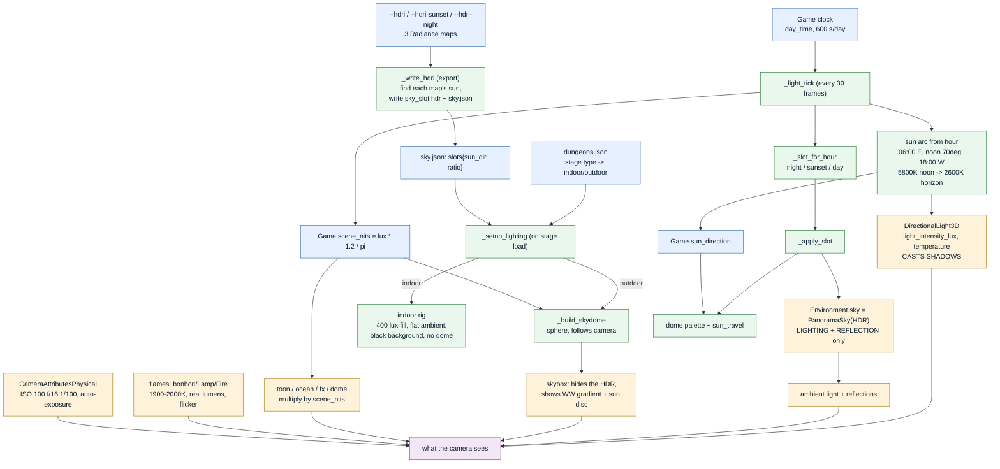
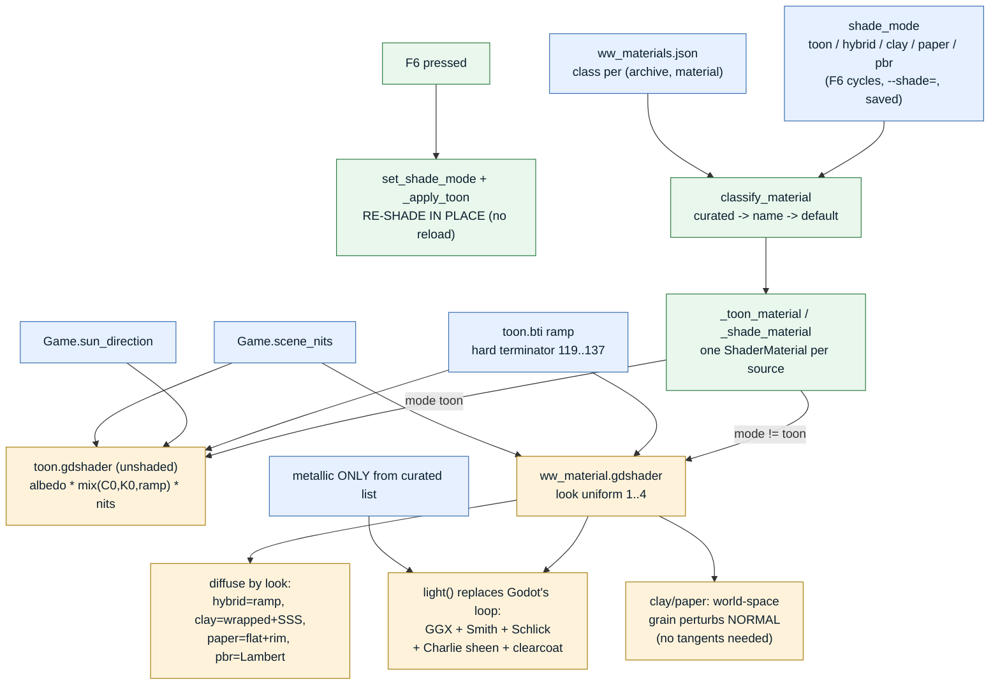
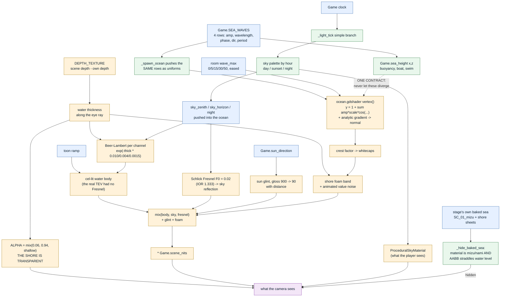

<title>Render Pipeline Map</title>

# The lighting and shader pipeline

How light and shading flow through the Wind Waker remake, so a change in one place has a
known blast radius. Everything here is what the code does today (ripper `ad7e65c`).

Three hard rules the whole thing rests on:

1. **There are two lighting worlds, and simple is the default.** Plain `light_energy`, a
   procedural sky, no exposure games, `scene_nits = 1`. The **physical** world (lux, lumens,
   `CameraAttributesPhysical` at ISO 100 f/16 1/100, the HDR sky dome) is opt-in via
   `--physical` or `--hdri`, and `lighting.json` tells the running game which one it is in.
   In the physical world every **unshaded** surface must output **nits** or it renders black
   against a sunlit white of ~31,800. This split exists because the physical rig shipped
   black to a play-tester twice.
2. **The sun has one source: the game clock.** Shadows, the visible sun disc, the toon ramp
   direction and the sea's specular all read `Game.sun_direction`. Never let anything else
   steer it.
3. **The sky and the sea share one palette.** Whatever colour the visible sky is showing this
   hour is pushed into the ocean shader as its reflection colour and night factor. Let them
   compute the hour separately and you get night-dark water under a noon sky, which reads to
   a player as "the water is broken".

---

## 1. Lighting pipeline

**The one that bit us twice:** an HDR is **light only**. It is the `Environment.sky` (ambient +
reflection), but the **sky dome** is a skybox drawn in front of it, so it is never the visible
background. The dome must **wrap the camera** (it follows the camera every frame) or it gets
frustum-culled and the HDR shows through — which is exactly what "all I can see is the HDR" was.

---

## 2. Shader pipeline

**Why toon is the only one that reads right so far:** it is unlit — it just emits the ramp — so
it is immune to whatever the lighting rig is doing. The other four depend entirely on the
lighting being correct, which is the thing we are still tuning. Fix the light and they come
alive; break the light and they go dark. That is not four broken shaders, it is one lighting
rig the lit looks are all downstream of.

---

## 3. Water pipeline

**Why the AABB test matters:** hide every `mizu` mesh by name and the forest pond at y = 768
disappears with the flat sea quad at y = 0. The height test is the whole difference between
"the shore stopped being black" and "interior water vanished".

---

## 4. The traps, in one place

| symptom | cause | fix |
|---|---|---|
| everything black | unshaded shader output not in nits, vs a 31,800-nit white | multiply by `Game.scene_nits` |
| all you see is the HDR | sky dome at origin, frustum-culled | dome follows the camera |
| over-saturated | flat painted sky + no exposure + no sky reflection | PhysicalSky/HDR + CameraAttributesPhysical |
| metal renders dark | nothing to reflect | a real sky in the Environment (HDR or PhysicalSky) |
| F6 crashes | reloaded the whole 1224-actor scene each press | re-shade in place |
| clay/paper shrink-wrapped | NORMAL_MAP needs tangents the meshes lack | perturb NORMAL in world space |
| export fails randomly | OneDrive returns a partial file read | glb.pack retries the read |
| sun and shadow disagree | two sun sources | one source: the clock arc |
| shoreline reads black | opaque ocean + the stage's own baked sea sheet under it | depth-fade alpha, and hide baked sea at water level |
| night water under a noon sky | the sea read the clock, the sky did not | one palette, pushed from the stage into the shader |
| a surface vanishes from one side | cull mode dropped when the ShaderMaterial was built | `cull_disabled` shader twin, chosen per material |
| nothing missing reappears with culling off | the geometry genuinely is not there | build it (the rope bridge span came from PATH data) |
| an actor is built 400k units away | stage data keyed by `current_stage_key()` | key by the SCENE `name` - `sea_r44` has its own origin |
| planks tilt sideways along a span | `rotation` euler order is Y then X | build the Basis from the curve tangent |

Everything traces back to the two hard rules at the top.
