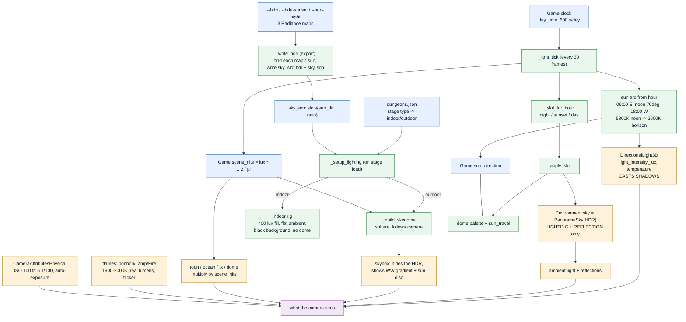
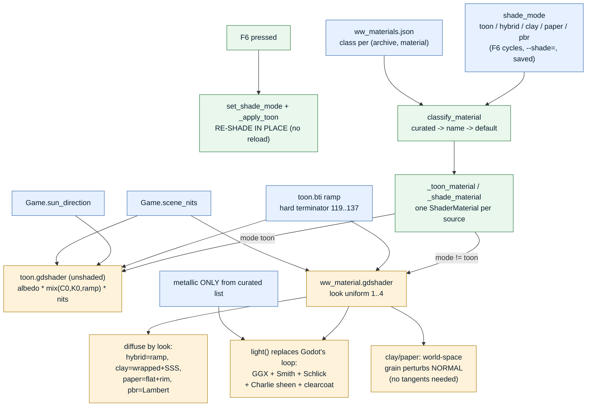

<title>Render Pipeline Map</title>

# The lighting and shader pipeline

How light and shading flow through the Wind Waker remake, so a change in one place has a
known blast radius. Everything here is what the code does today (ripper `b0d5a10`).

Two hard rules the whole thing rests on:

1. **Physical light units are on.** Every light is in **lux / lumens**, the camera has a real
   **exposure** (ISO 100, f/16, 1/100), and any **unshaded** surface must output **nits** or it
   renders black against a sunlit white of ~31,800 nits.
2. **The sun has one source: the game clock.** Shadows, the visible sun disc, and the toon
   ramp direction all read `Game.sun_direction`. Never let anything else steer it.

---

## 1. Lighting pipeline

**The one that bit us twice:** an HDR is **light only**. It is the `Environment.sky` (ambient +
reflection), but the **sky dome** is a skybox drawn in front of it, so it is never the visible
background. The dome must **wrap the camera** (it follows the camera every frame) or it gets
frustum-culled and the HDR shows through — which is exactly what "all I can see is the HDR" was.

---

## 2. Shader pipeline

**Why toon is the only one that reads right so far:** it is unlit — it just emits the ramp — so
it is immune to whatever the lighting rig is doing. The other four depend entirely on the
lighting being correct, which is the thing we are still tuning. Fix the light and they come
alive; break the light and they go dark. That is not four broken shaders, it is one lighting
rig the lit looks are all downstream of.

---

## 3. The traps, in one place

| symptom | cause | fix |
|---|---|---|
| everything black | unshaded shader output not in nits, vs a 31,800-nit white | multiply by `Game.scene_nits` |
| all you see is the HDR | sky dome at origin, frustum-culled | dome follows the camera |
| over-saturated | flat painted sky + no exposure + no sky reflection | PhysicalSky/HDR + CameraAttributesPhysical |
| metal renders dark | nothing to reflect | a real sky in the Environment (HDR or PhysicalSky) |
| F6 crashes | reloaded the whole 1224-actor scene each press | re-shade in place |
| clay/paper shrink-wrapped | NORMAL_MAP needs tangents the meshes lack | perturb NORMAL in world space |
| export fails randomly | OneDrive returns a partial file read | glb.pack retries the read |
| sun and shadow disagree | two sun sources | one source: the clock arc |

Everything traces back to the two hard rules at the top.
