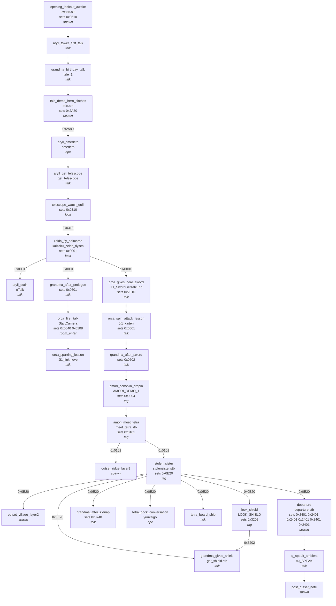
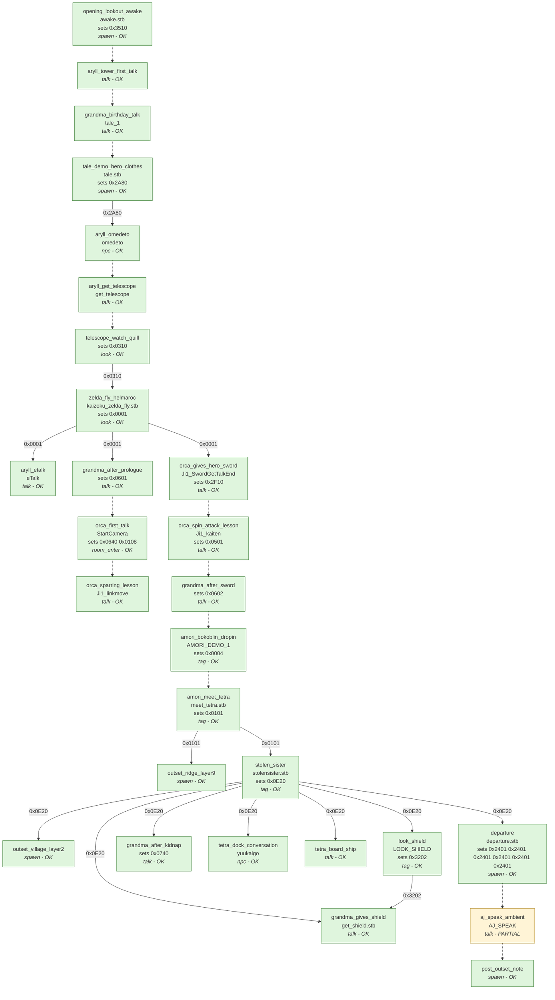

# Wind Waker opening: original flow vs. our remake

Generated by `tools/ww_story_chart.py` from `gcrip/data/ww_story_outset.json`
(mined from the zeldaret/tww decompilation, every step carrying file:line sources).
Re-run it after changing the engine's trigger mechanisms.

**27 of 28 steps are reachable in the remake** (1 partial, 0 missing).

## 1. The original game

## 2. The same flow in our remake

Solid arrows are event-bit dependencies; dotted arrows are play order.

## 3. Step by step

| step | trigger | actor | event | cutscene | needs | sets | state | note |
|---|---|---|---|---|---|---|---|---|
| opening_lookout_awake | spawn |  | awake | awake.stb |  | 0x3510 | **ok** | PLYR params >> 24 indexes the stage EVNT table (Game._place_player) |
| aryll_tower_first_talk | talk | Ls1 |  |  |  |  | **ok** | story-graph talk steps (Game.story_talk) via actors/npc.gd |
| grandma_birthday_talk | talk | Ba1 | tale_1 |  |  |  | **ok** | story-graph talk steps (Game.story_talk) via actors/npc.gd |
| tale_demo_hero_clothes | spawn |  | TALE_DEMO | tale.stb |  | 0x2A80 | **ok** | PLYR params >> 24 indexes the stage EVNT table (Game._place_player) |
| aryll_omedeto | npc | Ls1 | omedeto |  | 0x2A80 |  | **ok** | the NPC orders it itself, by proximity or on being placed (Game.story_npc_tick) |
| aryll_get_telescope | talk | Ls1 | get_telescope |  |  |  | **ok** | story-graph talk steps (Game.story_talk) via actors/npc.gd |
| telescope_watch_quill | look | Bm1 |  |  |  | 0x0310 | **ok** | the Telescope's scope look at the step's target (Game.telescope_look) |
| zelda_fly_helmaroc | look |  | zelda_fly | kaizoku_zelda_fly.stb | 0x0310 | 0x0001 | **ok** | the Telescope's scope look at the step's target (Game.telescope_look) |
| aryll_etalk | talk | Ls1 | eTalk |  | 0x0001 |  | **ok** | story-graph talk steps (Game.story_talk) via actors/npc.gd |
| grandma_after_prologue | talk | Ba1 |  |  | 0x0001 | 0x0601 | **ok** | story-graph talk steps (Game.story_talk) via actors/npc.gd |
| orca_first_talk | room_enter | Ji1 | StartCamera |  |  | 0x0640 0x0108 | **ok** | a stage's StartCamera event runs on arrival (stage.gd) |
| orca_sparring_lesson | talk | Ji1 | Ji1_linkmove |  |  |  | **ok** | story-graph talk steps (Game.story_talk) via actors/npc.gd |
| orca_gives_hero_sword | talk | Ji1 | Ji1_SwordGetTalkEnd |  | 0x0001 | 0x2F10 | **ok** | story-graph talk steps (Game.story_talk) via actors/npc.gd |
| orca_spin_attack_lesson | talk | Ji1 | Ji1_kaiten |  |  | 0x0501 | **ok** | story-graph talk steps (Game.story_talk) via actors/npc.gd |
| grandma_after_sword | talk | Ba1 |  |  |  | 0x0602 | **ok** | story-graph talk steps (Game.story_talk) via actors/npc.gd |
| amori_bokoblin_dropin | tag |  | AMORI_DEMO_1 |  |  | 0x0004 | **ok** | TagEv volumes order their EVNT entry (actors/tag_event.gd) |
| amori_meet_tetra | tag |  | MEET_TETORA | meet_tetra.stb |  | 0x0101 | **ok** | TagEv volumes order their EVNT entry (actors/tag_event.gd) |
| outset_ridge_layer9 | spawn |  |  |  | 0x0101 |  | **ok** | PLYR params >> 24 indexes the stage EVNT table (Game._place_player) |
| stolen_sister | tag |  | STOLENSISTER | stolensister.stb | 0x0101 | 0x0E20 | **ok** | TagEv volumes order their EVNT entry (actors/tag_event.gd) |
| outset_village_layer2 | spawn |  |  |  | 0x0E20 |  | **ok** | PLYR params >> 24 indexes the stage EVNT table (Game._place_player) |
| look_shield | tag |  | LOOK_SHIELD |  | 0x0E20 | 0x3202 | **ok** | TagEv volumes order their EVNT entry (actors/tag_event.gd) |
| grandma_gives_shield | talk | Ba1 | get_shield | get_shield.stb | 0x0E20 0x3202 |  | **ok** | story-graph talk steps (Game.story_talk) via actors/npc.gd |
| grandma_after_kidnap | talk | Ba1 |  |  | 0x0E20 | 0x0740 | **ok** | story-graph talk steps (Game.story_talk) via actors/npc.gd |
| tetra_dock_conversation | npc | Zl1 | yuukaigo |  | 0x0E20 |  | **ok** | the NPC orders it itself, by proximity or on being placed (Game.story_npc_tick) |
| tetra_board_ship | talk | Zl1 |  |  | 0x0E20 |  | **ok** | story-graph talk steps (Game.story_talk) via actors/npc.gd |
| departure | spawn |  | departure_DEMO | departure.stb | 0x0E20 | 0x2401 0x2401 0x2401 0x2401 0x2401 0x2401 | **ok** | PLYR params >> 24 indexes the stage EVNT table (Game._place_player) |
| aj_speak_ambient | talk | Aj1 | AJ_SPEAK |  |  |  | **partial** | mined with low confidence |
| post_outset_note | spawn |  |  |  | 0x0520 |  | **ok** | PLYR params >> 24 indexes the stage EVNT table (Game._place_player) |
